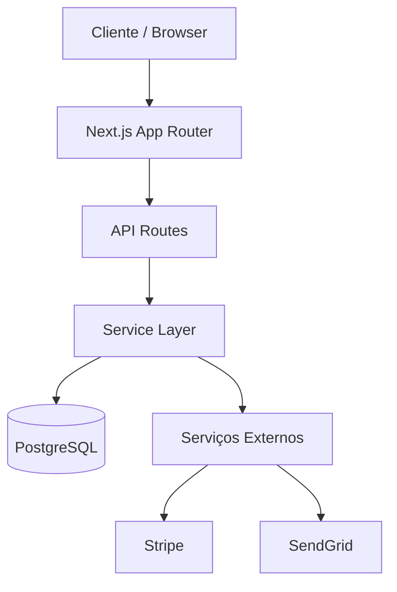
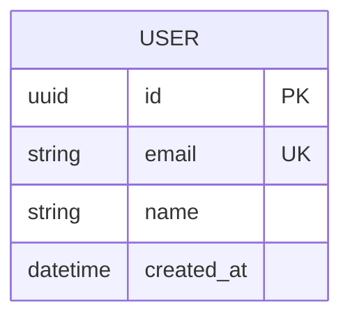

# PRD — Product Requirements Document

> Template obrigatório para projetos novos. Preencha antes de criar a primeira task em `tasks.md`.
> Este documento é a fonte de verdade sobre **o que** o projeto resolve, **como** será construído e **se** é viável.
> Localização: `.claude/prd.md`

---

## 1. Visão do Produto

### 1.1 Problema

<!-- Descreva o problema real que este projeto resolve. Não descreva a solução — descreva a dor.
     Teste: alguém que nunca viu seu código entenderia por que este projeto precisa existir? -->

**Problema central:**
[Uma frase clara descrevendo a dor ou necessidade.]

**Quem sofre com isso:**
[Público-alvo — seja específico. "Todos" não é público-alvo.]

**Como é resolvido hoje (se for):**
[Soluções existentes, workarounds manuais, ou "não é resolvido".]

### 1.2 Proposta de Solução

<!-- Descreva a solução em termos de resultado, não de implementação.
     "Permitir que o usuário acompanhe gastos em tempo real" — não "criar um app React com Firebase". -->

**O que o sistema faz:**
[Resultado entregue ao usuário final.]

**Diferencial em relação às alternativas:**
[Por que esta solução é melhor que as existentes? Se não houver diferencial claro, questione se o projeto vale o investimento.]

### 1.3 Critérios de Sucesso do Produto

<!-- Métricas que definem se o projeto atingiu seu objetivo. Devem ser mensuráveis. -->

| Métrica | Alvo | Como medir |
|---------|------|------------|
| [ex: Tempo de onboarding] | [ex: < 2 minutos] | [ex: Medição manual com 5 usuários] |
| [ex: Taxa de conclusão do fluxo principal] | [ex: > 80%] | [ex: Analytics / logs] |
| [ex: Uptime] | [ex: 99.5%] | [ex: Monitoramento] |

---

## 2. Escopo Funcional

### 2.1 Funcionalidades — MVP

<!-- Liste APENAS o que entra na primeira versão utilizável.
     Cada funcionalidade deve ser decomponível em tasks para o tasks.md.
     Se a lista tem mais de 8-10 itens, o MVP está grande demais. -->

| # | Funcionalidade | Descrição | Prioridade | Complexidade estimada |
|---|----------------|-----------|------------|-----------------------|
| F-001 | [nome curto] | [o que faz do ponto de vista do usuário] | must-have | minor / major |
| F-002 | [nome curto] | [descrição] | must-have | minor / major |
| F-003 | [nome curto] | [descrição] | should-have | minor / major |

**Legenda de prioridade:**
- **must-have** — sem isso o produto não funciona.
- **should-have** — importante, mas o MVP sobrevive sem.
- **nice-to-have** — desejável, entra após o MVP.

### 2.2 Funcionalidades — Pós-MVP

<!-- Funcionalidades planejadas mas que NÃO entram na primeira versão.
     Registrar aqui evita scope creep durante o desenvolvimento. -->

| # | Funcionalidade | Descrição | Dependência |
|---|----------------|-----------|-------------|
| F-100 | [nome] | [descrição] | [depende de F-00N ou "nenhuma"] |
| F-101 | [nome] | [descrição] | [dependência] |

### 2.3 Fora de Escopo

<!-- Tão importante quanto o que entra. Liste explicitamente o que o projeto NÃO faz.
     Isso protege contra expansão de escopo durante o desenvolvimento. -->

- [ex: O sistema não processa pagamentos — usa gateway externo.]
- [ex: Não haverá app mobile na primeira versão.]
- [ex: Não suporta múltiplos idiomas no MVP.]

---

## 3. Stack Técnica

### 3.1 Decisões de Stack

<!-- Para cada camada, registre a escolha E a justificativa.
     A justificativa é obrigatória — "porque eu conheço" é válido, mas registre. -->

| Camada | Tecnologia | Versão | Justificativa |
|--------|-----------|--------|---------------|
| **Linguagem** | [ex: TypeScript] | [ex: 5.x] | [ex: Tipagem estática, ecossistema maduro] |
| **Framework** | [ex: Next.js] | [ex: 14.x] | [ex: SSR, App Router, deploy fácil na Vercel] |
| **Banco de dados** | [ex: PostgreSQL] | [ex: 16] | [ex: Relacional, suporte a JSON, escalável] |
| **ORM / Query builder** | [ex: Prisma] | [ex: 5.x] | [ex: Type-safe, migrations automáticas] |
| **Autenticação** | [ex: NextAuth.js] | [ex: 5.x] | [ex: Integração nativa com Next.js] |
| **Estilização** | [ex: Tailwind CSS] | [ex: 3.x] | [ex: Utility-first, design system rápido] |
| **Hospedagem** | [ex: Vercel] | — | [ex: Deploy automático, edge functions] |
| **CI/CD** | [ex: GitHub Actions] | — | [ex: Integração nativa com GitHub] |
| **Testes** | [ex: Vitest + Playwright] | — | [ex: Unit + E2E, rápido, compatível com Vite] |
| **Monitoramento** | [ex: Sentry] | — | [ex: Error tracking, performance monitoring] |

### 3.2 Dependências Críticas

<!-- Bibliotecas ou serviços externos dos quais o projeto depende fortemente.
     Se um destes falhar ou mudar API, o projeto é impactado. -->

| Dependência | Uso no projeto | Risco se indisponível | Alternativa viável |
|-------------|----------------|----------------------|-------------------|
| [ex: Stripe API] | [pagamentos] | [alto — fluxo principal para] | [ex: Mercado Pago] |
| [ex: SendGrid] | [e-mails transacionais] | [médio — degradação graciosa possível] | [ex: AWS SES] |

### 3.3 Requisitos de Infraestrutura

- **Ambiente de desenvolvimento:** [ex: Node 20+, Docker para banco local]
- **Ambiente de staging:** [ex: Vercel preview deploys por branch]
- **Ambiente de produção:** [ex: Vercel Pro, PostgreSQL em Supabase/Neon]
- **Variáveis de ambiente necessárias:** [listar chaves, não valores]

```env
# .env.example
DATABASE_URL=
NEXTAUTH_SECRET=
NEXTAUTH_URL=
STRIPE_SECRET_KEY=
STRIPE_WEBHOOK_SECRET=
SENDGRID_API_KEY=
```

---

## 4. Arquitetura

### 4.1 Visão Geral

<!-- Descreva a arquitetura em texto antes do diagrama.
     O texto deve ser compreensível sem o diagrama. -->

[Descreva a arquitetura: monolito/microserviços, camadas principais, fluxo de dados.]

### 4.2 Diagrama de Arquitetura

<!-- Mermaid embutido. Este mesmo diagrama será usado no README público (guia de portfólio (`.claude/guides/guia-portfolio.md`, seção 12.2)). -->



### 4.3 Estrutura de Diretórios (Proposta)

<!-- Defina a organização antes de criar o primeiro arquivo.
     Esta estrutura guia o reconhecimento de codebase (regra 02). -->

```
src/
├── app/                    # Rotas (App Router)
│   ├── (auth)/             # Grupo de rotas autenticadas
│   ├── api/                # API routes
│   └── layout.tsx
├── components/             # Componentes reutilizáveis
│   ├── ui/                 # Primitivos (Button, Input, Card)
│   └── features/           # Componentes de domínio
├── services/               # Lógica de negócio
├── repositories/           # Acesso a dados
├── lib/                    # Utilitários e configurações
├── types/                  # TypeScript types/interfaces
└── tests/
    ├── unit/
    └── e2e/
```

### 4.4 Modelo de Dados (Inicial)

<!-- Entidades principais e seus relacionamentos.
     Não precisa ser completo — o suficiente para validar a viabilidade. -->



---

## 5. Análise de Viabilidade

### 5.1 Viabilidade Técnica

<!-- Para cada item, avalie se é viável com a stack escolhida e o conhecimento atual. -->

| Aspecto | Avaliação | Observações |
|---------|-----------|-------------|
| A stack suporta todas as funcionalidades do MVP? | ✓ / ✗ / parcial | [detalhar se parcial] |
| O desenvolvedor domina a stack escolhida? | ✓ / ✗ / parcial | [se parcial: quais gaps?] |
| Há limitações técnicas conhecidas? | sim / não | [se sim: quais e como mitigar] |
| As dependências externas têm documentação adequada? | ✓ / ✗ | [listar as problemáticas] |
| A arquitetura proposta suporta crescimento pós-MVP? | ✓ / ✗ | [pontos de bottleneck previstos] |

### 5.2 Viabilidade de Prazo

<!-- Estimativa honesta. Se o MVP não cabe em 4-8 semanas de trabalho individual, reduza o escopo. -->

| Fase | Escopo | Estimativa |
|------|--------|------------|
| Setup + TASK-000 | Repositório, framework .claude/, CI básico | [ex: 1 dia] |
| Fundação | Auth, modelo de dados, layout base | [ex: 1 semana] |
| Core (must-have) | Funcionalidades F-001 a F-00N | [ex: 2-3 semanas] |
| Polimento | Testes E2E, tratamento de erros, UX | [ex: 1 semana] |
| Deploy | Staging + produção + monitoramento | [ex: 2-3 dias] |
| **Total estimado** | | **[ex: 5-6 semanas]** |

### 5.3 Viabilidade de Custo

<!-- Quanto custa manter este projeto rodando. Serviços "grátis" têm limites. -->

| Serviço | Plano | Custo mensal | Limite relevante |
|---------|-------|-------------|------------------|
| [Vercel] | [Hobby/Pro] | [R$ 0 / US$ 20] | [100GB bandwidth] |
| [Supabase] | [Free/Pro] | [R$ 0 / US$ 25] | [500MB DB, 1GB storage] |
| [Sentry] | [Developer] | [R$ 0] | [5k erros/mês] |
| **Total** | | **[R$ X / mês]** | |

### 5.4 Riscos Identificados

| Risco | Probabilidade | Impacto | Mitigação |
|-------|--------------|---------|-----------|
| [ex: API do Stripe muda breaking change] | baixa | alto | [manter versão pinada, monitorar changelog] |
| [ex: Escopo cresce além do MVP] | alta | médio | [PRD como âncora, fora de escopo documentado] |
| [ex: Performance com volume de dados] | média | alto | [indexação, paginação, caching desde o início] |

---

## 6. Fluxos de Usuário (MVP)

<!-- Descreva os fluxos principais que o usuário percorre.
     Cada fluxo mapeia para funcionalidades da seção 2.1 e ajuda a decompor tasks. -->

### 6.1 Fluxo: [Nome do Fluxo Principal]

```
[Passo 1] → [Passo 2] → [Passo 3] → [Resultado]
```

**Cenário feliz:** [o que acontece quando tudo funciona]
**Cenário de erro:** [o que acontece quando falha — como o sistema se comporta]

### 6.2 Fluxo: [Nome do Segundo Fluxo]

```
[Passo 1] → [Passo 2] → [Resultado]
```

---

## 7. Decomposição em Tasks

<!-- Esta seção conecta o PRD ao tasks.md.
     Cada funcionalidade must-have se decompõe em tasks implementáveis.
     Não preencha o tasks.md ainda — esta é a visão de alto nível. -->

### 7.1 Sequência de Implementação Sugerida

| Ordem | Task (alto nível) | Funcionalidade ref. | Complexidade | Dependência |
|-------|-------------------|---------------------|--------------|-------------|
| 1 | TASK-000: Bootstrap do framework | — | major | — |
| 2 | TASK-001: [setup inicial do projeto + auth] | F-001 | major | TASK-000 |
| 3 | TASK-002: [modelo de dados + migrations] | F-001, F-002 | major | TASK-001 |
| 4 | TASK-003: [funcionalidade core 1] | F-002 | minor | TASK-002 |
| 5 | TASK-004: [funcionalidade core 2] | F-003 | minor | TASK-002 |
| ... | ... | ... | ... | ... |

### 7.2 Regras de Decomposição

Ao transferir esta sequência para o `tasks.md`, cada linha acima pode virar uma ou mais tasks seguindo as regras de preenchimento:

- Uma task por sessão de desenvolvimento.
- O campo Objetivo cabe em uma frase.
- Critérios de Aceite são verificáveis (sim/não).
- Se a task afeta mais de 10 arquivos, decomponha.

---

## 8. Decisões em Aberto

<!-- Questões que ainda não têm resposta e precisam ser resolvidas antes ou durante o desenvolvimento.
     Cada decisão resolvida migra para a seção "Decisões Técnicas Relevantes" do registry.md. -->

| # | Questão | Impacto | Prazo para decidir | Decisão tomada |
|---|---------|---------|-------------------|----------------|
| D-001 | [ex: Usar SSR ou SSG para páginas públicas?] | [performance, SEO] | [antes de TASK-002] | [pendente] |
| D-002 | [ex: Autenticação por magic link ou senha?] | [UX, segurança] | [antes de TASK-001] | [pendente] |

---

## Histórico do PRD

| Data | Alteração | Autor |
|------|-----------|-------|
| [YYYY-MM-DD] | Versão inicial | [nome] |

---

> **Conexão com o framework .claude/:**
> - Este PRD é lido pelo agente no reconhecimento de codebase (regra 02) como fonte de contexto do projeto.
> - Funcionalidades listadas aqui alimentam a criação de tasks no `tasks.md`.
> - Decisões de stack são registradas no `registry.md` (seção Decisões Técnicas).
> - O diagrama de arquitetura é reutilizado no README público (guia de portfólio (`.claude/guides/guia-portfolio.md`, seção 12.2)).
> - Funcionalidades "fora de escopo" são a referência para recusar scope creep (regra 03.2.1).
