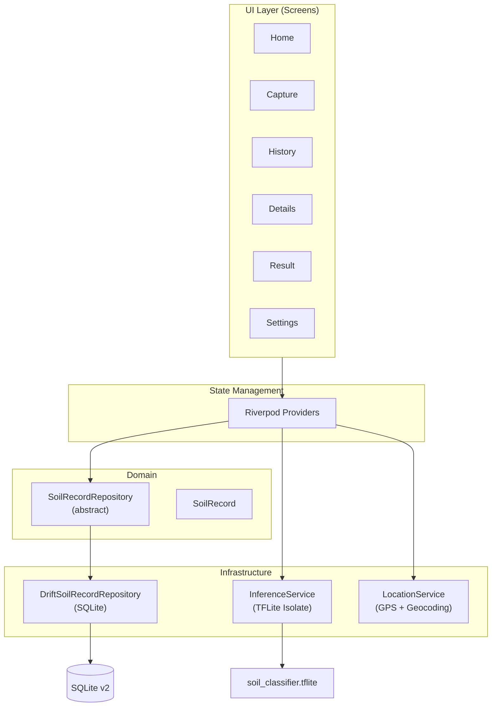

[](https://github.com/LukeSantossz/visiosoil-app/actions)

# VisioSoil

## Why this exists

Soil texture classification in the field still relies on manual feel tests — a subjective method that varies between professionals and offers no traceability. VisioSoil replaces that with a mobile workflow: photograph a soil sample, record GPS coordinates, and get an instant on-device classification into one of 12 USDA texture classes. Every analysis is persisted locally with geolocation, creating an auditable history of soil data across lots and seasons.

The app is the production-mobile evolution of academic research on image-based soil texture classification, targeting agronomists and field technicians who need consistent, repeatable results without cloud dependency.

## Architecture



**Data flow:** Screens consume Riverpod providers. A `StreamProvider` fed by Drift's `watchAll()` keeps home and history in sync with the database automatically. Classification runs in a separate Dart `Isolate` via `InferenceService` so the UI thread is never blocked. Navigation uses GoRouter with record IDs passed via `state.extra`.

## Engineering decisions

| Decision | Rationale |
|----------|-----------|
| **Repository pattern over direct Drift** | UI never imports Drift types. The abstract `SoilRecordRepository` allows swapping to a remote API or adding sync without touching screens. |
| **Isolate-based TFLite inference** | Model bytes are passed as `Uint8List` because `rootBundle` is unavailable in isolates. Keeps classification off the UI thread. |
| **MobileNetV2 with transfer learning** | ImageNet pretrained weights with a `Rescaling` layer that converts `[0,1]` to `[-1,1]` built into the model graph. Two-phase training: head-only then fine-tuning. |
| **SQLite schema v2 migration** | `texture_class` and `confidence_score` columns added via Drift's migration strategy with version checks, preserving existing data. |
| **GoRouter `state.extra` for IDs** | Record IDs passed via extra (not URL params) — avoids slugification and keeps routes clean. |
| **Local-only ML experiment tracking** | JSON-based metrics per version (`models/vN/metrics.json`). No MLflow/W&B — overhead disproportionate for a single-model pipeline. |

## How to run

```bash
git clone https://github.com/LukeSantossz/visiosoil-app.git
cd visiosoil-app
flutter pub get
dart run build_runner build --delete-conflicting-outputs
flutter run
```

**Requirements:** Flutter SDK 3.x, Android Studio (or a connected device), Xcode for iOS.

```bash
# Static analysis
flutter analyze

# Run tests
flutter test

# Build release APK
flutter build apk --release
```

## Project structure

```
lib/
├── main.dart                          # ProviderScope + MaterialApp.router
├── core/
│   ├── theme/                         # AppTheme, AppColors, AppTypography, AppSpacing
│   ├── routes/app_router.dart         # GoRouter (record IDs via state.extra)
│   ├── widgets/                       # VisioAppBar, VisioButton, VisioCard, EmptyState
│   ├── utils/                         # LocationService, formatters
│   ├── services/inference_service.dart # TFLite classification in isolate
│   ├── database/                      # Drift DB + tables + generated code
│   ├── data/repositories/             # Abstract interface + Drift implementation
│   └── features/                      # Screens: home, capture, history, details, result, settings
├── models/soil_record.dart            # Domain model
└── providers/                         # Riverpod providers (DB, repository, inference, image)
```

## Current status

**v2.0.0** — UI redesign + TFLite classification integrated.

### Pending

- Train and bundle production MobileNetV2 model (current asset is a placeholder)
- Re-enable gallery image source (camera-only; code preserved behind `TODO(v2)`)
- Remote sync (repository interface prepared)
