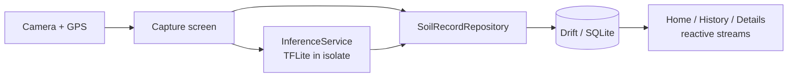

[](https://flutter.dev)
[](https://dart.dev)
[](https://github.com/LukeSantossz/visiosoil-app/actions)

# VisioSoil — Geolocated Soil Texture Analysis

> A cross-platform Flutter app that turns a phone photo of a soil sample into a georeferenced texture record, classified on-device — no connectivity required in the field.

---

## What It Does

VisioSoil lets agronomists and field technicians capture, classify, and catalog soil samples directly from a mobile device.

- **Guided field workflow** — a splash screen requests runtime permissions, a 3-step onboarding tutorial explains capture, and a setup wizard tags each sample with its crop and sampling depth
- **Geolocated capture** — takes a photo and automatically records GPS coordinates and a reverse-geocoded address
- **On-device classification** — a TensorFlow Lite model labels the sample into one of 5 soil texture classes with a confidence score (shown as a graded confidence banner), running fully offline
- **Local catalog** — every sample is persisted to a local database with grid history, texture filters, address search, multi-select, batch delete, and a zoomable full-screen viewer

## What It Is

VisioSoil is a **cross-platform mobile app** (Android + iOS) that produces a persistent, georeferenced record of each soil sample together with its predicted texture class. It targets fieldwork where connectivity is unreliable: capture, inference, and storage all happen on the device, so an agronomist can survey a plot end-to-end without a network.

## Tech Stack

| Layer | Technology |
| --- | --- |
| Language | Dart 3.10.4+ |
| Framework / Runtime | Flutter 3.x (Android + iOS) |
| State management | Riverpod (`flutter_riverpod`) |
| Navigation | GoRouter |
| Data layer | Drift + SQLite (`sqlite3_flutter_libs`) |
| On-device inference | TensorFlow Lite (`tflite_flutter`), isolate-based |
| Model training | TensorFlow / Keras — MobileNetV2 transfer learning (in `ml/`) |
| Device I/O | `image_picker` (camera), `geolocator` + `geocoding` (GPS) |
| Testing / CI | `flutter_test`, GitHub Actions |

## Architecture



The UI talks only to Riverpod providers, which depend on an abstract `SoilRecordRepository` — never on Drift types directly. TFLite inference runs in a separate Dart isolate to keep the UI thread free; model bytes are loaded from assets and passed into the isolate because `rootBundle` is unavailable there. The model itself is produced by a separate training pipeline under `ml/`, which is decoupled from the app and integrates through a `spec.json` contract plus a `.tflite` artifact copied into `assets/models/`.

## Engineering Decisions

| Decision | Alternative considered | Why this approach |
| --- | --- | --- |
| Repository pattern abstracting Drift | UI queries Drift directly | UI imports only the interface, so the persistence backend (local DB, remote API, cache) can be swapped without touching screens |
| TFLite inference in a separate isolate | Run inference on the main thread | Classification never blocks the UI; model bytes are passed as `Uint8List` since `rootBundle` cannot be used inside an isolate |
| Training pipeline isolated in `ml/` (TF/Keras) | Train or fine-tune inside the Flutter app | Keeps the mobile codebase free of Python/ML weight; `spec.json` is the single integration contract between the pipeline and `InferenceService` |
| Drift + SQLite with schema versioning | Hive / raw `sqflite` | Typed queries, reactive `watchAll()` streams that auto-refresh history, and explicit migrations (currently schema v2) |
| Local JSON for experiment tracking | MLflow / Weights & Biases | Disproportionate overhead for the project size; each model version emits `metrics.json` + `config.json` under `ml/models/vN/` |

## Getting Started

### Prerequisites

- Flutter SDK 3.x (Dart 3.10.4+)
- Android Studio with an emulator, or a connected device
- Xcode (for iOS builds)

### Installation

```bash
git clone https://github.com/LukeSantossz/visiosoil-app.git
cd visiosoil-app

flutter pub get
# Generate Drift adapters (required after changes to DB tables / models)
dart run build_runner build --delete-conflicting-outputs
```

### Running

```bash
# Run on a connected emulator or device
flutter run

# Static analysis
flutter analyze
```

### Tests

```bash
flutter test
```

## Project Structure

```
visiosoil-app/
├── lib/
│   ├── main.dart            # Entry: ProviderScope + MaterialApp.router
│   ├── core/
│   │   ├── theme/           # AppTheme, AppColors, AppTypography, AppSpacing
│   │   ├── routes/          # GoRouter config (11 routes)
│   │   ├── widgets/         # VisioAppBar, VisioButton, EmptyState
│   │   ├── utils/           # LocationService (GPS + geocoding), formatters
│   │   ├── services/        # InferenceService (TFLite, isolate) + PermissionService
│   │   ├── database/        # Drift DB class + tables + generated code
│   │   ├── data/            # SoilRecordRepository (interface + Drift impl)
│   │   └── features/        # Screens: splash, onboarding, main, home, capture,
│   │                        #          history, details, preview, result, settings
│   ├── models/              # SoilRecord, CaptureContext, ConfidenceLevel, HomeStats
│   └── providers/           # Riverpod providers (database, repository, inference, image)
├── ml/                      # TF/Keras training pipeline (MobileNetV2 → TFLite)
├── assets/models/           # Deployed .tflite model + spec
└── test/                    # Unit + repository tests (in-memory SQLite)
```

## Project Status

**Status: in development — v2.0.0**

### Done

- [x] Material 3 theme, Riverpod state management, GoRouter navigation (11 routes)
- [x] Splash screen with runtime permission requests via `PermissionService`
- [x] 3-step onboarding capture tutorial and a capture setup wizard (crop, depth)
- [x] Bottom navigation shell (`MainScreen`) with home and history tabs
- [x] Camera capture with real GPS (`geolocator` + `geocoding` via `LocationService`)
- [x] Image preview after capture and zoomable full-screen viewer
- [x] History grid with texture filters, address search, multi-select, and batch delete
- [x] Result screen with graded confidence banner; details screen with classification display and delete action
- [x] Settings screen (app version, re-run onboarding, data wipe)
- [x] Persistence on Drift + SQLite via `SoilRecordRepository` (schema v2)
- [x] On-device TFLite classification into 5 soil texture classes, running in an isolate
- [x] Repository tests with `NativeDatabase.memory()`
- [x] CI pipeline (analyze → test → APK build)
- [x] Reproducible ML pipeline under `ml/` (MobileNetV2 transfer learning, 2-phase training)

### Pending

- [ ] Train and deploy the production model, then re-export and ship the `.tflite` to `assets/models/`
- [ ] Load labels, input size, and normalization from `spec.json` at runtime instead of hardcoding them in `InferenceService`
- [ ] Remote sync (the repository interface already leaves room for it)

## Known Issues & Limitations

- **Bundled model is a placeholder** — the production model is still being trained; `assets/models/soil_classifier.tflite` should not be relied on for accurate field classification yet.
- **Labels and preprocessing are hardcoded in `InferenceService`** — the generated `spec.json` is not yet read at runtime, so a pipeline change requires a matching manual edit on the Dart side.
- **Camera-only capture** — gallery selection is intentionally not supported.
- **No remote sync** — all data is device-local; the repository interface is prepared for a future sync layer but none is implemented.
- **`drift_flutter` pinned to `>=0.2.0 <0.2.4`** — do not bump without verifying compatibility.

## Contributing

Branch from `main` (`type/short-description`), keep `flutter analyze` and `flutter test` green, use single-line Conventional Commits (`type(scope): subject`), and open a PR with type and complexity labels.

## License

[MIT](LICENSE)
