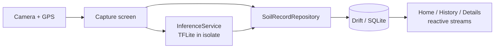

[](https://flutter.dev)
[](https://dart.dev)
[](https://github.com/LukeSantossz/visiosoil-app/actions)

# VisioSoil — Geolocated Soil Texture Analysis

> A cross-platform Flutter app that turns a phone photo of a soil sample into a georeferenced texture record, classified on-device — no connectivity required in the field.

---

## What It Does

VisioSoil lets agronomists and field technicians capture, classify, and catalog soil samples directly from a mobile device.

- **Guided field workflow** — a splash screen requests runtime permissions and a 3-step onboarding tutorial explains capture
- **Geolocated capture** — takes a photo and automatically records GPS coordinates and a reverse-geocoded address, stripping EXIF metadata at the storage boundary so the original location tags never persist
- **On-device classification** — a TensorFlow Lite model labels the sample into one of 5 soil texture classes with a confidence score (shown as a graded confidence banner), running fully offline
- **Local catalog** — every sample is persisted to a local database with grid history, texture filters, address search, multi-select, batch delete, and a zoomable full-screen viewer
- **Privacy-preserving share** — a record can be shared as text plus photo; precise coordinates are omitted unless the user opts in on that specific share
- **Management tips** — an optional research agent fetches agronomic guidance for the classified texture over HTTP, cached locally and clearly marked advisory
- **Account** — optional Google sign-in, with the session held in secure storage, groundwork for the sync layer

## What It Is

VisioSoil is a **cross-platform mobile app** (Android + iOS) that produces a persistent, georeferenced record of each soil sample together with its predicted texture class. It targets fieldwork where connectivity is unreliable: capture, inference, and storage all happen on the device, so an agronomist can survey a plot end-to-end without a network.

## Tech Stack

| Layer | Technology |
| --- | --- |
| Language | Dart 3.10.4+ |
| Framework / Runtime | Flutter 3.x (Android + iOS) |
| State management | Riverpod (`flutter_riverpod`) |
| Navigation | GoRouter |
| Data layer | Drift + SQLite (`sqlite3_flutter_libs`) |
| On-device inference | TensorFlow Lite (`tflite_flutter`), isolate-based |
| Model training | TensorFlow / Keras — MobileNetV2 transfer learning (in `ml/`) |
| Device I/O | `image_picker` (camera), `geolocator` + `geocoding` (GPS), `share_plus` |
| Auth | `google_sign_in`, session persisted via `flutter_secure_storage` |
| Connectivity / network | `connectivity_plus`, `http` (research agent proxy) |
| Testing / CI | `flutter_test`, GitHub Actions |

## Architecture



The UI talks only to Riverpod providers, which depend on an abstract `SoilRecordRepository` — never on Drift types directly. TFLite inference runs in a separate Dart isolate to keep the UI thread free; model bytes are loaded from assets and passed into the isolate because `rootBundle` is unavailable there. The model itself is produced by a separate training pipeline under `ml/`, which is decoupled from the app and integrates through a `.tflite` artifact copied into `assets/models/`. The pipeline also emits a `spec.json` describing the labels and normalization, but the app does not read it yet — that contract is currently honored by hand on the Dart side.

## Engineering Decisions

| Decision | Alternative considered | Why this approach |
| --- | --- | --- |
| Repository pattern abstracting Drift | UI queries Drift directly | UI imports only the interface, so the persistence backend (local DB, remote API, cache) can be swapped without touching screens |
| TFLite inference in a separate isolate | Run inference on the main thread | Classification never blocks the UI; model bytes are passed as `Uint8List` since `rootBundle` cannot be used inside an isolate |
| Training pipeline isolated in `ml/` (TF/Keras) | Train or fine-tune inside the Flutter app | Keeps the mobile codebase free of Python/ML weight; `spec.json` is the single integration contract between the pipeline and `InferenceService` |
| Drift + SQLite with schema versioning | Hive / raw `sqflite` | Typed queries, reactive `watchAll()` streams that auto-refresh history, and explicit migrations (currently schema v4) |
| Image files stored outside the cache, repository-owned lifecycle ([ADR 0002](docs/adr/0002-image-file-storage-and-lifecycle.md)) | Keep the `image_picker` cache path in the DB | The picker's cache path is transient, so a stored record could outlive its photo; the repository copies into durable storage before the row is written |
| Image file deleted at tombstone time, repository-owned ([ADR 0003](docs/adr/0003-image-file-deletion-and-write-exclusivity.md)) | Delete inside the DB transaction, or defer to a tombstone purge | DB stays the source of truth; a best-effort delete after commit never aborts the tombstone, and no purge step exists to defer to |
| Flutter toolchain version has a single source of truth ([ADR 0004](docs/adr/0004-flutter-toolchain-version-single-source.md)) | Let each contributor use any Flutter 3.x | Another 3.x SDK silently rewrites `pubspec.lock`, and a local/CI mismatch hid a widget-finder failure that only surfaced on CI |
| EXIF stripped at the image-storage boundary ([ADR 0005](docs/adr/0005-strip-exif-at-image-storage-boundary.md)) | Ask `image_picker` for reduced metadata at the capture site | The capture-site flag is ignored for Android camera captures, so GPS survived on the primary platform; the orientation tag is deliberately kept, since both display and inference apply it |
| Android OS backup disabled ([ADR 0006](docs/adr/0006-disable-android-os-backup.md)) | Rely on `allowBackup="false"` alone | That flag does not govern Android 12+ device-to-device transfer, so the cleartext database and photos still left the device; `dataExtractionRules` closes both paths |
| Share omits location by default, opt-in per share ([ADR 0007](docs/adr/0007-share-location-opt-in.md)) | Coarsen coordinates to ~1 km, or omit location entirely | Preserves the legitimate use of sending a colleague the sample's location while defaulting to non-disclosure of a client's field coordinates |
| Research agent is advisory and web-grounded ([ADR 0001](docs/adr/0001-research-agent-advisory-web-grounded.md)) | Ship canned agronomic guidance, or omit tips entirely | Soil management advice is regional and changes; grounding each tip in a citable source keeps it useful without the app appearing to prescribe |
| Local JSON for experiment tracking | MLflow / Weights & Biases | Disproportionate overhead for the project size; each model version emits `metrics.json` + `config.json` under `ml/models/vN/` |

## Getting Started

### Prerequisites

- Flutter 3.44.1 (Dart 3.12.1) — pinned to match CI (`.github/workflows/ci.yml`); a different 3.x SDK will rewrite `pubspec.lock`
- Android Studio with an emulator, or a connected device
- Xcode (for iOS builds)

### Installation

```bash
git clone https://github.com/LukeSantossz/visiosoil-app.git
cd visiosoil-app

flutter pub get
# Generate Drift adapters (required after changes to DB tables / models)
dart run build_runner build --delete-conflicting-outputs
```

### Running

```bash
# Run on a connected emulator or device
flutter run

# Static analysis
flutter analyze
```

### Tests

```bash
flutter test
```

### Release Signing (Android)

Release APKs are signed from an untracked keystore. Without it,
`flutter build apk --release` falls back to the debug key (with a warning), so
contributors and CI still build. To produce a distributable, release-signed APK:

1. Generate a keystore (store it and its passwords safely and back them up —
   losing the key means you can no longer update a published app):

   ```bash
   keytool -genkey -v -keystore visiosoil-release.jks \
     -keyalg RSA -keysize 2048 -validity 10000 -alias visiosoil
   ```

2. Create `android/key.properties` (already git-ignored) with:

   ```properties
   storePassword=<store password>
   keyPassword=<key password>
   keyAlias=visiosoil
   storeFile=C:/Users/you/visiosoil-release.jks
   ```

   `key.properties` is a Java properties file, so a backslash is an escape
   character. On Windows, write `storeFile` with forward slashes
   (`C:/Users/...`) or doubled backslashes (`C:\\Users\\...`); a plain
   `C:\Users\...` will not resolve.

3. Build and verify the signing certificate:

   ```bash
   flutter build apk --release
   apksigner verify --print-certs build/app/outputs/flutter-apk/app-release.apk
   ```

Never commit the keystore or `key.properties`.

## Project Structure

```
visiosoil-app/
├── lib/
│   ├── main.dart            # Entry: ProviderScope + MaterialApp.router
│   ├── core/
│   │   ├── theme/           # AppTheme, AppColors, AppTypography, AppSpacing,
│   │   │                    #   SoilTextureColors
│   │   ├── routes/          # GoRouter config (7 routes + errorBuilder)
│   │   ├── constants/       # Centralized pt-BR UI strings
│   │   ├── widgets/         # VisioAppBar, VisioButton, EmptyState, ErrorState,
│   │   │                    #   LoadingIndicator, PermissionDeniedView, RouteErrorView
│   │   ├── utils/           # LocationService (GPS + geocoding), formatters
│   │   ├── services/        # InferenceService (TFLite, isolate), ImageStorageService,
│   │   │   │                #   ShareService, ConnectivityService, PermissionService,
│   │   │   │                #   SyncEngine
│   │   │   ├── auth/        # AuthService + Google implementation, secure credential store
│   │   │   └── research/    # ResearchService + HTTP proxy, management tips controller
│   │   ├── database/        # Drift DB class + tables/ + generated code + row mapper
│   │   ├── data/
│   │   │   ├── repositories/# Interfaces + Drift impls (soil records, management tips)
│   │   │   └── sync/        # RemoteSyncBackend contract, local store, sync operations
│   │   └── features/        # Screens: splash, onboarding, main, home, capture,
│   │                        #          history, details, preview, settings
│   ├── models/              # SoilRecord, ConfidenceLevel, HomeStats, ManagementTipsResult
│   └── providers/           # 11 Riverpod providers (database, repository, inference, image,
│                            #   auth, connectivity, share, research, management tips)
├── ml/                      # TF/Keras training pipeline (MobileNetV2 → TFLite)
├── assets/models/           # Destination for the trained .tflite (artifact is git-ignored)
├── docs/                    # specs/ (durable SPEC archive), adr/, architecture/
└── test/                    # Unit, widget and repository tests (in-memory SQLite)
```

## Project Status

**Status: in development — v2.0.0**

### Done

- [x] Material 3 theme, Riverpod state management, GoRouter navigation (7 routes)
- [x] Splash screen with runtime permission requests via `PermissionService`
- [x] 3-step onboarding capture tutorial
- [x] Bottom navigation shell (`MainScreen`) with home and history tabs
- [x] Camera capture with real GPS (`geolocator` + `geocoding` via `LocationService`)
- [x] Image preview after capture and zoomable full-screen viewer
- [x] History grid with texture filters, address search, multi-select, and batch delete
- [x] Details screen with graded confidence banner, classification display, and delete action
- [x] Settings screen (app version, re-run onboarding, data wipe, account tile)
- [x] Persistence on Drift + SQLite via `SoilRecordRepository` (schema v4, soft deletes)
- [x] On-device TFLite classification into 5 soil texture classes, running in an isolate
- [x] EXIF metadata stripped at the image-storage boundary, orientation deliberately preserved
- [x] Android hardened for release: OS backup and device-transfer disabled, signing from an untracked keystore
- [x] Share with per-share location opt-in, falling back to text-only when the photo is unusable
- [x] Optional Google sign-in with the session in secure storage
- [x] Management tips from the research agent, cached in the database and marked advisory
- [x] Sync foundation: uuid, `updated_at`, tombstones, `sync_queue` outbox, `SyncEngine`, backend contract
- [x] Repository, widget and migration tests with `NativeDatabase.memory()`
- [x] CI pipeline (analyze → test → APK build)
- [x] Reproducible ML pipeline under `ml/` (MobileNetV2 transfer learning, 2-phase training)

### Pending

- [ ] Train and deploy the production model, then export and ship the `.tflite` to `assets/models/`
- [ ] Load labels, input size, and normalization from `spec.json` at runtime instead of hardcoding them in `InferenceService`
- [ ] Implement a concrete `RemoteSyncBackend` and wire `SyncEngine` into the provider graph
- [ ] Run the `ml/` Python tests in CI, and add an iOS build job

## Known Issues & Limitations

- **No model artifact ships with the repo** — `assets/models/` contains only `.gitkeep` and `assets/models/*.tflite` is git-ignored, so classification does not work until a trained model is supplied by the pipeline.
- **Labels and preprocessing are hardcoded in `InferenceService`** — `spec.json` is generated into `ml/models/<version>/`, not into `assets/models/`, and is never read at runtime, so a pipeline change requires a matching manual edit on the Dart side. The label list currently exists in four independent copies with no test asserting they agree.
- **Camera-only capture** — gallery selection is intentionally not supported.
- **Sync is not usable yet** — the foundation is implemented, but no concrete backend exists and `SyncEngine` is not wired into the provider graph, so all data remains device-local.
- **Delete flows are untested** — no test exercises a delete-confirmation dialog, and `home_page.dart` has no test file.
- **`drift_flutter` pinned to `>=0.2.0 <0.2.4`** — do not bump without verifying compatibility.

## Contributing

Branch from `main` (`type/short-description`), keep `flutter analyze` and `flutter test` green, use single-line Conventional Commits (`type(scope): subject`), and open a PR with type and complexity labels.

## License

[MIT](LICENSE)
