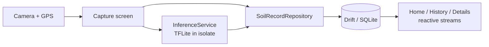

[](https://flutter.dev)
[](https://dart.dev)
[](https://github.com/LukeSantossz/visiosoil-app/actions)

# VisioSoil — Geolocated Soil Texture Analysis

> A cross-platform Flutter app that turns a phone photo of a soil sample into a georeferenced texture record, classified on-device — no connectivity required in the field.

---

## What It Does

VisioSoil lets agronomists and field technicians capture, classify, and catalog soil samples directly from a mobile device.

- **Guided field workflow** — a splash screen requests runtime permissions and a 3-step onboarding tutorial explains capture
- **Geolocated capture** — takes a photo and automatically records GPS coordinates and a reverse-geocoded address, stripping EXIF metadata at the storage boundary so the original location tags never persist
- **On-device classification path** — an isolate-based TensorFlow Lite pipeline labels the sample into one of 4 soil texture classes with a confidence score (shown as a graded confidence banner), fully offline. The inference code, retry handling and UI are complete, but **no trained model artifact ships with this repository**, so classification currently returns no result and records save without a texture class (see Known Issues)
- **Local catalog** — every sample is persisted to a local database with grid history, texture filters, address search, multi-select, batch delete, and a zoomable full-screen viewer
- **Privacy-preserving share** — a record can be shared as text plus photo; precise coordinates are omitted unless the user opts in on that specific share
- **Account** — optional Google sign-in, with the session held in secure storage, groundwork for the sync layer

## What It Is

VisioSoil is a **cross-platform mobile app** (Android + iOS) that produces a persistent, georeferenced record of each soil sample together with its predicted texture class. It targets fieldwork where connectivity is unreliable: capture, inference, and storage all happen on the device, so an agronomist can survey a plot end-to-end without a network.

## Tech Stack

| Layer | Technology |
| --- | --- |
| Language | Dart 3.12.1 (pinned to match CI; `pubspec.yaml` requires `^3.12.0`) |
| Framework / Runtime | Flutter 3.44.1, pinned to match CI (Android + iOS) |
| State management | Riverpod (`flutter_riverpod`) |
| Navigation | GoRouter |
| Data layer | Drift + SQLite (`sqlite3_flutter_libs`) |
| On-device inference | TensorFlow Lite (`tflite_flutter`), isolate-based |
| Model training | TensorFlow / Keras — MobileNetV2 transfer learning (in `ml/`) |
| Device I/O | `image_picker` (camera), `geolocator` + `geocoding` (GPS), `share_plus` |
| Auth | `google_sign_in`, session persisted via `flutter_secure_storage` |
| Connectivity / network | `connectivity_plus`, `http` (research agent proxy) |
| Testing / CI | `flutter_test`, GitHub Actions |

## Architecture


```mermaid
flowchart LR
    Cam[Camera + GPS] --> Cap[Capture screen]
    Cap --> Inf[InferenceService\nTFLite in isolate]
    Cap --> Repo[SoilRecordRepository]
    Inf --> Repo
    Repo --> DB[(Drift / SQLite)]
    DB --> UI[Home / History / Details\nreactive streams]
```

### Database schema (v4)

Three tables: `soil_records`, `sync_queue` (the outbox `SyncEngine` drains) and `management_tips` (a read-through cache).

`soil_records` holds `id` (PK auto), `uuid` (unique index), `remote_id?`, `sync_status` (default `pending`), `image_path`, `latitude?`, `longitude?`, `address?`, `timestamp`, `updated_at`, `deleted` (default `false`), `texture_class?` and `confidence_score?`.

Migrations are cumulative: **v1→v2** adds the classification columns; **v2→v3** adds the sync metadata, creates `sync_queue`, backfills `uuid`/`updated_at` per row, normalizes legacy timestamps to UTC and enqueues an `upsert` per legacy record; **v3→v4** creates `management_tips`.

Deletes are soft: a tombstone sets `deleted` and enqueues a sync operation instead of removing the row, and every read excludes tombstoned rows.

The UI talks only to Riverpod providers, which depend on an abstract `SoilRecordRepository` — never on Drift types directly. TFLite inference runs in a separate Dart isolate to keep the UI thread free; model bytes are loaded from assets and passed into the isolate because `rootBundle` is unavailable there. The model itself is produced by a separate training pipeline under `ml/`, which is decoupled from the app and integrates through a `.tflite` artifact copied into `assets/models/`. The pipeline also emits a `spec.json` describing the labels and normalization, but the app does not read it yet — that contract is currently honored by hand on the Dart side.

## Engineering Decisions

| Decision | Alternative considered | Why this approach |
| --- | --- | --- |
| Repository pattern abstracting Drift | UI queries Drift directly | UI imports only the interface, so the persistence backend (local DB, remote API, cache) can be swapped without touching screens |
| TFLite inference in a separate isolate | Run inference on the main thread | Classification never blocks the UI; model bytes are passed as `Uint8List` since `rootBundle` cannot be used inside an isolate |
| Training pipeline isolated in `ml/` (TF/Keras) | Train or fine-tune inside the Flutter app | Keeps the mobile codebase free of Python/ML weight. The intended integration contract is `spec.json`, but the app does not read it yet — the `.tflite` artifact is currently the only real interface |
| Drift + SQLite with schema versioning | Hive / raw `sqflite` | Typed queries, reactive `watchAll()` streams that auto-refresh history, and explicit migrations (currently schema v4) |
| Image files stored outside the cache, repository-owned lifecycle ([ADR 0002](docs/adr/0002-image-file-storage-and-lifecycle.md)) | Keep the `image_picker` cache path in the DB | The picker's cache path is transient, so a stored record could outlive its photo; the repository copies into durable storage before the row is written |
| Image file deleted at tombstone time, repository-owned ([ADR 0003](docs/adr/0003-image-file-deletion-and-write-exclusivity.md)) | Delete inside the DB transaction, or defer to a tombstone purge | DB stays the source of truth; a best-effort delete after commit never aborts the tombstone, and no purge step exists to defer to |
| Flutter toolchain version has a single source of truth ([ADR 0004](docs/adr/0004-flutter-toolchain-version-single-source.md)) | Let each contributor use any Flutter 3.x | Another 3.x SDK silently rewrites `pubspec.lock`, and a local/CI mismatch hid a widget-finder failure that only surfaced on CI |
| EXIF stripped at the image-storage boundary ([ADR 0005](docs/adr/0005-strip-exif-at-image-storage-boundary.md)) | Ask `image_picker` for reduced metadata at the capture site | The capture-site flag is ignored for Android camera captures, so GPS survived on the primary platform; the orientation tag is deliberately kept, since both display and inference apply it |
| Android OS backup disabled ([ADR 0006](docs/adr/0006-disable-android-os-backup.md)) | Rely on `allowBackup="false"` alone | That flag does not govern Android 12+ device-to-device transfer, so the cleartext database and photos still left the device; `dataExtractionRules` closes both paths |
| Share omits location by default, opt-in per share ([ADR 0007](docs/adr/0007-share-location-opt-in.md)) | Coarsen coordinates to ~1 km, or omit location entirely | Preserves the legitimate use of sending a colleague the sample's location while defaulting to non-disclosure of a client's field coordinates |
| Research agent is advisory and web-grounded ([ADR 0001](docs/adr/0001-research-agent-advisory-web-grounded.md)) | Ship canned agronomic guidance, or omit tips entirely | Soil management advice is regional and changes; grounding each tip in a citable source keeps it useful without the app appearing to prescribe |
| Local JSON for experiment tracking | MLflow / Weights & Biases | Disproportionate overhead for the project size; each model version emits `metrics.json` + `config.json` under `ml/models/vN/` |
| TFLite stays the only on-device inference runtime ([ADR 0008](docs/adr/0008-tflite-remains-the-mobile-inference-runtime.md)) | Core ML on iOS alongside TFLite on Android; ONNX Runtime Mobile; ExecuTorch | A second runtime doubles the export path, the parity gate and the failure surface, and none of the alternatives solves a problem this project has measured |
| Target isolation is a fixed ROI plus a heuristic quality gate ([ADR 0009](docs/adr/0009-fixed-roi-and-heuristic-quality-gate-over-segmentation.md)) | Classical segmentation; a MobileNet-backbone segmentation model; a detector feeding the classifier | The capture protocol is enforced rather than compensated for. Detection is deferred rather than discarded — it is what would recover a real millimetres-per-pixel scale from the coin the protocol already asks for |
| Synthetic image generation is deferred behind a measured gap ([ADR 0010](docs/adr/0010-synthetic-image-generation-deferred-behind-a-measured-gap.md)) | cGAN conditioned on the class and a VAE for minority-class oversampling, both rejected; diffusion img2img at low strength, deferred rather than rejected | Collection, corrected augmentation and compositing come first, and generation only if an ablation proves a downstream gain on a real-only test set. If field collection stalls, this is the record to revisit |
| Classification uncertainty is a four-state verdict from the margin and the mass ([ADR 0011](docs/adr/0011-classification-verdict-from-margin-and-mass.md)) | A top-1 confidence percentage; Shannon entropy of the distribution | With four classes a single number cannot separate "one class, confidently" from "two classes, tied"; the app abstains when it can assert nothing and names two candidates when two hold the mass |
| The released model artifact and its `spec.json` are tracked in git ([ADR 0012](docs/adr/0012-released-model-artifact-tracked-in-git.md)) — **decided, not yet in effect**: `.gitignore` still excludes both paths, and the entries go with SPEC 0035 | A GitHub Release plus a CI download step; Git LFS; a model registry | A clone at any commit builds an APK whose behaviour that commit fully determines, which is what makes a regression bisectable. Experiment outputs under `ml/models/` stay ignored |
| Model monitoring is local-first ([ADR 0013](docs/adr/0013-local-first-model-monitoring.md)) | Server-side monitoring with sampled image upload | Aggregates stay on the device and no image, coordinate or record is transmitted; the field data is a client's, and there is no backend to receive it |
| A classification reports an outcome and a named cause, never an absent value ([ADR 0015](docs/adr/0015-classification-reports-a-named-failure-cause.md)) | Keep returning `null` and add a separate failure getter; throw a typed exception per failure | One `null` reported a model that was never shipped and a run that timed out alike, so the interface could not tell "nothing to retry" from "retry is exactly right"; a second getter would be a separate read of mutable state with a classification in flight between them |
| Dataset is the laboratory's sample archive photographed on a fixed rig, carrying the class name and no granulometry ([ADR 0014](docs/adr/0014-petri-dish-capture-protocol-and-the-unresolved-scale-reference.md)) — **Retired**, superseded by ADR 0016 | Run a field collection campaign; link the laboratory reports into the pipeline | Described a collection that turned out to have already happened, under an arrangement differing on every axis it fixed. Its granulometry exclusion, its bench-to-field limitation and its Siltosa policy survive in ADR 0016; its rig, conditions, counts and scale-constancy claims are withdrawn |
| Dataset is the archive already photographed in Petri dishes, and Siltosa is out of the first model ([ADR 0016](docs/adr/0016-dataset-is-the-existing-dish-archive-and-siltosa-is-out-of-v1.md)) | Treat the delivered images as pre-training only and wait for a rig collection; re-photograph all 194 samples first; run five classes anyway | 194 samples exist with the laboratory number in the filename and the dish rim giving scale per image, so the go/no-go gate moves from a schedule item to this week. Siltosa holds three samples, which is the arithmetic minimum for a split and not a measurement, so the first model classifies four groups and the app says so |
| Scale is read from an object of known size by a classical operator ([ADR 0017](docs/adr/0017-scale-is-read-by-a-classical-operator-on-a-known-circle.md)) | A printed fiducial marker; a coin; a physical spacer; the phone estimating its own distance; assuming a typical distance | Particle size in an image is meaningless without scale, and both sides now measure it — the dish rim in the dataset, the A4 sheet in the app. A photograph without a readable reference is refused rather than analysed at a guessed scale, because a guess fails silently and confidently |
| The model sees greyscale patches of a fixed physical size, and their disagreement is a quality signal ([ADR 0018](docs/adr/0018-model-sees-fixed-size-greyscale-patches-and-their-spread-is-a-quality-signal.md)) | One centred square over the whole disc; a single zoomed patch; majority vote; the most confident patch; a learned aggregator | A 224-pixel view of a 90 mm disc is coarser than the photograph itself. Patches measured in millimetres cover the same soil on every camera, and because they are not independent they are not an ensemble — so their spread measures how evenly the sample was spread, not how sure the model is, and it is reported as a criterion the user can act on |
| A dataset version is a build product and nothing under it is versioned ([ADR 0019](docs/adr/0019-a-dataset-version-is-a-build-product-and-nothing-under-it-is-versioned.md)) | Keep committing manifest.csv; commit a reduced inventory of counts and digests; keep it and move the directory off the synchronised folder | Ingestion is deterministic, so a version is a function of the archive and the code rather than a human judgement worth preserving. The price is stated rather than discovered: CI can no longer re-check the archive's inventory, and a clone holds no archive, so the reproducibility argument covers the transformation and not its input |
| Evaluation is repeated stratified group k-fold with nested selection, and uncertainty is never the spread across folds ([ADR 0020](docs/adr/0020-evaluation-is-repeated-group-k-fold-with-nested-selection.md)) | Keep the single seeded train/val/test split with an interval; leave-one-group-out; k = 10; report the standard error across folds; un-nested selection; let group B into the test sides | Twelve test groups cannot carry an interval, so every eligible group is tested once per repeat, every selection is nested and audited, the sample group is the unit of every interval and paired contrast, and the minimum detectable effect is a recorded output. The price is 25 refits per deep-learning arm on CPU and an MDE the protocol can only make visible, not small |

## Getting Started

### Prerequisites

- Flutter 3.44.1 (Dart 3.12.1) — pinned to match CI (`.github/workflows/ci.yml`); a different 3.x SDK will rewrite `pubspec.lock`
- Android Studio with an emulator, or a connected device
- Xcode (for iOS builds)

### Installation

```bash
git clone --recurse-submodules https://github.com/LukeSantossz/visiosoil-app.git
cd visiosoil-app
# On a clone made without --recurse-submodules:
# git submodule update --init

flutter pub get
# Generate Drift adapters (required after changes to DB tables / models)
dart run build_runner build --delete-conflicting-outputs

# Wire the commit-msg and pre-push gates, and report what has no route.
# Needs `mf` on PATH; see .standards/README.md for the install command.
bash scripts/setup.sh
```

`.standards/` is the development-standards harness, vendored as a submodule. The
gates read the corpus it supplies; a clone without it has no standards to check
against. Both hooks fail closed, so `mf` missing from `PATH` refuses the next
commit rather than passing it.

### Running

```bash
# Run on a connected emulator or device
flutter run

# Static analysis
flutter analyze
```

### Tests

```bash
flutter test
```

### Release Signing (Android)

No keystore is configured in this repository today, so `flutter build apk --release`
falls back to the debug key (with a warning) and contributors and CI still build —
but the resulting APK is not distributable. To produce a genuinely release-signed APK:

1. Generate a keystore (store it and its passwords safely and back them up —
   losing the key means you can no longer update a published app):

   ```bash
   keytool -genkey -v -keystore visiosoil-release.jks \
     -keyalg RSA -keysize 2048 -validity 10000 -alias visiosoil
   ```

2. Create `android/key.properties` (already git-ignored) with:

   ```properties
   storePassword=<store password>
   keyPassword=<key password>
   keyAlias=visiosoil
   storeFile=C:/Users/you/visiosoil-release.jks
   ```

   `key.properties` is a Java properties file, so a backslash is an escape
   character. On Windows, write `storeFile` with forward slashes
   (`C:/Users/...`) or doubled backslashes (`C:\\Users\\...`); a plain
   `C:\Users\...` will not resolve.

3. Build and verify the signing certificate:

   ```bash
   flutter build apk --release
   apksigner verify --print-certs build/app/outputs/flutter-apk/app-release.apk
   ```

Never commit the keystore or `key.properties`.

## Project Structure

```
visiosoil-app/
├── lib/
│   ├── main.dart            # Entry: ProviderScope + MaterialApp.router
│   ├── core/
│   │   ├── theme/           # AppTheme, AppColors, AppTypography, AppSpacing,
│   │   │                    #   SoilTextureColors
│   │   ├── routes/          # GoRouter config (7 routes + errorBuilder)
│   │   ├── constants/       # Centralized pt-BR UI strings
│   │   ├── widgets/         # VisioAppBar, VisioButton, EmptyState, ErrorState,
│   │   │                    #   LoadingIndicator, PermissionDeniedView, RouteErrorView
│   │   ├── utils/           # LocationService (GPS + geocoding), formatters
│   │   ├── services/        # InferenceService (TFLite, isolate), ImageStorageService,
│   │   │   │                #   ShareService, ConnectivityService, PermissionService,
│   │   │   │                #   SyncEngine
│   │   │   ├── auth/        # AuthService + Google implementation, secure credential store
│   │   │   └── research/    # ResearchService + HTTP proxy, management tips controller
│   │   ├── database/        # Drift DB class + tables/ + generated code + row mapper
│   │   ├── data/
│   │   │   ├── repositories/# Interfaces + Drift impls (soil records, management tips)
│   │   │   └── sync/        # RemoteSyncBackend contract, local store, sync operations
│   │   └── features/        # Screens: splash, onboarding, main, home, capture,
│   │                        #          history, details, preview, settings
│   ├── models/              # SoilRecord, ConfidenceLevel, HomeStats, ManagementTipsResult
│   └── providers/           # 11 files declaring 22 Riverpod providers (database, repository,
│                            #   inference, image, auth, connectivity, share, research,
│                            #   management tips, image storage, history filter/derived stats)
├── ml/                      # TF/Keras training pipeline (MobileNetV2 → TFLite)
├── assets/models/           # Destination for the trained .tflite (artifact is git-ignored)
├── docs/                    # specs/ (durable SPEC archive), adr/, architecture/
└── test/                    # Unit, widget and repository tests (in-memory SQLite)
```

## Project Status

**Status: in development.** The most recent tag is `v2.0.0` (2026-05-03); `main` has advanced well beyond it, so the tag does not describe the state below. ADRs 0002–0007, the EXIF strip, the Android backup hardening and the share opt-in all landed after it.

### Done

- [x] Material 3 theme, Riverpod state management, GoRouter navigation (7 routes)
- [x] Splash screen with runtime permission requests via `PermissionService`
- [x] 3-step onboarding capture tutorial
- [x] Bottom navigation shell (`MainScreen`) with home and history tabs
- [x] Camera capture with real GPS (`geolocator` + `geocoding` via `LocationService`)
- [x] Image preview after capture and zoomable full-screen viewer
- [x] History grid with texture filters, address search, multi-select, and batch delete
- [x] Details screen with graded confidence banner, classification display, and delete action
- [x] Settings screen (app version, re-run onboarding, data wipe, account tile)
- [x] Persistence on Drift + SQLite via `SoilRecordRepository` (schema v4, soft deletes)
- [x] On-device TFLite inference path into 4 soil texture classes, running in an isolate with retry and timeout handling — awaiting a trained model artifact to become functional
- [x] EXIF metadata stripped at the image-storage boundary, orientation deliberately preserved
- [x] Android hardened for release: OS backup and device-transfer disabled, guarded by a config test
- [x] Share with per-share location opt-in, falling back to text-only when the photo is unusable
- [x] Optional Google sign-in with the session in secure storage
- [x] Management tips foundation: UI section, controller, `management_tips` cache table and `ResearchService` seam
- [x] Sync foundation: uuid, `updated_at`, tombstones, `sync_queue` outbox, `SyncEngine`, backend contract
- [x] Repository, widget, migration and repository-policy tests with `NativeDatabase.memory()` — 436 Dart tests plus 234 Python tests under `ml/tests/`. Three Dart tests are skipped on a feature branch: an icon-generation test gated on `GENERATE_ICONS`, and the two spec-numbering contiguity guards, which run on `main` only
- [x] CI pipeline of six jobs — `analyze`, `test` and `ml-tests` in parallel, then `build` (release APK) and `build-ios` (unsigned), then `smoke` booting the minified APK on an emulator — with the Flutter toolchain pinned in each of the four jobs that use it
- [x] ML training pipeline implemented under `ml/` (MobileNetV2 transfer learning, 2-phase training)

### Pending

- [ ] Train and deploy the production model, then export and ship the `.tflite` to `assets/models/`
- [x] Ingest the delivered archive as a dataset version — 221 photographs of 194 samples are ingested as `v1` ([SPEC 0040](docs/specs/0040-ingest-the-delivered-archive-as-dataset-version-v1.md)), and the collection premise the protocol described is withdrawn ([SPEC 0041](docs/specs/0041-close-the-collection-premise-in-the-records.md)). The images stay git-ignored; the manifest is committed
- [ ] Track the artifacts a training run would produce — no checkpoint or metrics file is versioned, so no published run is reproducible from this repository
- [x] Add a contract test asserting the label list agrees across the two languages — `test/standards/class_list_test.dart` reads the `classes:` block of `ml/config.yaml` and compares it to `SoilTextureLabels.ordered` ([SPEC 0048](docs/specs/0048-correct-the-records-that-still-say-five-classes.md)). The Python fixtures that still carry a literal carry the *archive's* five, which is a different list and is tied to `src.manifest.ARCHIVE_CLASSES` by `test_manifest.py`
- [ ] Add an asset-existence test so a missing model cannot pass a green suite, and produce a genuinely release-signed APK in CI
- [ ] Load labels, input size, and normalization from `spec.json` at runtime instead of hardcoding them in `InferenceService` — specified in [SPEC 0035](docs/specs/0035-spec-json-runtime-contract.md), not yet implemented
- [ ] Implement a concrete `RemoteSyncBackend` and wire `SyncEngine` into the provider graph
- [ ] Wire `ProxyResearchService` and per-user auth so management tips actually resolve

## Known Issues & Limitations

- **No model artifact ships with the repo** — `assets/models/` contains only `.gitkeep` and `assets/models/*.tflite` is git-ignored, so classification does not work until a trained model is supplied by the pipeline.
- **Labels and preprocessing are hardcoded in `InferenceService`** — `spec.json` is generated into `ml/models/<version>/` and copied into `assets/models/` by the deploy script, but it is git-ignored there and never read at runtime, so a pipeline change requires a matching manual edit on the Dart side. [SPEC 0035](docs/specs/0035-spec-json-runtime-contract.md) specifies the fix. Within Dart the list has one declaration, a test asserting the colour map covers it, and — since [SPEC 0048](docs/specs/0048-correct-the-records-that-still-say-five-classes.md) — a test asserting it against `ml/config.yaml`, so the two languages can no longer drift apart.
- **Release builds are debug-signed** — `android/key.properties` is git-ignored and absent, so `flutter build apk --release` falls back to the debug key with a warning, and CI has no keystore step. The APK it uploads is therefore not distributable through Play. The signing procedure below is the path to fixing that, not a description of the current state.
- **iOS is compiled but not signed** — the `build-ios` CI job runs `flutter build ios --release --no-codesign` on every change, so a platform-config break fails the pipeline; there is still no `Podfile` and no `DEVELOPMENT_TEAM`, so no distributable iOS build is produced.
- **Camera-only capture** — gallery selection is intentionally not supported.
- **Sync is not usable yet** — the foundation is implemented, but no concrete backend exists and `SyncEngine` is not wired into the provider graph, so all data remains device-local.
- **Management tips always report unavailable** — `researchServiceProvider` returns `UnavailableResearchService` until the proxy and per-user auth wiring lands, so the UI, cache table and `ProxyResearchService` exist but no tip is ever fetched.
- **`drift_flutter` pinned to `>=0.2.0 <0.2.4`** — do not bump without verifying compatibility.

## Contributing

Branch from `main` (`type/short-description`), keep `flutter analyze` and `flutter test` green, use single-line Conventional Commits (`type(scope): subject`), and open a PR with type and complexity labels.

Run `bash scripts/setup.sh` once per clone; it is what wires the gates. Then per
change of any substance: a spec under `docs/specs/NNNN-<slug>.md` before the
code — a typo or a one-line fix needs none — then `mf author declare` once per
branch, and `mf check` before pushing — the same gates the
hooks run. The binding standards are in `.standards/docs/standards/`, and
`CLAUDE.md` and `AGENTS.md` are generated from them plus this repository's own
sections in `docs/agents/project.md`; edit that file, never the generated ones.

## License

[MIT](LICENSE)
