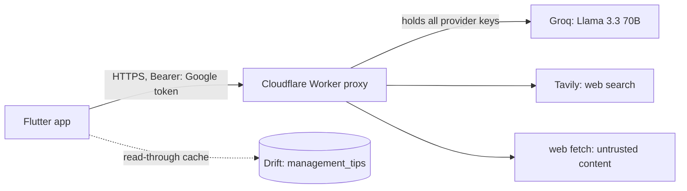
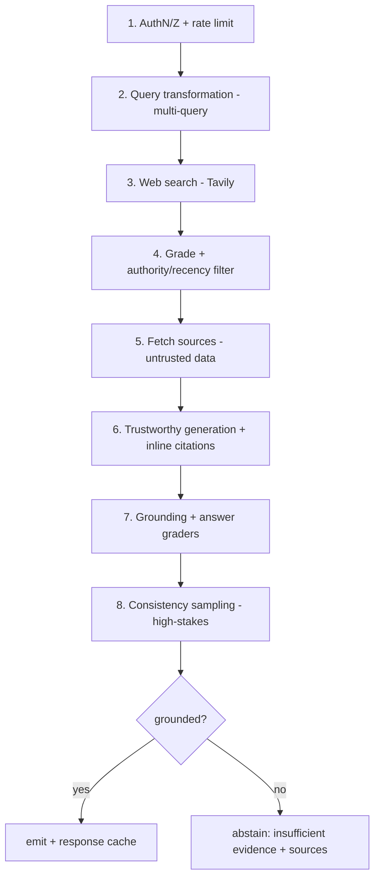

# Research Agent — Architecture

Status: **modelled, not yet implemented**. This document is the design reference for the Research Agent feature. The direction and the headline decisions are recorded in [ADR 0001](../adr/0001-research-agent-advisory-web-grounded.md); this document expands them into a buildable model. No `lib/` code ships with this document; the delivery slices at the end are the implementation plan.

## 1. Purpose

Turn a Soil Record's **texture class + location** (GPS, address, timestamp) into **cited, advisory Management Tips** ("dicas de manejo"). Tips inform and cite sources; they never prescribe a field action (see `CONTEXT.md` — Advisory vs Prescription).

## 2. Topology



The **app↔proxy HTTP contract is the stable boundary**. Everything behind it — the model, the search provider — is swappable without touching the app. No provider credentials ever live in the mobile client (consistent with today: there is no `apiKey`/`baseUrl` anywhere in `lib/`).

## 3. Agent pipeline (proxy-internal)

A **bounded corrective-RAG chain**, not an autonomous ReAct agent. The task shape is fixed, so the proxy controls the loop with a hard iteration cap; the model never decides when to stop. Each step cites the `llm-wiki` page that justifies it.



1. **AuthN/Z** — verify the Google token (audience = OAuth Web client), identify the user, enforce per-user rate limit/quota.
2. **Query transformation** — from {texture, region/address, GPS, date} synthesize agronomic search queries; **multi-query** (several diverse queries) + rewrite into source vocabulary. Thin inputs won't match source wording — the documented trigger for query rewriting (`transformacao-queries.md`, `tema-rag-decisao.md`).
3. **Web search** — Tavily over the queries; collect candidate sources.
4. **Grade + metadata filter** — binary-relevance document grader + **authority/recency filter** preferring extension services / agricultural departments / recent material (`padroes-rag-avancados.md` P10). Off-topic and low-authority hits are dropped before generation.
5. **Fetch sources** (bounded count) — **all fetched content is untrusted DATA**: delimited and labelled as untrusted, instructions found inside are never executed (indirect prompt injection, OWASP **LLM01** — `prompt-injection.md`, `seguranca-agentes.md`). Tools are limited to search + fetch (least privilege, **LLM08**).
6. **Trustworthy generation** — the LLM (via a `LLMClient` DI interface) generates advisory tips answering **only** from retrieved context, with inline citations `[n]` (`padroes-rag-avancados.md` P11). **Assembled-reformat** for numeric facts: pH ranges, application rates, etc. are pulled verbatim from a source and the model only rewords them — it never originates a figure (`salvaguardas-llm.md` P30). Advisory persona, never prescriptive; the disclaimer is part of the output schema.
7. **Grounding + answer graders** — LLM-as-judge at temperature 0 verifies each claim is supported by a cited source and that the tips actually address the sample (`rag-auto-corretivo.md`, `padroes-confiabilidade-llm.md` P17).
8. **Consistency sampling (robust tier)** — for low-confidence / high-stakes output, generate N times and cluster by meaning (**discrete semantic entropy**, which works on black-box hosted models without token probabilities — `entropia-semantica.md`, `salvaguardas-llm.md` P31). Keep the majority; used sparingly because of the N× cost.
9. **Abstain-or-emit** — if ungrounded or evidence is insufficient, return an **abstention** result ("evidência insuficiente — veja o que encontramos" + the sources) rather than fabricate (**LLM09** Overreliance).
10. **Response cache** at the proxy (keyed by texture + region) to conserve free-tier quota; the app caches per record independently (§6).

> Why not the alternatives: a single-shot pipeline is under-engineered (plausible-but-ungrounded tips); a free-roaming ReAct agent is over-engineered and risky on a free model — non-convergent loops, unbounded call cost, confident-but-empty reasoning (`react.md`, `arquiteturas-cognitivas.md`). The bounded chain is the medium-risk tier for an advisory, customer-facing feature (`arquiteturas-risco-genai.md`).

## 4. App↔proxy contract

```
POST /v1/management-tips
Authorization: Bearer <Google token>
X-App-Version: <semver>

{ "recordUuid": "...", "textureClass": "Argilosa",
  "latitude": -23.5, "longitude": -46.6, "address": "...", "locale": "pt-BR" }
```

Response (`200`):

```json
{
  "status": "grounded",            // or "abstained"
  "tips": [{ "text": "...", "citations": [0, 2] }],
  "sources": [{ "title": "...", "url": "...", "publisher": "...", "date": "2025-..." }],
  "disclaimer": "Orientação advisory; valide com análise de solo local.",
  "model": "groq:llama-3.3-70b",
  "retrievedAt": "2026-06-23T..."
}
```

Errors: `401` unauthenticated · `429` rate-limited · `503` upstream (Groq/Tavily) unavailable. The app treats any non-200 as recoverable: show cached tips if present, otherwise an error/offline state.

## 5. App-side seams (mirror existing patterns)

| Concern | New element | Mirror of |
|---|---|---|
| Service seam | `abstract ResearchService` + `ProxyResearchService` | `lib/core/services/auth/auth_service.dart`, `google_auth_service.dart` |
| Transport | `abstract HttpTransport` over `package:http` (transitive 1.6.0 today) | `google_sign_in_gateway.dart` (plugin wrap), `key_value_secure_storage.dart` |
| Config | base URL via `String.fromEnvironment('RESEARCH_PROXY_BASE_URL')`, injected into the provider | none today — new pattern |
| Auth | inject `AuthService`, call `accessToken()` for the bearer | `google_auth_service.dart:52` — `accessToken()` has **no consumer today**; this is its first |
| Resilience | `.timeout(...)`, bounded retries, return a typed result (never throw into UI) | `lib/core/services/inference_service.dart` (timeouts, retries, `ModelAssetLoader` injection) |
| Domain | `ManagementTip`, `ManagementTipsResult` with hand-written `toJson`/`fromJson` | `lib/core/services/auth/auth_session.dart` (house-style JSON, no codegen) |

Service shape: `Future<ManagementTipsResult> fetchTips(SoilRecord record)`. Fakes implement the abstract seams (house style — no `mockito`/`mocktail`), as in `test/services/google_auth_service_test.dart` and `test/services/sync_engine_test.dart`.

## 6. Persistence / cache

- New Drift table **`management_tips`** keyed by the record's **`uuid`** (the stable cross-device identity from `SoilRecords.uuid`), storing the graded/cited result + source URLs + `retrievedAt`. Schema **v3 → v4**; the migration is a single `migrator.createTable(managementTips)` (no backfill — a brand-new table). Add the table to the `@DriftDatabase(tables: [...])` array and bump `schemaVersion` in `lib/core/database/app_database.dart`; regenerate with `dart run build_runner build`.
- **Read-through cache, NOT the sync outbox.** Tips are server-derived, read-only, with no local mutations and no last-write-wins conflict, so they must not enqueue into `sync_queue` / `SyncEngine` (`lib/core/data/sync/*`, which exist for user-authored records). Keying by `uuid` lets cached tips persist the same way records do across devices/reinstalls.
- `abstract ManagementTipsRepository` + Drift impl, mirroring `lib/core/data/repositories/soil_record_repository.dart` and `drift_soil_record_repository.dart` (injectable `clock` for deterministic tests). Drift types never leak past the repository.
- Providers (mirroring `lib/providers/soil_record_repository_provider.dart`):
  - `researchServiceProvider` (`Provider<ResearchService>`, overridable in tests),
  - `managementTipsRepositoryProvider`,
  - `managementTipsProvider = FutureProvider.family<ManagementTipsResult?, int>((ref, recordId) {...})` — read cache → if empty **and** online (`connectivityStatusProvider`) fetch via the service, cache, and return → if offline with empty cache, surface an offline-empty state.

## 7. UI

- `_ManagementTipsSection(record)` on the **Details** screen (`lib/core/features/details/details.dart`), inserted between `_InfoSection` and `_ActionButtons` on the existing `AppSpacing.xl` rhythm.
- States: loading (`LoadingIndicator`), empty/offline (`EmptyState`), error (`error_state.dart`); data = tip cards (mirror `_InfoTile`) + citation chips (`AppRadius.borderRadiusPill`) + a **mandatory advisory disclaimer banner** (mirror `_LowConfidenceBanner`, `AppColors.warningContainer`).
- "Gerar / atualizar dicas" action via `VisioButton(isLoading:)`.
- pt-BR copy written inline at the widget; use the glossary term **"dicas de manejo"** and avoid "recomendação" (`CONTEXT.md`).

## 8. Cross-cutting concerns

- **Security** — zero-trust toward both the LLM and web content (`seguranca-llm.md`): treat the model as a potentially adversarial component, never trust inputs or outputs. Sanitize/encode output before Flutter render, no executable links (**LLM02**). Secrets stay server-side only.
- **Swappability** — `LLMClient` + `SearchClient` DI interfaces in the proxy (`padroes-confiabilidade-llm.md` P19): Groq/Tavily now, Claude/other later without changing the app↔proxy contract. Small-open-model-first is endorsed for scoped tool-use (`small-language-models.md`, `src-slm-future-agentic-ai.md`); on-device Ollama is a documented future escape hatch (`ollama.md`).
- **Evaluation (proxy repo)** — an offline eval set (texture + location → expected tip themes / must-cite source types), scored for groundedness/faithfulness via LLM-as-judge plus tool recall/precision (`avaliacao-agentes.md`, `metricas-avaliacao-llm.md`). Shadow-test before any model swap; gate the eval in the proxy's CI.
- **Privacy** — GPS/location leaves the device to reach the proxy; call this out in a privacy note and keep the on-device path as the privacy escape hatch.
- **Offline-first** — the cached cited result makes a record's tips available offline; an explicit offline-empty state covers a record never fetched while online.

## 9. Delivery slices (for `/to-issues` later — not built now)

1. Proxy skeleton on Cloudflare Workers: `/v1/management-tips`, Google-token verification, `LLMClient`/`SearchClient` DI, the contract + error codes.
2. Pipeline core: query-transform → Tavily → grade/filter → trustworthy generation with citations.
3. Guardrails: grounding/answer graders + abstention + consistency sampling + untrusted-content handling.
4. Proxy eval harness + CI gate (groundedness set, shadow testing).
5. App: `ResearchService` + `HttpTransport` + config + domain models (with fakes/tests).
6. App: `management_tips` table (v4 migration) + repository + providers (with in-memory Drift tests).
7. App: Details `_ManagementTipsSection` UI + states + disclaimer + pt-BR copy.
8. Wire `accessToken()` as the bearer; offline cache-first behaviour end-to-end.

Each slice is a vertical, independently reviewable change behind its own SPEC gate. Slices 1–4 land in the proxy repo; 5–8 in this app repo.
