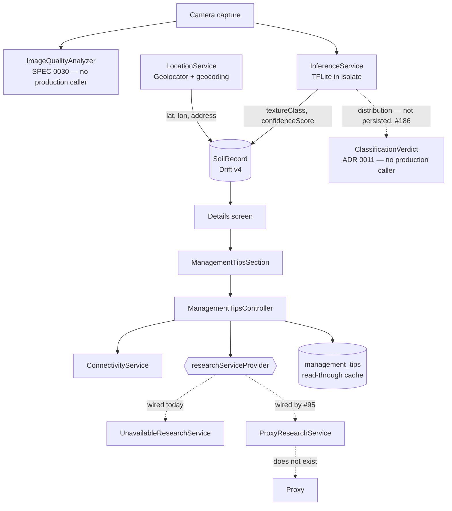
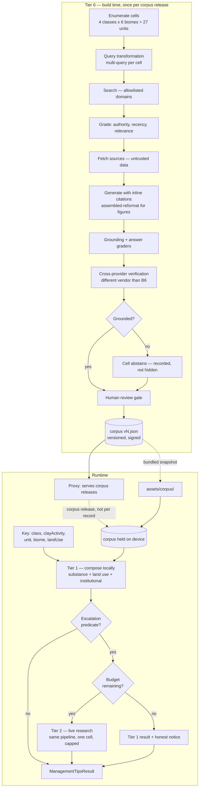

# Research Agent — Architecture

Status: **design reference — pre-SPEC, not an implementation authorization.** The
headline decisions are recorded in
[ADR 0022](../adr/0022-research-agent-precompiles-a-reviewed-corpus-and-escalates-under-a-cap.md),
which supersedes [ADR 0001](../adr/0001-research-agent-advisory-web-grounded.md).
No `lib/` code and no proxy code ships with this document. Every delivery slice
(§15) passes its own Spec Gate (`.standards/docs/standards/spec_method.md`)
before any code is written.

Prices, rate limits and deprecation dates in this document were checked against
primary sources in September 2026 and are dated where they appear. Token counts
attributed to a pipeline are **this document's estimates**, not measurements;
slice 1 of §15 exists to replace them with measured values before any budget is
committed.

## 1. Diagnosis of the current state

### 1.1 What exists

The app-side half of ADR 0001 is implemented and tested.

| Element | File | State |
|---|---|---|
| Service seam | `lib/core/services/research/research_service.dart` | Abstract `ResearchService`, sealed `ResearchResult`, seven-member `ResearchFailureKind` |
| Proxy client | `lib/core/services/research/proxy_research_service.dart` | 20 s timeout, 3 attempts, 400 ms backoff, typed failures, never throws into UI |
| Transport | `lib/core/services/research/http_transport.dart` | Fakeable seam over `package:http` |
| Orchestration | `lib/core/services/research/management_tips_controller.dart` | Validates record, checks connectivity, calls service, persists on success |
| Domain | `lib/models/management_tips_result.dart` | `ManagementTipsResult`, `ManagementTip`, `TipSource`, hand-written JSON |
| Cache | `lib/core/database/tables/management_tips_table.dart` | Drift table, schema v4, keyed by record `uuid` |
| Repository | `lib/core/data/repositories/management_tips_repository.dart` | Abstract + Drift implementation |
| UI | `lib/core/features/details/management_tips_section.dart` | Cache-first, citation chips, sources list, mandatory disclaimer, offline and error states |
| Tests | 7 files under `test/` | Service, controller, repository, providers, models, widget |

### 1.2 What does not exist

- **The proxy.** No repository, no deployment, nothing on this machine. The
  entire agent side of ADR 0001 was never built.
- **The binding.** `researchServiceProvider` returns
  `UnavailableResearchService`, so the feature reports `upstreamUnavailable` on
  every call and no tip has ever been fetched.
- **Backend-verifiable auth.** The Google gateway captures only `accessToken`;
  no `idToken`, no `serverClientId` (issue #95).

### 1.3 What was found wrong

Three falsifications of ADR 0001, recorded in full in ADR 0022 §Context: the
named model was shut down for free and developer tiers on 2026-08-16; the
ten-step per-request pipeline admits roughly four to seven requests per day
against the published free daily token ceiling; and it does not complete inside
the 20-second timeout the already-built client applies.

Two defects in the current implementation, independent of those:

- **Precise coordinates leave the device.** `ProxyResearchService` sends
  `record.latitude` and `record.longitude` verbatim. ADR 0007 requires location
  to be opt-in for sharing; no equivalent gate exists for this egress. §6 does not
  gate or coarsen the field — the per-record request that carried it ceases to
  exist.
- **The cache has no invalidation.** `management_tips` rows carry `retrievedAt`
  but nothing reads it to decide staleness, so a cached tip is served
  indefinitely. §13 gives it a corpus version to compare against.

### 1.4 The 2026-09-11 agronomic review, and what it is worth

Several decisions in this document cite an expert agronomic review taken on
2026-09-11. Its standing needs to be stated plainly, because it is easy to
over-credit.

It was produced by a language model prompted to act as a Brazilian soil
scientist, asked adversarially — told that an honest negative verdict was worth
more than encouragement — and forbidden to search, so the answer came from the
model rather than from compilation. **It is not an agronomist.** It does not
satisfy, reduce or substitute for the human review that §12.3 makes the release
gate, and the reviewer named in §17.1 is still unidentified.

What it is worth was calibrated rather than assumed. Three of its checkable
factual claims were verified against primary sources, and all three held,
including an exact numeric threshold:

| Claim | Verification |
|---|---|
| EMATER-PR became IDR-Paraná | Correct — Lei 20.121/2019, Iapar-Emater merger |
| Bahia's EBDA was extinguished | Correct — 2015 administrative reform, replaced by Bahiater |
| SiBCS divides Ta from Tb at 27 cmolc/kg of clay | Correct and exact, per Embrapa |

Its verdict was **(b) — useful only with a specific change**, with the note that
on the design exactly as specified it would have voted (c). What it changed is
recorded where each decision lives: the substance key (§5.1), the land-use axis
(§5.3), the editorial rules (§12.3), the soil-map dependency (§8.4), and the
naming question raised to the UI/UX terminal (§18.2).

## 2. Map of existing integrations


```mermaid
flowchart TD
    CAM[Camera capture] --> IQ[ImageQualityAnalyzer<br/>SPEC 0030 — no production caller]
    CAM --> IS[InferenceService<br/>TFLite in isolate]
    IS -->|textureClass, confidenceScore| REC[(SoilRecord<br/>Drift v4)]
    IS -.->|distribution — not persisted, #186| CV[ClassificationVerdict<br/>ADR 0011 — no production caller]
    GPS[LocationService<br/>Geolocator + geocoding] -->|lat, lon, address| REC
    REC --> DET[Details screen]
    DET --> MTS[ManagementTipsSection]
    MTS --> MTC[ManagementTipsController]
    MTC --> CONN[ConnectivityService]
    MTC --> RS{{researchServiceProvider}}
    RS -.->|wired today| UNAV[UnavailableResearchService]
    RS -.->|wired by #95| PRS[ProxyResearchService]
    MTC --> MTR[(management_tips<br/>read-through cache)]
    PRS -.->|does not exist| PROXY[Proxy]
```

Three seams are load-bearing for this design and already exist: the
`ResearchService` abstraction, the `management_tips` read-through cache keyed by
record `uuid`, and `ConnectivityService`. Nothing in §5 requires a new seam in
the app beyond a region resolver.

### 2.1 Where the classification result travels

`InferenceService` produces a class and a score. Only those two reach
`SoilRecord`. The distribution, the verdict, the quality report and the model
version are computed or computable but never persisted, so any consumer reading
a record from history sees a top-1 and nothing else.

Two consequences run through the rest of this document. It is the binding
constraint on §6, which cannot ask for fields the record does not hold. And it is
why a record reopened from history cannot be known to be ambiguous: the
composition in §5.4 renders one cell where it should render two, until issue #186
persists the distribution.

## 3. Use case catalogue

Thirteen candidates, drawn from the brief and from the integration map. The
verdict column is the outcome of asking whether the case needs *open-ended,
model-driven* behaviour, or whether a fixed rule over a precomputed artifact
serves it.

| # | Use case | Input | Output | Agentic? | Verdict |
|---|---|---|---|---|---|
| 1 | Management guidance for a classified record | class, region | Cited tips | At build time only | **v1 — Tier 1** |
| 2 | Explain what the texture class means | class | Static explainer | No — compiled copy | **v1 — compiled, no agent** |
| 3 | Why these tips and not others | corpus cell provenance | Source list + build date | No — read the artifact | **v1 — Tier 1** |
| 4 | Free-text question about this record | question, class, region | Cited answer | **Yes** | **v1 — Tier 2** |
| 5 | Guidance when the verdict is ambiguous | two candidate classes, region | Both cells, side by side | **No** — two Tier 1 lookups | **v1 — Tier 1 composition** |
| 6 | Conflict between classification and regional soil data | class, region soil prior | Named discrepancy | **Yes** | v1 contract, dormant (no model) |
| 7 | Region outside the corpus | class, region | Honest unavailability, or live research | **Yes** | **v1 — Tier 2** |
| 8 | Next steps after a result | verdict, record state | Primary action | No — `compose`, UX terminal | Out of scope here |
| 9 | Ask the user for more context | — | Refinement question | No — a fixed question set per class | Deferred — no consumer |
| 10 | Personalise by management context | land use | Which constraint dominates | No — an overlay layer | **v1 — land use only**; crop and season stay deferred |
| 11 | Refresh stale guidance | corpus version | New corpus | No — a release | **v1 — corpus release** |
| 12 | Compare two records | two records | Comparison | Yes | Deferred — no demand evidence |
| 13 | Low-confidence alternatives | distribution | Alternative classes | No — that is the verdict | Out of scope — ADR 0011 owns it |

### 3.1 The cases that genuinely justify an agent

Three, and they share one property: the input space is unbounded, so no
enumeration can precompute the answer.

- **#4, free-text question.** The user writes arbitrary text. Nothing else in
  this design has that property.
- **#6, contradiction.** Naming *how* a regional soil prior disagrees with the
  photograph's classification is specific to the coordinate.
- **#7, corpus miss.** By construction there is no cell to read.

**#5 was a fourth and is no longer.** An ambiguous verdict looks like it needs
synthesis, and the first draft of this document treated it that way. It does not:
the two candidate classes each already have a reviewed cell, and rendering both
is honest about a distribution that settled nothing. Synthesising them would
assert a combined reading no source supports, which is the failure mode the whole
design exists to avoid. The enumerable fallback — six class pairs per clay-activity family —
remains costed in §15.1 and unbuilt.

### 3.2 The non-agentic alternatives, stated

For every case marked "No" above, the alternative is named rather than implied:
compiled pt-BR copy for #2 and #9; reading the artifact's own provenance for #3;
the UX terminal's pure `compose` function for #8; a corpus release for #11; and
`ClassificationVerdict.fromDistribution` for #13, which already exists and is
tested.

### 3.3 What is eliminated

- **#10, crop and season personalisation.** The app collects neither. Designing
  for it now would be building an interface for data that does not exist.
- **#12, record comparison.** No evidence of demand, and it multiplies the
  surface.
- **#9, refinement questions.** Retained in the output contract (§7) as a field
  the agent may populate, because Tier 2 genuinely can ask one, but with no v1
  consumer beyond rendering it as text.

## 4. Architecture comparison

Five candidates. Costs assume the September 2026 prices in §15.1. The runtime
rows assume one request per capture; the build row assumes 44 artifacts.

| Criterion | A. Deterministic workflow | B. Runtime RAG | C. Tool-using agent | D. Precompiled corpus | E. **D + capped C** |
|---|---|---|---|---|---|
| Viable on zero budget | Yes | No (~7/day) | No (~4/day) | Yes | Yes for the main path |
| Marginal cost per request | 0 | ~$0.09 | ~$0.10+ | **0** | 0, except on escalation |
| Latency | ~1 s | 8–15 s | 22–30 s | **< 100 ms** | < 100 ms, or 10–20 s escalated |
| Fits the client's 20 s timeout | Yes | Borderline | **No** | Yes | Yes, with a Tier 2 budget |
| Runtime hallucination risk | None | Medium | Medium-high | **None** | Confined to Tier 2 |
| Injection reaches the user | n/a | Yes | Yes | **No** | Only via Tier 2 |
| Works offline | No | No | No | **Yes** | Tier 1 yes, Tier 2 no |
| Human review before publication | n/a | No | No | **Yes** | Tier 1 yes, Tier 2 no |
| Testability | High | Medium | Low | **High** — corpus is a fixture | High for Tier 1 |
| Observability | High | Medium | Low | **High** | High |
| Precise location leaves device | Yes | Yes | Yes | **No** | No |
| Answers an open question | No | Yes | Yes | **No** | **Yes** |
| Specificity beyond (class, region) | No | Yes | Yes | No | Only on escalation |
| Maintenance | Low | Medium | High | Medium — corpus releases | Medium-high |

**E is chosen.** D dominates on every operational axis but cannot answer an open
question, which is a real capability the product wants. Adding C behind a
deterministic gate and a spend cap buys that capability without paying for it on
every capture. A and B are dominated: A cannot cite sources, B costs per request
what D costs once.

## 5. Recommended architecture

Three tiers. Tier 0 runs offline and produces an artifact; Tier 1 reads it; Tier
2 is reached only through fixed predicates.

Tiers 0 and 1 are **Template Generation**, pattern 29 of the safeguards catalogue
in `salvaguardas-llm.md` (see §9): generate offline, have a human review, fill
deterministically at runtime. Its preconditions are a finite set of combinations
and a high cost of inappropriate content, and both hold here. Naming the pattern
matters for a reason beyond attribution — its known limits are this design's
limits, and §16 inherits them rather than rediscovering them.


```mermaid
flowchart TD
    subgraph T0["Tier 0 — build time, once per corpus release"]
        direction TB
        B1[Enumerate cells<br/>4 classes x 6 biomes + 27 units] --> B2[Query transformation<br/>multi-query per cell]
        B2 --> B3[Search — allowlisted domains]
        B3 --> B4[Grade: authority, recency, relevance]
        B4 --> B5[Fetch sources — untrusted data]
        B5 --> B6[Generate with inline citations<br/>assembled-reformat for figures]
        B6 --> B7[Grounding + answer graders]
        B7 --> B8[Cross-provider verification<br/>different vendor than B6]
        B8 --> B9{Grounded?}
        B9 -->|no| B10[Cell abstains — recorded, not hidden]
        B9 -->|yes| B11[Human review gate]
        B10 --> B11
        B11 --> ART[(corpus vN.json<br/>versioned, signed)]
    end

    ART --> CDN[Proxy: serves corpus releases]
    ART -.->|bundled snapshot| ASSET[assets/corpus/]

    subgraph RT["Runtime"]
        direction TB
        REQ[Key: class, clayActivity,<br/>unit, biome, landUse] --> T1[Tier 1 — compose locally<br/>substance + land use + institutional]
        CDN -.->|corpus release, not per record| HELD[(corpus held on device)]
        ASSET --> HELD
        HELD --> T1
        T1 --> P{Escalation<br/>predicate?}
        P -->|no| OUT[ManagementTipsResult]
        P -->|yes| CAP{Budget<br/>remaining?}
        CAP -->|no| DEG[Tier 1 result + honest notice]
        CAP -->|yes| T2[Tier 2 — live research<br/>same pipeline, one cell, capped]
        T2 --> OUT
        DEG --> OUT
    end
```

### 5.1 The corpus

The substance layer is keyed by **clay activity**, not by biome. An expert
agronomic review on 2026-09-11 found biome to be a lossy proxy for the variable
that actually decides what a texture class means — weathering degree and clay
mineralogy — and that it fails hardest in the two most populous biomes. The
review's reasoning and the evidence checked against it are summarised in ADR
0022.

| Layer | Cells | Key | Content |
|---|---|---|---|
| Substance | 12 | `(class, clayActivity)` | The guidance, citations, evidence strength, limitations |
| Land use | 5 | `(landUse)` | What the dominant constraint becomes under that use |
| Institutional | 27 + 6 | `(unit)`, `(biome)` | State agency and extension service; the regional Embrapa unit |

**44 artifacts to review**, against 51 under the biome key. Re-keying halves the
substance layer, and that saving is what pays for the land-use axis.

The clay-activity families are three:

| Value | Meaning |
|---|---|
| `tb_oxidic` | Deeply weathered, low-activity clay — CEC of the clay fraction below 27 cmolc/kg (SiBCS Tb) |
| `intermediate` | Between the two |
| `ta_less_weathered` | Less weathered, high-activity clay (SiBCS Ta) |

The 27 federative units are ISO 3166-2:BR codes. The six IBGE biomes —
`amazonia`, `cerrado`, `mata_atlantica`, `caatinga`, `pampa`, `pantanal` — remain
in the model, moved to the institutional layer, because Embrapa's decentralised
units are themselves biome-shaped.

The five land-use values are `native_vegetation`, `pasture`, `annual_crop`,
`perennial_or_forest`, `exposed_or_degraded`.

**Coverage is Brazil only.** Every table here is Brazilian, as are the source
tiers in §8. A coordinate outside Brazil is a `corpusMiss` and is told so plainly.
Extending coverage later is additive and nothing in the key forecloses it.

### 5.2 Resolving the key on device

Everything except land use is derived from data the app already holds, and all of
it is resolved **on the device**. Resolving server-side would require sending the
coordinate, which is the egress §6 exists to remove.

| Key part | Source |
|---|---|
| `textureClass` | The classifier |
| `clayActivity` | Packed grid, sampled from the soil map at build time |
| `biome` | Packed grid |
| `unit` | The address the app already reverse-geocodes |
| `landUse` | The user, one tap |

The two grids are a 0.1° lattice over Brazil's bounding box, one byte per cell
each, roughly 130 KB apiece. Lookup is an array index from latitude and
longitude — constant time, no parsing, no dependency.

Their error is confined to transition bands and to the generalisation already
present in the source maps. That is accepted: a soil map at national scale gives a
distribution over map-unit associations rather than a soil class, which is exactly
why the guidance derived from it is advisory and says so. Each grid records its
resolution and its source map in the artifact, so refinement is a data change
rather than a code change.

**Any key part may be null, and none of them is fatal.** A null `clayActivity`
falls back to the biome-derived default and the response says the substance layer
is generic. A null `unit` drops the institutional overlay. A null `landUse` — the
user declined to answer — drops that overlay. §6 defines each as a valid request.

### 5.3 Land use is the one thing the user is asked

The same review identified current land use at the sampling point as the single
cheapest input that materially raises usefulness. It is the cheapest observable
proxy for management history, whose absence is the largest hole in what this
feature knows; the user is standing there looking at it, so it needs no expertise
and no equipment; it stays advisory, where crop would pull straight toward rates
and critical levels; and the Brazilian source literature is already segmented
along it, so cells can be filled from existing reviews rather than synthesised.

It changes which constraint dominates in a way texture alone cannot express. On
the same clayey Cerrado soil: under degraded pasture the binding issues are
compaction, low organic matter and absent correction history; under fifteen years
of no-till they are nutrient stratification, subsurface acidity and the traffic
window; under native vegetation they are the conversion decision and the up-front
phosphorus fixation cost.

**Assumption, cheap to reverse:** land use is asked at tips-generation time and
travels in the request, rather than being captured with the photograph and
persisted on `SoilRecord`. Persisting it is scientifically tidier — it is a
property of the sample, not of the query — but it would change the capture flow,
which the UI/UX terminal is actively redesigning, and add a column to a shared
table. Moving it to capture later is a migration plus a request-field change, both
small. Asking it at generation time is the v1 answer.

### 5.4 Escalation predicates

All are cheap, total functions over data the app already holds. None is a model
call.

| Predicate | Fires when | Dormant until |
|---|---|---|
| `userQuestion` | The user submitted free text | A text input exists on the result surface — see §18.2 |
| `regionalContradiction` | Corpus soil prior for the cell disagrees with the class | A `.tflite` artifact exists |
| `corpusMiss` | No cell for `(class, biome)` | — |

**An ambiguous verdict does not escalate.** When two classes hold the mass, the
app performs two Tier 1 lookups and renders both cells. That is free, offline,
already reviewed, and it needs no contract change — the request carries one
class, so two candidates are two requests, both cached. It does not synthesise
("what to do while you are unsure between these two"), and the interface must
present it as two readings rather than as one answer. If that proves inadequate,
the fallback is 36 precomputed pair cells, costed in §15.1 and not built.

`notAnalysed` never escalates. ADR 0011 and ADR 0015 forbid offering retry on it
until SPEC 0035 lands, and researching a classification that never ran would be
exactly that offer in another form.

### 5.5 What the proxy is, and what it is not

**The proxy is not on the Tier 1 request path.** The app holds the corpus and
composes locally, always — online and offline take the same code path. Two
implementations of the composition rule, one in the proxy and one in the app,
would have to agree forever; one implementation cannot disagree with itself.

The proxy therefore does two things:

| Job | Shape |
|---|---|
| Serve corpus releases | `GET /v1/corpus/latest`, `GET /v1/corpus/{version}` |
| Own Tier 2 | `POST /v1/record-inquiry`, with credentials and the spend cap |

Both fit the 10 ms CPU limit of the Cloudflare Workers free plan (100,000
requests/day, 50 subrequests/request, as of September 2026); serving a static
document is what that plan is best at.

The bundled snapshot is the corpus the app starts with. A downloaded release
supersedes it by version, and the bundled copy remains the floor a fresh install
cannot fall below.

## 6. Input contract

Tier 1 has no network request, so it has no HTTP input contract. What it has is a
**composition input**, assembled entirely on the device.

### 6.1 Tier 1 — the composition input

```jsonc
{
  "textureClass": "Argilosa",          // required — from SoilTextureLabels.ordered
  "classListVersion": "v1-four-class", // required — guards ADR 0022's orphaning
  "clayActivity": "tb_oxidic",         // required, nullable — the substance key
  "unit": "BR-SP",                     // nullable — ISO 3166-2:BR, institutional overlay
  "biome": "cerrado",                  // nullable — selects the Embrapa unit
  "landUse": "pasture",                // nullable — the user may decline
  "locale": "pt-BR"                    // defaults to pt-BR
}
```

**Nothing in this object leaves the device.** That is the strongest form of the
privacy property this design set out to reach: not coarse location instead of
precise location, but **no per-record egress at all**. The defect recorded in
§1.3 — `ProxyResearchService` sending `record.latitude` and `record.longitude`
verbatim — is not gated or coarsened; the request that carried it ceases to
exist.

Every key part may be null and none is fatal. A null `clayActivity` falls back to
the biome default and the result says the substance is generic; a null `unit`
drops the institutional overlay; a null `landUse` drops that overlay. Each absence
is reported in `coverage`, never hidden.

### 6.2 Corpus fetch — `GET /v1/corpus/latest`

Carries no record data. The only client-identifying header is the bearer, and its
purpose is rate limiting rather than personalisation: every caller at a given
version receives a byte-identical document.

```
Authorization: Bearer <token>
X-App-Version: <semver>
If-None-Match: "<etag of the held corpus>"
```

A `304` means the held corpus is current. A `200` carries the new document and its
version. A failure is not an error state for the user: the app keeps composing
from what it holds, which is at worst the bundled snapshot.

### 6.3 Tier 2 — `POST /v1/record-inquiry`

The only per-record request the design makes, and the only one that carries
anything about a sample.

```jsonc
{
  "trigger": "userQuestion",           // required — one of the three predicates
  "question": "…",                      // required iff userQuestion; max 500 chars
  "textureClass": "Argilosa",           // required
  "clayActivity": "tb_oxidic",          // nullable
  "unit": "BR-SP",                      // nullable
  "biome": "cerrado",                   // nullable
  "landUse": "pasture",                 // nullable
  "priorFractions": {                   // required iff regionalContradiction
    "clay": 0.52, "sand": 0.31, "silt": 0.17
  },
  "corpusVersion": "2026.09.1",         // what the client composed from
  "locale": "pt-BR"
}
```

No `recordUuid`. Tier 2 is a question about a *sample's properties*, not about a
stored record, and the proxy has no reason to be able to correlate two questions
to the same record.

### 6.4 Field policy

| Policy | Fields |
|---|---|
| **Required** | Tier 2 only: `trigger`, `textureClass`, plus the per-trigger fields |
| **Optional** | `clayActivity`, `unit`, `biome`, `landUse`, `corpusVersion`, `locale` |
| **Forbidden** | `latitude`, `longitude`, `address`, any image or thumbnail, EXIF of any kind, device identifiers, the user's name or e-mail, `recordUuid`, any other record's data |

The forbidden list is enforced rather than documented: the Tier 2 endpoint
rejects a request carrying any of those keys with `400`, so a client regression
that reintroduces coordinates fails loudly instead of leaking quietly.

### 6.5 The composition rule

Composition is a pure function from the §6.1 input and a corpus to a
`ManagementTipsResult`. It is **the one piece of logic that must be identical
wherever it runs**, so it is specified here rather than left to an
implementation, and it is covered by a golden fixture the way the image-quality
criteria already are (`test/fixtures/image_quality/golden.json`, implemented in
both Dart and Python).

**Layer order is fixed**: substance, then land use, then institutional. Tips
appear in that order and are never interleaved, so two records with the same key
always read identically.

**Source arrays are concatenated in layer order, and citations are re-indexed.**
This is the part that is easy to get wrong. Each layer stores its own `sources`
array and its tips cite by index into *that* array. On composition:

1. Start with an empty output `sources` list.
2. For each layer in order, append its sources to the output list, recording the
   offset at which that layer's sources began.
3. For each tip in that layer, rewrite every citation index `i` as `i + offset`.

A citation that does not resolve within its own layer before re-indexing is a
corpus defect and fails the build (§12.1), so composition may assume resolvable
input and is not a validation step.

**Duplicate sources are not merged.** If two layers cite the same URL it appears
twice, with two indices. Merging would mean re-indexing across layers and
introduces a second place where an index can be wrong, to save a repeated line in
a source list. Honesty about which layer used which source is worth more than the
tidiness.

**Derived fields:**

| Field | Rule |
|---|---|
| `status` | `grounded` if any layer contributed a tip; `insufficient_evidence` if none did; `abstained` if the substance layer abstained explicitly |
| `disclaimer` | The substance layer's, always non-empty |
| `corpusVersion` | The corpus document's version |
| `retrievedAt` | When the corpus was fetched, not when it was composed |
| `limitations` | Concatenated across layers, de-duplicated by exact string |
| `alerts` | Concatenated, plus any staleness alert the app adds |
| `coverage` | Records which layers were present and whether the substance is generic |

**The empty composition is valid.** A key that matches no substance cell composes
to `insufficient_evidence` with an empty tips list and a non-empty disclaimer —
never to an exception, and never to an empty screen.

## 7. Output contract

The result keeps the shape `ManagementTipsResult.fromJson` already parses and
adds **nine** fields. It is produced by local composition (§6.5) rather than
received from a server, but the type, the cache, the repository and the UI are
unchanged by that — which is what the `ResearchService` seam was for. Tier 2
returns the same shape over HTTP.

The added fields: `category` and `evidenceStrength` on a tip, `accessedAt` and
`tier` on a source, and `corpusVersion`, `limitations`, `alerts`,
`followUpQuestions` and `coverage` at the top level.

**Additive has two directions here, and the second is easy to miss.** Over the
wire it means an old client ignores what it does not know and a new client
tolerates absence. But the Drift cache stores the serialised payload
(`payloadJson`) and reads it back through the *same* `fromJson`, so **every row
cached before this change is parsed by the new reader**. If any new field is read
as required, every existing cache entry fails to parse — and because the Details
section has an error branch, it degrades quietly: the user simply loses the
offline tips they had. The local cache is the same compatibility boundary as the
transport, and every field added here is read null-safely with a defined default
for that reason.

```jsonc
{
  "status": "grounded",                // grounded | abstained | insufficient_evidence
  "tips": [
    {
      "text": "…",
      "citations": [0, 2],
      "category": "water",             // NEW — water | crops | preparation | other
      "evidenceStrength": "strong"     // NEW — strong | moderate | limited | inferred
    }
  ],
  "sources": [
    {
      "title": "…",
      "url": "https://…",
      "publisher": "Embrapa",
      "date": "2025-03-11",
      "accessedAt": "2026-09-10T…",    // NEW — when the build fetched it
      "tier": 1                         // NEW — source policy tier, §8
    }
  ],
  "disclaimer": "…",                   // required, never empty
  "model": "…",
  "retrievedAt": "2026-09-10T…",
  "corpusVersion": "2026.09.1",        // NEW
  "limitations": ["…"],                // NEW — what this guidance cannot tell you
  "alerts": [],                         // NEW — conflicts, staleness, regional gaps
  "followUpQuestions": [],              // NEW — what the agent would need to narrow it
  "coverage": {                         // NEW — which layers answered
    "clayActivity": "tb_oxidic",        // null when the grid could not resolve it
    "substanceIsGeneric": false,        // true when clayActivity was null
    "unit": "BR-SP",
    "unitLayerPresent": true,
    "biome": "cerrado",
    "landUse": "pasture",
    "landUseLayerPresent": true
  }
}
```

Errors keep the codes the client already maps: `401` unauthenticated, `429`
rate-limited or cap exhausted, `503` upstream unavailable. Two states are
carried in a `200` rather than an error, because they are answers and not
failures: `abstained` (the agent found sources but would not assert) and
`insufficient_evidence` (no source met the policy). The Details section already
renders abstention as informational rather than as an error, and the UX
terminal's `abstention_is_not_an_error` criterion requires exactly that.

### 7.1 Two cross-terminal conflicts, resolved here

**The recommendation contract divergence.** `docs/design/ux-2026/05-design-system.md`
§5 records three options and marks the choice as jointly owned. This document
takes option 1: `ManagementTip` gains an optional `category` from the closed
enumeration `{water, crops, preparation, other}`. The app groups by category when
present and renders a flat list when absent, so the design system's sectioned
screen becomes renderable without the app inventing the grouping. Option 3 —
grouping by keyword in the app — stays rejected for the reason that record gives:
it would attribute structure the agent never asserted.

**Suggested components.** The brief for this work asked the output to carry
"componentes sugeridos para apresentação na interface". That is refused, and the
refusal is not a preference. `docs/design/ux-2026/10-genui-strategy.md` §4.1
invariant 7 states that generated content occupies slots and never selects them,
and that no field of any agent response is an input to `compose`. A
component-name field would be exactly such an input. The output instead carries
*semantic* facts — `status`, `evidenceStrength`, `coverage`, whether `alerts` or
`followUpQuestions` are non-empty — and the app's own composition function maps
those to components. The UX terminal keeps sole authority over layout.

## 8. Source policy

### 8.1 Tiers

| Tier | Admits | Examples |
|---|---|---|
| 1 | Brazilian federal research and extension, official statistics | Embrapa, IBGE, MAPA, ANA |
| 2 | State extension services and state agencies | Emater, IAC, Epagri, IAPAR |
| 3 | Universities and peer-reviewed literature | USP/ESALQ, UFV, UFRGS; SciELO; indexed journals |
| 4 | International institutional bodies | FAO, ISRIC, USDA-NRCS |
| 5 | Recognised technical publications, used only to corroborate | Sector press with named authorship |

A tip must cite at least one tier 1–3 source. Tier 4 may support but not carry a
claim on its own. Tier 5 may only corroborate a claim already carried by a lower
tier. A cell that cannot reach that bar emits `insufficient_evidence` rather
than a weaker tip.

Domains are an explicit allowlist passed to the search tool, so the constraint
is enforced by the platform rather than by a post-filter over whatever the web
returned.

### 8.2 Evidence strength

| Value | Meaning |
|---|---|
| `strong` | Multiple tier 1–3 sources agree, and at least one is current |
| `moderate` | One tier 1–3 source, uncontradicted |
| `limited` | Sources agree but are dated, narrow, or from an adjacent region |
| `inferred` | The system reasoned from a cited fact; the inference is labelled as the system's |

`inferred` is the honest label for what would otherwise be a silent leap. It is
never applied to a numeric figure: figures are copied from a source verbatim and
only reworded, never originated.

### 8.3 Recency

Agronomic guidance ages slowly, so recency is a grading input rather than a hard
filter. A source older than ten years may still carry a claim if it is tier 1–3
and nothing newer contradicts it, and the age is surfaced in `limitations`.

### 8.4 Structured sources

Two structured sources are read at **build time** and baked into the corpus
rather than called at runtime.

- **Embrapa** — AgroAPI/SmartSolos Expert (SiBCS classification), BD Solos, and
  the Plataforma Saúde do Solo, which carries texture among its indicators.
- **ISRIC SoilGrids** — clay, sand and silt fractions by coordinate, CC-BY 4.0.
  The point API is not dependable: probed on 2026-09-05 it returned `200` with
  null values and then `503` on consecutive requests, at 2.8–5.6 s. The
  downloadable coverage is used instead, sampled per biome and unit at build
  time.

The sampled fractions are what the `regionalContradiction` predicate compares a
classification against. Baking them removes a runtime dependency on a service
that is currently degraded.

- **The national soil map** — Embrapa/IBGE at 1:5,000,000 and the state surveys at
  1:250,000 — is what the clay-activity grid of §5.2 is sampled from. At those
  scales a coordinate yields a distribution over map-unit associations rather than
  a soil class, which is precisely why the guidance derived from it is advisory and
  says so. This is a **new load-bearing dependency** introduced by the 2026-09-11
  re-key, and §15.3 records that its availability and licence are unverified.

### 8.5 Conflicts between sources

A disagreement between two admissible sources is reported, never silently
resolved. The tip states that guidance differs, cites both, and the cell's
`evidenceStrength` drops to at most `moderate`. If the disagreement is material
and unresolved, the cell abstains.

## 9. `llm-wiki` strategy

The vault holds 507 pages, 424 of them `area: machine-learning`. Searching for
soil, agronomy or Embrapa content returns nine pages, every one about UAV remote
sensing. **It contains no agronomic domain knowledge.**

| Candidate role | Verdict |
|---|---|
| Primary internal source for tips | **No.** No domain content exists to serve it |
| RAG corpus for the build | **No.** Same reason |
| Reference repository for citations | **No.** Its own citations are to ML literature |
| Discovery mechanism for agronomic sources | **No** |
| Method authority for how this system is built | **Yes** — the only role it can hold |

Used as method authority it is genuinely load-bearing, and it was used that way
in this document:

| Page | What it supplied |
|---|---|
| `salvaguardas-llm.md` | **Pattern 29, Template Generation** — the architecture of §5, by name and with its preconditions; pattern 30, Assembled Reformat, for the rule in §8.2 that figures are copied and only reworded |
| `tema-rag-decisao.md` | The symptom-to-pattern decision tree, and the over-engineering signals that falsified ADR 0001's tier |
| `avaliacao-rag.md` | The metric vocabulary in §12, including the meta-evaluation showing no automatic judge reaches the human ceiling |
| `prompt-injection.md`, `seguranca-agentes.md`, `owasp-top-10-llm.md` | The threat taxonomy and control layering in §10 |
| `arquiteturas-risco-genai.md` | The risk tiering — which places this feature at medium, not high; see the note below |

**A correction this validation produced.** An earlier draft said the risk
framework assigns human review to output of this kind. It does not:
`arquiteturas-risco-genai.md` assigns human-in-the-loop to its **high**-risk tier
(medical, legal, financial, safety-critical), and ADR 0001 classified this feature
as **medium**. The classification stands. Pattern 29 is what makes review
affordable at a medium tier, so this design exceeds its tier rather than
satisfying it — a stronger claim than the one it replaces, and an accurate one.

**A second correction.** §10 maps corpus poisoning and impersonating sources to
LLM03. That entry is *Training Data Poisoning*, and a reviewed knowledge base is
not training data. The mapping is an extension by analogy, useful for locating
the control and not a literal classification; it is labelled as such in §10.

Two cautions the vault's own conventions impose. Its pages carry `updated` and
`status` frontmatter and are a lossy compilation of their sources, so a claim
taken from it is checked against the `sources:` it names before being relied on.
And it is explicitly read-only to external agents: this work never writes to it.

The pages cited in this document exist — all 25 were verified present on
2026-09-05 — but they are **not files in this repository** and the citations are
provenance, not resolvable links.

## 10. Security strategy

The controlling fact is that **nothing is generated while a user waits on the
Tier 1 path**. Every threat below that involves model or web content is
therefore confined to build time, where a human reads the output before it
ships, or to Tier 2, where it is capped and flagged.

| Threat | OWASP | Control | Where |
|---|---|---|---|
| Indirect prompt injection in fetched pages | LLM01 | Fetched content is delimited and labelled untrusted; instructions inside are never executed; a human reads every cell | Build |
| Malicious instructions reaching a user | LLM01 | Structurally impossible at Tier 1 — no generation, no fetch | Runtime |
| Fake or impersonating sources | LLM03* | Platform-enforced domain allowlist; tiering by institution | Build |
| Stale content | — | `accessedAt` per source; corpus version; staleness surfaced in `alerts` | Both |
| Corpus poisoning | LLM03* | The artifact is versioned and reviewed; a release is a reviewed diff, not a push | Build |
| Untrusted URLs rendered to the user | LLM02 | URLs are displayed as text, never as executable links; scheme allowlist at render | Runtime |
| Location leakage | — | Tier 1 makes no request at all; Tier 2's contract excludes coordinates and the proxy rejects them with `400` | Runtime |
| Personal data exposure | LLM06 | No image, no EXIF, no `recordUuid`, no identity beyond the bearer; nothing per-record leaves the device on Tier 1 | Runtime |
| Tool misuse | LLM08 | Build tools are search and fetch only; Tier 2 inherits the same two | Both |
| Runaway loops | — | Hard step cap per cell; a cell that does not converge abstains | Build |
| Unexpected cost | — | Per-cell, per-run and global caps; Tier 2 has a hard spend ceiling that fails closed | Both |
| Unsupported recommendation | LLM09 | Grounding grader, then cross-provider verification, then human review | Build |
| Fabricated citation | LLM09 | Every citation index is resolved against the fetched source set; an unresolvable index fails the cell | Build |
| Output outside the schema | — | Schema validation at the proxy boundary; the client already maps a malformed body to `malformedResponse` | Both |

\* LLM03 is *Training Data Poisoning*. A reviewed knowledge base is not training
data, so these two rows are an extension by analogy — the control they point at
is right, the classification is approximate. Every other code in the table is a
literal fit.

### 10.1 Tier 2's residual risk, stated

Tier 2 generates for a user in real time and therefore reintroduces injection
exposure, hallucination risk and variable cost. It is accepted because the
capability is real, and bounded by: the same allowlist; no tool beyond search
and fetch; a hard step and time cap; a spend cap that fails closed; schema
validation; and a response that is visibly marked as unreviewed, so the user can
tell reviewed corpus guidance from live output.

### 10.2 Refusal policy

The agent declines, at either tier, when the classification is `notAnalysed`;
when no admissible source is found; when admissible sources conflict materially
and unresolvably; when the question falls outside soil management; or when the
question asks for a prescription. `CONTEXT.md` fixes the advisory stance, and a
Prescription stays out of scope until the app collects crop, season and soil
chemistry.

## 11. Observability strategy

Build-time observability has a property worth naming: **there is no user in it.**
The inputs are a class and a region, so traces can go to a hosted tool with no
privacy question. That is not true of runtime, which is treated separately.

### 11.1 Build time

Full tracing of every cell: each query, each search, each fetched URL, each
grader verdict, each token count and cost, the model identifier and the prompt
version. The trace is the audit record for the human reviewer, and the artifact
references its trace identifier.

**Traces are local JSONL**, one file per build run, not a hosted tracer. This
follows the precedent the README already records for experiment tracking — local
JSON over MLflow or Weights & Biases, as disproportionate overhead for the
project's size — and the same reasoning holds here: 44 artifacts built a handful of
times does not justify hosted infrastructure or a third party in the loop. The
one capability a hosted tracer would add, replaying the corpus against a new
model, is reached by re-running a build that is cheap by construction.

Two constraints keep the choice reversible. The pipeline is written in plain code
against the `LLMClient` and `SearchClient` seams, so tracing is a decorator
rather than a framework. And a graph orchestration framework is **not** adopted,
because this pipeline is a bounded chain run 51 times and `tema-rag-decisao.md`
lists exactly that shape as an over-engineering signal.

The record that would overturn this is the human review proving impractical to
perform against raw JSONL. That is a measurable outcome of slice 4, not a
prediction, and the trace format is chosen so a hosted tracer could ingest it.

### 11.2 Runtime

| Metric | Tier | Why |
|---|---|---|
| Lookup hit rate by `(class, unit, biome)` | 1 | Reveals which cells matter and which were never worth building |
| `corpusMiss` rate | 1 | Drives the next corpus release's scope |
| Composition failures | 1 | A missing overlay is a build defect |
| Escalation rate by predicate | 2 | Tells whether Tier 2 is earning its cap |
| Cap exhaustion events | 2 | The budget signal |
| Tier 2 latency, cost, tool calls, failures per tool | 2 | Operational |
| Abstention and refusal rate | Both | Honesty signal — a rate of zero is suspicious |
| Tips shown without a disclaimer | Both | Must be zero; it is an invariant, not a metric |

Runtime telemetry carries no coordinate, no free-text question, and no record
identifier. The escalation counter records the predicate, not the question.

### 11.3 User feedback

A per-tip "this was useful / this was wrong" control, stored locally and
aggregated without content. A tip reported wrong above a threshold is flagged
for the next corpus review. This is the only mechanism that closes the loop from
field reality back to the corpus, and it costs nothing to run.

## 12. Evaluation plan

### 12.1 What is measured

Following `avaliacao-rag.md`, the targets are paired and the pairing is stated,
because a pipeline that measures only faithfulness can be perfectly faithful to
an irrelevant context.

| Target | Pair | Method |
|---|---|---|
| Retrieval relevance | retrieved sources against the cell query | Human spot-check on a sample |
| Source admissibility | retrieved sources against §8 tiers | Automatic — domain and tier are structural |
| Faithfulness | each claim against its cited source | Claim-level entailment, cross-provider |
| Citation resolvability | citation indices against the source list | Automatic — must be 100% |
| Answer relevance | guidance against the cell's question | Human review |
| Numeric fidelity | every figure against its source | Automatic extraction plus human check |

`avaliacao-rag.md` records that no automatic framework reaches the human
ceiling, and that the best measured correlation was 61.9 against a human
annotator's 70.1. Automatic scores therefore gate the *build*, and the human
review gates the *release*. Neither substitutes for the other.

### 12.2 Test scenarios

Each becomes a test, against fixtures, with no network:

normal cell; low-confidence classification; absent location; absent biome;
offline device; empty cache and offline; conflicting sources; sources older than
ten years; a fetched page containing an injection attempt; a classification the
regional prior contradicts; inconsistent metadata; `notAnalysed`; a partial tool
failure mid-build; a response violating the schema; a citation index out of
range; zero admissible results; corpus version older than the server's; a
`(class, biome)` pair with no cell; a unit overlay missing for a present biome
cell; Tier 2 cap exhausted mid-request.

### 12.3 The review checklist

Human review is the release gate, so "a human reviews it" is not a sufficient
specification. Review is **complete** — every cell is read — and each cell is
judged against a fixed list. A cell failing any item is rejected and rebuilt or
dropped; a rejected cell never ships in a weaker form.

| # | The reviewer confirms |
|---|---|
| 1 | The guidance is agronomically correct for this texture class in this biome |
| 2 | Each cited source actually supports the claim attached to it |
| 3 | Every number appears in a cited source, unchanged |
| 4 | Nothing prescribes a field action; the stance is advisory throughout (`CONTEXT.md`) |
| 5 | No claim rests on a source below the tier §8.1 requires |
| 6 | Nothing in the text originates from fetched page content acting as an instruction |
| 7 | The stated `evidenceStrength` matches what the sources actually support |
| 8 | The limitations are the real ones, not boilerplate |

Item 6 is what makes the reviewer the injection control, and it is the reason
review is complete rather than sampled: a sampled review defends nothing, because
an injected cell is exactly the one an attacker would want unsampled.

Three editorial rules bind the authors before the reviewer sees anything. All
three come from the 2026-09-11 agronomic review.

**Adjacent cells differ in degree, never in direction.** The classifier will
misread by one adjacent texture class routinely, so if `(Média, tb_oxidic)` and
`(Argilosa, tb_oxidic)` ever point a reader opposite ways, a single-class error
makes the app confidently wrong. Two adjacent cells that disagree in direction is
a defect in the pair, not in either cell.

**The silt caveat appears wherever silt is plausible.** Siltosa is absent from
the class list (ADR 0016), and silty soils behave unlike both their neighbours —
low aggregate stability, high crusting, the highest erodibility. The model will
sort them silently into Média or Argilosa. Every cell where Cambissolos or várzea
alluvium are plausible carries a one-line field test the reader can perform on the
spot: if the sample feels smooth or silky rather than gritty or sticky, the silt
fraction may dominate and the classification does not apply.

**The Média cell states its own width.** 15–35% clay is a wide bucket, and it is
where management decisions most diverge — a 16% soil and a 34% soil are different
farms, and the sandy edge of the class is among the country's live agronomic
problems. Saying so is honest and advisory-safe.

The reviewer's identity and competence are recorded with the release, so a corpus
reviewed by a non-specialist is labelled as one rather than presented as
equivalent.

### 12.4 The injection test is a fixture, not a live page

A page whose text instructs the model to ignore its instructions is stored as a
fixture and replayed. The assertion is that the produced cell contains no
content derived from the instruction and that the grader flags it.

## 13. Offline and degraded behaviour

**Tier 1 has no offline behaviour distinct from its online behaviour**, and that
is the point of composing locally. The app always holds a corpus — the bundled
snapshot at worst — so the same code path answers in both states. What
connectivity changes is whether the corpus can be *refreshed* and whether Tier 2
is reachable, never whether Tier 1 answers.

| Condition | Behaviour |
|---|---|
| Any connectivity, corpus held | Tier 1 composes locally and answers |
| Online, newer corpus available | Answers immediately from the held corpus; fetches the release in the background; the next composition uses it |
| Online, corpus fetch fails | Silent — the held corpus still answers. Never an error the user sees |
| Corpus older than its review horizon | Answers, with staleness in `alerts` |
| Offline, escalation predicate true | Tier 1 result plus a notice that deepening needs a connection |
| Online, cap exhausted | Tier 1 result plus a notice that the allowance is spent, not that the user should retry — the cap is one-time and does not reset (§15.2) |
| Key partly unresolved | Composes what it can; `coverage` names each absent layer |
| Key matches no substance cell | `insufficient_evidence`, empty tips, non-empty disclaimer — never an empty screen |

There is no "offline, nothing available" row any more. A fresh install with no
network composes from the bundled snapshot, which is the field case ADR 0001's
design could not serve at all.

The `management_tips` cache survives this change, but its justification does not.
It is no longer a performance cache — local composition is cheap enough to repeat.
It is an **audit record**: what this record was told, and from which corpus
version. That is a better reason than the one it was built for, and it is why
`corpusVersion` becomes a column (§19.2) rather than being dropped along with the
caching rationale.

## 14. GenUI integration

The UX terminal has decided adaptive composition over server-driven UI
(`10-genui-strategy.md`). This document does not reopen that, and its output
contract is built to respect it.

The agent supplies **presence and status**, never structure:

| `compose` input | Source | Not an input |
|---|---|---|
| Tips present / absent | `tips` non-empty | The tip text |
| Grounded / abstained / insufficient / failed / never generated | `status` plus the failure kind | The reasoning |
| Sources present | `sources` non-empty | Source titles |
| Alerts present | `alerts` non-empty | Alert text |
| Follow-up available | `followUpQuestions` non-empty | The questions |
| Regional coverage | `coverage.unitLayerPresent` | — |

That `10-genui-strategy.md` §2 identifies the tips signal as four values rather
than the two the type declares is satisfied here: `grounded` and `abstained` come
from `status`, `insufficient_evidence` is the third, a transport failure is the
`ResearchFailureKind` the client already carries, and "never generated" is an
empty cache. The composition layer reads the outcome, not `ManagementTipsStatus`
alone — which is what that section asks for.

## 15. Delivery plan

Slices 1–5 build the corpus and live in a new proxy repository. Slices 6–9 are
app changes in this repository. Each passes its own Spec Gate.

| # | Slice | Repo | Gate |
|---|---|---|---|
| 1 | **Calibration probe** — build one cell end to end; measure real token usage and cost, **and put that cell in front of an agronomist** | proxy | Measured cost per cell replaces §15.1's estimate, **and the cell is judged useful rather than obvious** |
| 2 | Cell enumeration, region tables, structured-source sampling (Embrapa, SoilGrids coverage) | proxy | 24 + 27 cells enumerated; priors sampled. **Three inputs are unverified — see §15.3** |
| 3 | Build pipeline: query transform, allowlisted search, grading, generation with citations, grounding graders | proxy | Injection fixture passes; citations 100% resolvable |
| 4 | Cross-provider verification pass and the human review gate | proxy | No cell reaches the artifact unreviewed |
| 5 | Corpus release endpoint (`GET /v1/corpus/…`), ETag, and the Tier 2 endpoint's forbidden-field rejection | proxy | A `304` on an unchanged version; `400` on any forbidden key at Tier 2 |
| 6 | App: site resolver and the composition rule (§19.3, §6.5) | app | Golden fixture passes; no per-record request exists at all |
| 7 | App: corpus fetch, version comparison, background refresh; **schema v4→v5** (§19.2) | app | A failed fetch is invisible to the user; a pre-v5 row still parses |
| 8 | App: bundled corpus snapshot and the grids (§19.4) | app | Fresh install with no network answers; all assets stay under 500 KB |
| 9 | App: `category` and `evidenceStrength` rendering; per-tip feedback (§19.1) | app | Design-system sections render; flat fallback holds; an unknown enum member does not throw |
| 10a | Tier 2 for `corpusMiss`: endpoint, cap, unreviewed marking | both | Cap fails closed; unreviewed output is visibly distinct; depends on nothing external |
| 10b | Tier 2 for `userQuestion`, once the free-text input exists | both | 500-character limit enforced; `regionalContradiction` stays dormant until a model ships |
| 11 | Auth: `idToken` capture and `serverClientId` (issue #95) | app | Proxy verifies by audience |

Slice 11 is unchanged from ADR 0001's slice 8 and still depends on the OAuth Web
client from #55. Slices 1–9 do not depend on it: until it lands, the proxy
introspects the access token the app already holds, exactly as ADR 0001's
two-phase bearer specified.

**Slice 10 ships enabled in v1**, by the Developer's decision on 2026-09-11. It
carries a dependency this document cannot satisfy: the `userQuestion` predicate
needs a free-text input on the result surface, which does not exist and belongs
to the UI/UX terminal (§18.2). Until that input ships, slice 10 serves only
`corpusMiss`, and `regionalContradiction` stays dormant until a `.tflite`
artifact exists.

**Slice 4 is blocked**, not merely unscheduled: the human reviewer is not
identified (§17). Slices 1 through 3 proceed without it, and the artifact cannot
be released until it lifts.

### 15.1 Budget

One-time allowance of $50 — **one time, not recurring**. September 2026 prices:
Batch API at 50% of standard, web search at $10 per 1,000 searches, web fetch at
no additional cost.

Committed:

| Item | Estimate |
|---|---|
| Slice 1 calibration probe, one cell | $1 |
| 12 substance cells via Batch | $6 |
| 5 land-use overlays via Batch | $1 |
| 27 unit overlays via Batch | $3 |
| Cross-provider verification, 44 artifacts | $5 |
| **Committed subtotal** | **$16** |

The remaining **$34 is not allocated**, by decision: slice 1 measures the real
cost per cell, and the split is chosen against that measurement rather than
against this document's estimate. The three candidate splits, recorded so the
decision is a choice between known options:

| Split | Tier 2 runway | Corpus reserve | Buys |
|---|---|---|---|
| Conservative | $8 (~80 questions) | $26 | Two full rebuilds of the substance layer |
| Runway-weighted | $20 (~200 questions) | $14 | Enough live questions to learn what users ask |
| Quality-weighted | $8 (~80 questions) | $14, plus $12 upgrading every layer to the frontier model | Better permanent text, short runway |

A fourth option exists and is not costed here: 18 precomputed class-pair cells —
six pairs across three clay-activity families — at roughly $4, the fallback named
in §5.4 if composing two cells proves inadequate for the ambiguous case.

**Slice 1 gates everything after it.** If measured cost per cell diverges from
the estimate by more than a factor of two, the whole plan is re-costed before
slice 2 begins.

### 15.2 What the budget does not cover

**The product is both an academic deliverable and a field product at the same
time** (Developer's decision, 2026-09-11). That is not a hedge, and it settles
what follows: the observability in §11 is a live loop rather than a proposal, and
the recurring costs below are a **requirement to be funded**, not a gap to be
tolerated.

Two commitments outlive the allowance, and both are named here rather than
discovered later.

**The rebuild cadence is twice a year** (Developer's decision, 2026-09-11),
aligned to the agricultural calendar. At roughly $14 a rebuild that is $28 a
year, against a reserve of at most $34 that Tier 2 also draws from. **The first
year is funded and the second is not.** Because the product is meant to be
operated, this is a funding requirement with a date: the second rebuild of year
two needs money that does not exist today. Without it the corpus stops being
rebuilt, and the guidance ages behind §13's staleness signal — which is then the
only thing standing between a user and advice nobody refreshed.

**Tier 2 on a one-time budget has a finite lifetime**, not a monthly quota. At
roughly $0.10 a question its runway is whatever the split allocates, and when the
cap is reached it fails closed permanently rather than resetting. The interface
must therefore treat cap exhaustion as a durable state, not a temporary one.

### 15.3 Unverified inputs to slice 2

Three assumptions this document relies on were reasoned about but not checked.
They are inputs to slice 2 and each is cheap to verify before it is depended on.

| Assumption | What was actually verified | What was not |
|---|---|---|
| ISRIC SoilGrids coverage is obtainable in bulk | That the point API is degraded — `200` with null values, then `503`, on 2026-09-05 | That the CC-BY coverage downloads at a workable size and resolution |
| IBGE biome boundaries exist in a rasterisable form | Nothing | The source, its licence, and whether the ~130 KB figure in §5.2 survives contact with it |
| **The national soil map is obtainable and rasterisable into three clay-activity families** | Nothing — this dependency is one day old, introduced by the 2026-09-11 re-key | Whether Embrapa/IBGE coverages are downloadable, under what licence, and whether map-unit associations collapse cleanly into three families. **The substance key rests on this**, so it is the first of the three to check |
| Cross-provider verification costs about $6 | The arithmetic, given small inputs | That a second vendor is reachable on this budget — it means a second account and credential, and it does not get the first vendor's batch discount |

None of the three changes the architecture. All three change slice 2's estimate,
and a wrong figure discovered during the build is worse than a cheap check before
it.

## 16. Risks and mitigations

| Risk | Mitigation |
|---|---|
| The class list changes and orphans cells | `classListVersion` in the artifact and the contract; keys derived from `SoilTextureLabels.ordered`; only changed classes need rebuilding |
| Token estimates are wrong | Slice 1 measures before slice 2 spends |
| **No reviewer is identified** | **Unmitigated, and it blocks slice 4.** Slices 1–3 proceed; no corpus is released until it lifts. This is the one risk with no fallback |
| Human review does not happen | It is the release gate, not a recommendation; no artifact without it |
| Reviewer lacks agronomic expertise | Would silently weaken the design's central guarantee. The reviewer's competence is recorded with the release, so a corpus reviewed by a non-specialist is labelled as one |
| The corpus goes stale | `accessedAt` per source, corpus version, staleness in `alerts`, rebuild twice a year |
| **The cadence outlives the budget** | Twice-yearly rebuilds cost ~$28/year against a reserve of at most $29. Year one is funded; year two needs recurring budget that does not exist. §15.2 states it rather than letting it surface as a stalled release |
| **Tier 2's runway is exhausted permanently** | A one-time allowance is not a monthly quota. The cap fails closed for good, so the interface treats exhaustion as durable, not temporary |
| Guidance is too generic to be useful | Measured by the feedback loop in §11.3; if it fails, Tier 2 or richer inputs are the escalation |
| Tier 2 cost overruns | Hard cap that fails closed; it degrades to Tier 1 rather than to an error |
| Tier 2 ships before its input exists | Without the free-text field (§18.2) it serves only `corpusMiss`; that is a reduced feature, not a broken one |
| Tier 2 injection reaches a user | Allowlist, two tools only, schema validation, output marked unreviewed |
| A provider deprecates the build model | The seams keep the pipeline portable; the artifact survives the provider regardless |
| Clay-activity resolution on device is wrong | A null degrades to the biome default and the response says the substance is generic; a wrong value yields guidance for a neighbouring family, which is quieter than a crash and therefore belongs in the feedback loop |
| **The land-use overlay loses the interaction it approximates** | The review describes land use as interacting with texture, not merely adding to it. An overlay adds. Crossing it into the substance would be faithful and cost 87 artifacts against 44 — refused for review burden, not for money, and recorded here so the approximation is a known one |
| **The soil map may not collapse into three clay-activity families** | The substance key depends on it and the dependency is one day old. §15.3 makes it the first check of slice 2; if it fails, the biome key returns as the fallback it now serves as |
| A single-class classifier error produces opposite guidance | The editorial rule in §12.3: adjacent cells differ in degree, never direction |
| Silty soils are silently sorted into a neighbouring class | The silt field-test caveat in §12.3, on every cell where Cambissolos or várzea are plausible |
| The feature is measured against a promise it cannot keep | The name "dicas de manejo" implies prescription the design forbids. Raised to the UI/UX terminal in §18.2; not resolved here |
| The proxy repository never gets built | The app path degrades exactly as it does today — `UnavailableResearchService` — so nothing regresses |

## 17. Open questions

Nine questions have been decided by the Developer, on 2026-09-11, and are
recorded in the sections they belong to rather than here. What remains is two
open questions and two deferrals — and the second open question is new, raised by
reviewing this document rather than by writing it.

### 17.1 Open

1. **Who reviews the corpus?** The design makes human review the release gate and
   does not name who is qualified to give it. Two candidates the repository
   itself suggests — the project's academic supervisor, and the soil laboratory
   that supplied the 194-sample archive of ADR 0016 — are unconfirmed. **This
   blocks slice 4.** Slices 1 through 3 proceed without it; no corpus is released
   until it is answered. It is the only risk in §16 with no fallback.

   What review means is no longer open: §12.3 fixes it as complete, against an
   eight-item checklist. That makes the ask concrete enough to put to someone —
   44 artifacts, eight checks each — and it makes the cost of the answer visible
   before anyone agrees to it.

2. **Is guidance at `(class, biome)` specific enough to be worth an agronomist's
   attention?** The entire product value rests here and there is no evidence
   either way. It may be textbook content the reader already knows. Slice 1 now
   answers it for $1: the probe's cell goes in front of an agronomist, and a
   verdict of "useful" or "obvious" arrives before the other fifty are built.
   Asking someone to read one cell is a ten-minute request rather than an
   hours-long one, so the probe doubles as the approach that might resolve
   question 1.

### 17.2 Deferred with a stated trigger

3. **How the remaining $34 is split.** Deferred to the measurement from slice 1
   rather than guessed. The three candidate splits are costed in §15.1.
4. **Whether composing two cells is adequate for an ambiguous verdict.** The
   decision is to compose; the fallback is 18 precomputed pair cells at roughly
   $4. The trigger is field feedback, and the question cannot be answered before
   #186 makes the verdict reachable from history.

### 17.3 Decided

| Question | Decision | Recorded in |
|---|---|---|
| Key resolution on device | Packed 0.1° grids for clay activity and biome, ~130 KB each | §5.2 |
| Ambiguous verdict | Compose two Tier 1 cells; no escalation | §5.4 |
| Tier 2 enabled in v1 | Yes, complete — with the input-field dependency named | §15, §18.2 |
| Rebuild cadence | Twice a year, with its funding gap stated | §15.2 |
| Coverage beyond Brazil | Brazil only; a foreign coordinate is a `corpusMiss` | §5.1 |
| Substance key | Clay activity, not biome; biome moves to the institutional layer | §5.1 |
| Land use | Added as a five-value overlay, asked at generation time | §5.3 |
| Build tracing | Local JSONL, following the README's precedent | §11.1 |
| Review protocol | Complete, against an eight-item checklist | §12.3 |
| Tier 2 slicing | Split: 10a serves `corpusMiss` now, 10b waits on the input field | §15 |
| What the product is | Academic deliverable and field product at once — so §11 is a live loop and the recurring cost is a funding requirement | §15.2 |
| Where `corpusVersion` lives | A nullable column; schema v4→v5 | §19.2 |
| Bundled corpus in v1 | Yes, both layers, under a 500 KB ceiling | §19.4 |
| How the app is validated before a proxy exists | A three-cell fixture corpus versioned in `test/fixtures/corpus/` | §19.5 |
| When slice specs are written | One per Spec Gate, not all at once; §19 fixes their inputs | §19 |

## 18. Cross-terminal contracts

### 18.1 From the vision terminal

This terminal consumes and does not modify: `SoilTextureLabels.ordered` and its
version; `textureClass` and `confidenceScore`; `ClassificationVerdict` and, when
#186 lands, the `ClassScore` distribution; `ImageQualityReport` criteria names,
when a production caller exists; and the model version string.

It asks for two things it does not have, and works without them: the persisted
distribution (#186), without which a record reopened from history cannot be known
to be ambiguous and so renders one cell where it should render two; and a
`.tflite` artifact, which wakes `regionalContradiction`.

It undertakes not to change `ml/`, the model, or the preprocessing path.

### 18.2 To the UI/UX terminal

This terminal supplies the output contract in §7 and guarantees: `status`
distinguishes grounded, abstained and insufficient evidence, and a transport
failure stays a `ResearchFailureKind` rather than being folded into a status;
`disclaimer` is never empty; `category` is a closed enumeration with a defined
flat fallback; and **no field names a UI component**, per §7.1.

It asks the UI terminal to own: all layout and composition; the per-tip feedback
control in §11.3; the visual distinction between reviewed corpus guidance and
unreviewed Tier 2 output; and the copy for every degraded state in §13.

Four asks are new with the 2026-09-11 decisions, and the first is a **blocking
dependency for slice 10**:

1. **A free-text input on the result surface.** The `userQuestion` predicate has
   no entry point today — the Details screen has no text field. Tier 2 ships
   enabled, so until this exists it serves only `corpusMiss`. The input needs a
   length limit matching the contract's 500 characters, and it must be clear that
   what follows is live and unreviewed.
2. **Cap exhaustion is a durable state, not a transient one.** The budget is
   one-time, so "try again later" is the wrong copy: when the runway is gone it
   is gone. §15.2 states why.
3. **An ambiguous verdict renders as two readings, not one answer.** Composing
   two Tier 1 cells presents both candidate classes' guidance side by side. The
   surface must not merge them into a single recommendation, because nothing
   synthesised them. This complements `verdict_ambiguous` in the roadmap's
   acceptance criteria, which already requires neither candidate to be asserted.
4. **Absent coverage is stated, not hidden.** `coverage` reports each layer
   separately — a generic substance layer, a missing institutional overlay, a
   declined land use. A record saved without location is the normal case.
5. **A land-use control: one tap, five options**, with declining allowed. The
   values are `native_vegetation`, `pasture`, `annual_crop`,
   `perennial_or_forest`, `exposed_or_degraded` (§5.3). It is asked at
   tips-generation time, not at capture, so it does not touch the capture flow
   this terminal is redesigning.

**And one item for joint decision, not an ask.** The 2026-09-11 agronomic review
found that **"dicas de manejo" promises an action the design forbids itself to
give**, and that the feature will be measured against that promise and found
empty. The glossary term is `CONTEXT.md`'s and the copy is this terminal's, so
this document records the finding and does not rename anything. What the review
suggests the feature actually is: not advice, but what a texture class changes
about how the reader interprets their soil and their lab report. The same review
places the real audience at the recém-formado, the técnico agrícola and the
extension worker in an unfamiliar region — not the senior consultant, who already
knows the content.

Two items in `13-roadmap.md` §3.1 are answered by this document: the
recommendation contract divergence is resolved in §7.1, and the
`researchServiceProvider` blocker is addressed by slices 5–8.

### 18.3 Shared files

Changes to `lib/models/management_tips_result.dart`,
`lib/core/services/research/`, and `lib/providers/research_service_provider.dart`
belong to this terminal. `lib/core/features/details/management_tips_section.dart`
belongs to the UI terminal; the additive fields in §7 are declared here and
rendered there, in slice 9.

## 19. App implementation notes

These are the file-level decisions taken on 2026-09-11 so that each app slice's
spec is written against settled ground rather than re-deciding them. This section
**authorises no code** and does not replace a slice's Spec Gate; it fixes the
inputs those specs consume.

### 19.1 Domain model

`ManagementTipsResult`, `ManagementTip` and `TipSource` absorb the nine fields of
§7. No new result type is introduced: a parallel type would split the cache, the
repository and the UI for no gain.

Every added field is **optional in `fromJson` with a stated default**, because of
the cache boundary in §7 — rows written before this change are read by the new
parser.

| Field | On | Absent means |
|---|---|---|
| `category` | tip | `null` — render flat, do not group |
| `evidenceStrength` | tip | `null` — render no strength badge |
| `accessedAt` | source | `null` — show the source's own date only |
| `tier` | source | `null` — show no tier |
| `corpusVersion` | result | `null` — unknown, treated as stale at the next online check |
| `limitations` | result | empty list |
| `alerts` | result | empty list |
| `followUpQuestions` | result | empty list |
| `coverage` | result | `null` — say nothing about regional coverage |

`toJson` always writes every field, so anything this version caches is complete.

**Closed enumerations parse defensively.** An unrecognised `category` or
`evidenceStrength` string degrades to the absent case rather than throwing.
A corpus that adds a member must not break a client that predates it, and
`ManagementTipsStatus.values.byName` — which throws on an unknown name — is the
existing shape to avoid repeating here.

### 19.2 Schema v4 → v5

Add one nullable column to `management_tips`:

```dart
TextColumn get corpusVersion => text().named('corpus_version').nullable()();
```

The migration is cumulative, matching the existing style in `AppDatabase`:

```dart
if (from < 5) {
  await m.addColumn(managementTips, managementTips.corpusVersion);
}
```

Nullable rather than defaulted: a row cached before v5 genuinely has no known
version, and a fabricated default would claim currency the row does not have. A
null reads as stale at the next online check.

This follows the precedent the table already documents — `retrievedAt` was
duplicated out of the payload "for future staleness/eviction queries", and this
is that future. Regenerate with `dart run build_runner build
--delete-conflicting-outputs`, and cover the migration with an in-memory Drift
test.

### 19.3 Key resolution

New files under `lib/core/services/region/`:

| File | Contents |
|---|---|
| `site_resolver.dart` | `abstract SiteResolver` with `Future<SiteKey> resolve({double? latitude, double? longitude, String? address})` |
| `grid_site_resolver.dart` | The packed-grid implementation of §5.2, reading both grids |
| `lib/models/site_key.dart` | `SiteKey(country, clayActivity, unit, biome)`, every field but `country` nullable |
| `lib/models/land_use.dart` | The five-value enum of §5.3 |

It resolves a **site**, not a region: after the 2026-09-11 re-key the value it
produces carries the clay-activity family that keys the substance layer, the unit
that keys the institutional overlay, and the biome that selects the Embrapa unit.
Naming it `RegionResolver` would describe the smallest of the three.

`SiteKey` returns a value rather than a nullable — an unresolved coordinate yields
a `SiteKey` whose fields are null, not a null key, so a caller cannot forget to
handle the case.

**The controller resolves, not the service.** `ManagementTipsController` already
owns orchestration — it validates the record, checks connectivity, calls the
service and persists. Resolving the site is orchestration, so the resolver is
injected there and `ResearchService.fetchTips` gains `SiteKey site` and
`LandUse? landUse` named parameters. Keeping the resolver out of
`ProxyResearchService` leaves that class a transport concern and keeps it fakeable
without a grid asset.

**`CorpusResearchService` implements the seam.** `ResearchService` keeps its
shape, and a new implementation composes from the held corpus instead of calling
a proxy:

| File | Contents |
|---|---|
| `lib/core/services/research/corpus_research_service.dart` | Implements `ResearchService` by composing locally; the Tier 1 binding |
| `lib/core/services/research/corpus_composer.dart` | The pure function of §6.5 — key + corpus in, `ManagementTipsResult` out |
| `lib/core/services/research/corpus_store.dart` | Holds the corpus: bundled asset, downloaded release, version comparison |

`ProxyResearchService` is repurposed rather than deleted: it becomes the corpus
fetcher and, in slice 10, the Tier 2 client. Its timeout, retry and typed-failure
behaviour transfer unchanged, which is why it is kept.

`researchServiceProvider` stops returning `UnavailableResearchService` in slice 6
— it returns `CorpusResearchService`, which needs no network and no
configuration. That is the moment the feature becomes reachable for the first
time, and it happens without a proxy existing.

**`CorpusComposer` is a pure function with no I/O.** It takes the key and a
parsed corpus and returns a result. No async, no assets, no clock — the
`retrievedAt` it reports comes from the corpus, not from `DateTime.now()`. This is
what makes the golden fixture possible and what keeps the rule testable without a
device.

**Land use comes from the UI, not from the resolver.** It is the one key part the
device cannot derive, so it arrives as an argument from the widget that asked for
it. A user who declines passes null, which §6 accepts.

A null latitude or longitude yields an all-null `SiteKey`, which §6 defines as a
valid request. The app never sends coordinates.

### 19.4 Assets

```
assets/corpus/corpus.json            # substance, land-use and institutional layers
assets/corpus/biome-grid.bin         # packed 0.1 degree grid, institutional layer
assets/corpus/clay-activity-grid.bin # packed 0.1 degree grid, substance layer
```

`pubspec.yaml` gains `- assets/corpus/` alongside the existing
`- assets/models/`.

**Size ceiling: 500 KB for all three files combined.** The estimate is roughly
200 KB of corpus — 44 artifacts, fewer than the 51 the biome key needed — plus
about 130 KB per grid. That lands near 460 KB, which is inside the ceiling but not
comfortably. The second grid arrived with the 2026-09-11 re-key, and if the real
figures exceed the ceiling the first thing to try is a coarser lattice for the
clay-activity grid, whose source map is generalised at national scale anyway.
Exceeding the ceiling is a decision, not an accident — the spec that does so states
what it bought.

Loading is async and cached in memory for the process. It runs on the main
isolate, so the `rootBundle` restriction that shapes `InferenceService` does not
apply here.

The bundled copy is a **fallback**, never the authority: when the served corpus
version is newer, it wins. A bundled snapshot ages between releases, and §13's
staleness signal is what keeps that honest.

### 19.5 The fixture corpus

`test/fixtures/corpus/`, following the `image_quality` and `patch_geometry`
precedent already in `test/fixtures/`.

```
test/fixtures/corpus/corpus.json     # a small but real corpus, all three layers
test/fixtures/corpus/grids/          # cropped grids covering the fixture's keys
test/fixtures/corpus/golden.json     # key -> expected composed result
```

The corpus holds enough cells to exercise the shapes that differ rather than
several that look alike: a substance cell that grounds with sources, one that
abstains, a land-use overlay, an institutional overlay, and a key that matches no
substance cell at all.

`golden.json` is the **composition contract** — a list of `(key, expected
ManagementTipsResult)` pairs, following the precedent of
`test/fixtures/image_quality/golden.json`. It must cover, at minimum: all three
layers present; each layer absent in turn; **citation re-indexing across two
layers, which is the case most likely to be implemented wrongly**; a duplicate
source appearing twice with two indices; and the empty composition.

The cropped grids matter more than they look. Slices 6 through 9 are supposed to
need no proxy, but the real grids are produced by slice 2 in the proxy
repository. Without fixture grids the app would be blocked on the proxy after
all, which is the dependency this arrangement exists to remove.

The fixture serves three purposes at once: the corpus for app development before
a proxy exists, the golden for the composition rule, and the contract test — if a
built corpus stops matching the fixture's shape, a test fails rather than a user
finding out.

### 19.6 Slice map

| Slice | Files | Settled here | Its spec still decides |
|---|---|---|---|
| 6 | `region/`, `models/site_key.dart`, `models/land_use.dart`, `research/corpus_*.dart`, `management_tips_controller.dart`, `research_service_provider.dart` | Resolver interface, the composition rule, who calls what, land use as an argument | Both grids' encoding and their source maps |
| 7 | `management_tips_table.dart`, `app_database.dart`, `drift_management_tips_repository.dart` | v5 column, nullability, migration shape | The staleness rule's exact comparison |
| 8 | `assets/corpus/`, `pubspec.yaml`, a corpus loader | Asset paths, 500 KB ceiling, fallback precedence | Loader placement and its provider |
| 9 | `management_tips_result.dart`, and the Details widget (UI terminal) | Null-safe parsing, defensive enums, defaults | Rendering, owned by the UI terminal |
| 10a | Proxy plus the app's error mapping | Cap fails closed; exhaustion is durable and never resets | Where the counter lives, and how exhaustion reaches the user |

Slices 6 through 9 need **no proxy**. They are developed and validated against the
fixture corpus, which is why the fixture is a repository asset rather than a
throwaway.

### 19.7 Testing

Test-first, per the repo's policy. Fakes are hand-written in the house style —
no `mockito` or `mocktail` — extending `test/support/management_tips_fakes.dart`,
which already carries `FakeManagementTipsRepository`, `FakeResearchService` and
`FakeConnectivityService`. Repository and migration tests use
`AppDatabase.forTesting(NativeDatabase.memory())`.

Two tests matter more than their size suggests, because both cover a silent
failure rather than a loud one:

- **A row cached before the change still parses.** Seed the table with a payload
  written by today's `toJson`, read it through the new `fromJson`, assert the
  result is intact and the new fields hold their documented defaults.
- **No per-record request exists at all on Tier 1.** Assert that composing a
  result performs zero transport calls, using a fake transport that fails the test
  if touched. This is stronger than asserting a body has no coordinate, and it is
  the property §6.1 actually claims.
- **The composition rule matches the golden.** Every pair in `golden.json`, with
  the citation re-indexing case called out as its own test so a failure names
  itself.

