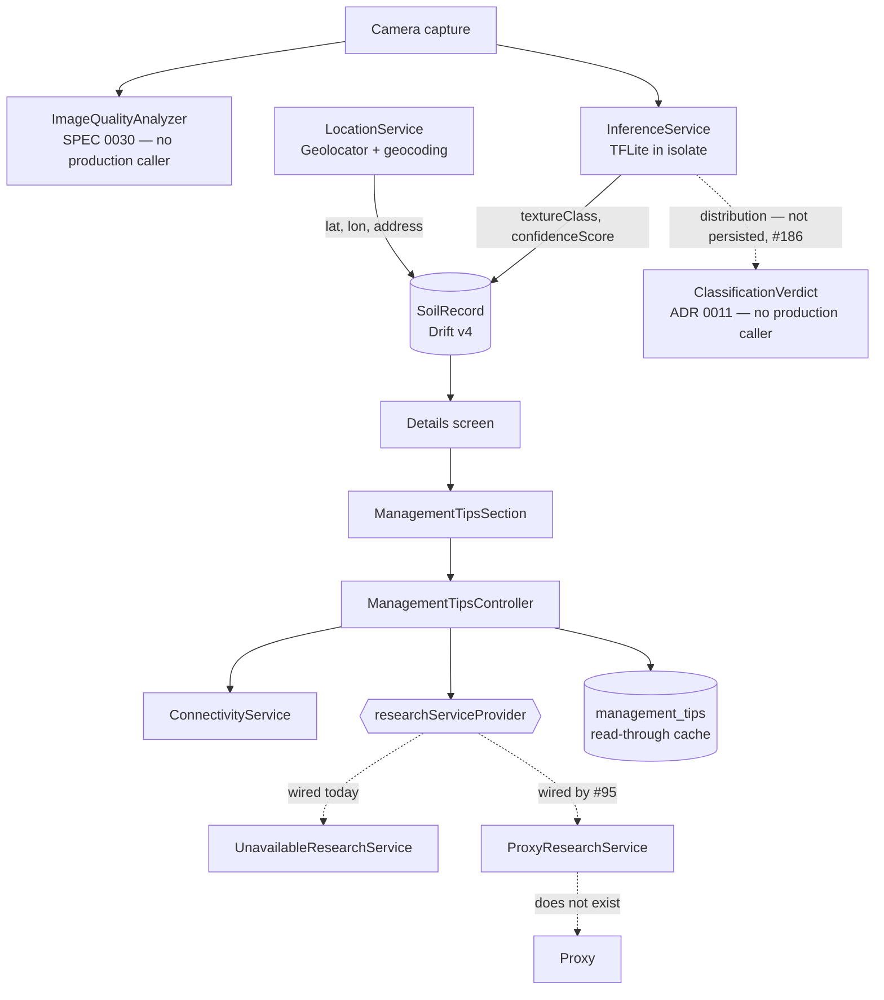
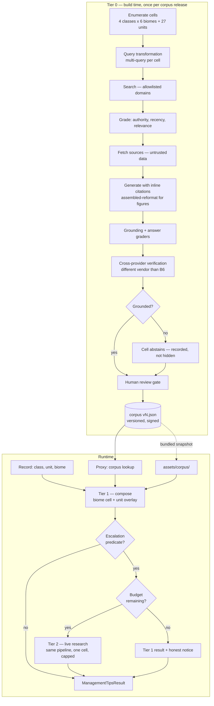

# Research Agent — Architecture

Status: **design reference — pre-SPEC, not an implementation authorization.** The
headline decisions are recorded in
[ADR 0022](../adr/0022-research-agent-precompiles-a-reviewed-corpus-and-escalates-under-a-cap.md),
which supersedes [ADR 0001](../adr/0001-research-agent-advisory-web-grounded.md).
No `lib/` code and no proxy code ships with this document. Every delivery slice
(§15) passes its own Spec Gate (`.standards/docs/standards/spec_method.md`)
before any code is written.

Prices, rate limits and deprecation dates in this document were checked against
primary sources in September 2026 and are dated where they appear. Token counts
attributed to a pipeline are **this document's estimates**, not measurements;
slice 1 of §15 exists to replace them with measured values before any budget is
committed.

## 1. Diagnosis of the current state

### 1.1 What exists

The app-side half of ADR 0001 is implemented and tested.

| Element | File | State |
|---|---|---|
| Service seam | `lib/core/services/research/research_service.dart` | Abstract `ResearchService`, sealed `ResearchResult`, seven-member `ResearchFailureKind` |
| Proxy client | `lib/core/services/research/proxy_research_service.dart` | 20 s timeout, 3 attempts, 400 ms backoff, typed failures, never throws into UI |
| Transport | `lib/core/services/research/http_transport.dart` | Fakeable seam over `package:http` |
| Orchestration | `lib/core/services/research/management_tips_controller.dart` | Validates record, checks connectivity, calls service, persists on success |
| Domain | `lib/models/management_tips_result.dart` | `ManagementTipsResult`, `ManagementTip`, `TipSource`, hand-written JSON |
| Cache | `lib/core/database/tables/management_tips_table.dart` | Drift table, schema v4, keyed by record `uuid` |
| Repository | `lib/core/data/repositories/management_tips_repository.dart` | Abstract + Drift implementation |
| UI | `lib/core/features/details/management_tips_section.dart` | Cache-first, citation chips, sources list, mandatory disclaimer, offline and error states |
| Tests | 7 files under `test/` | Service, controller, repository, providers, models, widget |

### 1.2 What does not exist

- **The proxy.** No repository, no deployment, nothing on this machine. The
  entire agent side of ADR 0001 was never built.
- **The binding.** `researchServiceProvider` returns
  `UnavailableResearchService`, so the feature reports `upstreamUnavailable` on
  every call and no tip has ever been fetched.
- **Backend-verifiable auth.** The Google gateway captures only `accessToken`;
  no `idToken`, no `serverClientId` (issue #95).

### 1.3 What was found wrong

Three falsifications of ADR 0001, recorded in full in ADR 0022 §Context: the
named model was shut down for free and developer tiers on 2026-08-16; the
ten-step per-request pipeline admits roughly four to seven requests per day
against the published free daily token ceiling; and it does not complete inside
the 20-second timeout the already-built client applies.

Two defects in the current implementation, independent of those:

- **Precise coordinates leave the device.** `ProxyResearchService` sends
  `record.latitude` and `record.longitude` verbatim. ADR 0007 requires location
  to be opt-in for sharing; no equivalent gate exists for this egress. §6
  removes the field rather than gating it.
- **The cache has no invalidation.** `management_tips` rows carry `retrievedAt`
  but nothing reads it to decide staleness, so a cached tip is served
  indefinitely. §13 gives it a corpus version to compare against.

## 2. Map of existing integrations


```mermaid
flowchart TD
    CAM[Camera capture] --> IQ[ImageQualityAnalyzer<br/>SPEC 0030 — no production caller]
    CAM --> IS[InferenceService<br/>TFLite in isolate]
    IS -->|textureClass, confidenceScore| REC[(SoilRecord<br/>Drift v4)]
    IS -.->|distribution — not persisted, #186| CV[ClassificationVerdict<br/>ADR 0011 — no production caller]
    GPS[LocationService<br/>Geolocator + geocoding] -->|lat, lon, address| REC
    REC --> DET[Details screen]
    DET --> MTS[ManagementTipsSection]
    MTS --> MTC[ManagementTipsController]
    MTC --> CONN[ConnectivityService]
    MTC --> RS{{researchServiceProvider}}
    RS -.->|wired today| UNAV[UnavailableResearchService]
    RS -.->|wired by #95| PRS[ProxyResearchService]
    MTC --> MTR[(management_tips<br/>read-through cache)]
    PRS -.->|does not exist| PROXY[Proxy]
```

Three seams are load-bearing for this design and already exist: the
`ResearchService` abstraction, the `management_tips` read-through cache keyed by
record `uuid`, and `ConnectivityService`. Nothing in §5 requires a new seam in
the app beyond a region resolver.

### 2.1 Where the classification result travels

`InferenceService` produces a class and a score. Only those two reach
`SoilRecord`. The distribution, the verdict, the quality report and the model
version are computed or computable but never persisted, so any consumer reading
a record from history sees a top-1 and nothing else.

Two consequences run through the rest of this document. It is the binding
constraint on §6, which cannot ask for fields the record does not hold. And it is
why a record reopened from history cannot be known to be ambiguous: the
composition in §5.3 renders one cell where it should render two, until issue #186
persists the distribution.

## 3. Use case catalogue

Thirteen candidates, drawn from the brief and from the integration map. The
verdict column is the outcome of asking whether the case needs *open-ended,
model-driven* behaviour, or whether a fixed rule over a precomputed artifact
serves it.

| # | Use case | Input | Output | Agentic? | Verdict |
|---|---|---|---|---|---|
| 1 | Management guidance for a classified record | class, region | Cited tips | At build time only | **v1 — Tier 1** |
| 2 | Explain what the texture class means | class | Static explainer | No — compiled copy | **v1 — compiled, no agent** |
| 3 | Why these tips and not others | corpus cell provenance | Source list + build date | No — read the artifact | **v1 — Tier 1** |
| 4 | Free-text question about this record | question, class, region | Cited answer | **Yes** | **v1 — Tier 2** |
| 5 | Guidance when the verdict is ambiguous | two candidate classes, region | Both cells, side by side | **No** — two Tier 1 lookups | **v1 — Tier 1 composition** |
| 6 | Conflict between classification and regional soil data | class, region soil prior | Named discrepancy | **Yes** | v1 contract, dormant (no model) |
| 7 | Region outside the corpus | class, region | Honest unavailability, or live research | **Yes** | **v1 — Tier 2** |
| 8 | Next steps after a result | verdict, record state | Primary action | No — `compose`, UX terminal | Out of scope here |
| 9 | Ask the user for more context | — | Refinement question | No — a fixed question set per class | Deferred — no consumer |
| 10 | Personalise by crop or season | crop, season | Narrower guidance | Yes, but | **Deferred — inputs do not exist** |
| 11 | Refresh stale guidance | corpus version | New corpus | No — a release | **v1 — corpus release** |
| 12 | Compare two records | two records | Comparison | Yes | Deferred — no demand evidence |
| 13 | Low-confidence alternatives | distribution | Alternative classes | No — that is the verdict | Out of scope — ADR 0011 owns it |

### 3.1 The cases that genuinely justify an agent

Three, and they share one property: the input space is unbounded, so no
enumeration can precompute the answer.

- **#4, free-text question.** The user writes arbitrary text. Nothing else in
  this design has that property.
- **#6, contradiction.** Naming *how* a regional soil prior disagrees with the
  photograph's classification is specific to the coordinate.
- **#7, corpus miss.** By construction there is no cell to read.

**#5 was a fourth and is no longer.** An ambiguous verdict looks like it needs
synthesis, and the first draft of this document treated it that way. It does not:
the two candidate classes each already have a reviewed cell, and rendering both
is honest about a distribution that settled nothing. Synthesising them would
assert a combined reading no source supports, which is the failure mode the whole
design exists to avoid. The enumerable fallback — six class pairs per biome —
remains costed in §15.1 and unbuilt.

### 3.2 The non-agentic alternatives, stated

For every case marked "No" above, the alternative is named rather than implied:
compiled pt-BR copy for #2 and #9; reading the artifact's own provenance for #3;
the UX terminal's pure `compose` function for #8; a corpus release for #11; and
`ClassificationVerdict.fromDistribution` for #13, which already exists and is
tested.

### 3.3 What is eliminated

- **#10, crop and season personalisation.** The app collects neither. Designing
  for it now would be building an interface for data that does not exist.
- **#12, record comparison.** No evidence of demand, and it multiplies the
  surface.
- **#9, refinement questions.** Retained in the output contract (§7) as a field
  the agent may populate, because Tier 2 genuinely can ask one, but with no v1
  consumer beyond rendering it as text.

## 4. Architecture comparison

Five candidates. Costs assume the September 2026 prices in §15.1. The runtime
rows assume one request per capture; the build row assumes 51 cells.

| Criterion | A. Deterministic workflow | B. Runtime RAG | C. Tool-using agent | D. Precompiled corpus | E. **D + capped C** |
|---|---|---|---|---|---|
| Viable on zero budget | Yes | No (~7/day) | No (~4/day) | Yes | Yes for the main path |
| Marginal cost per request | 0 | ~$0.09 | ~$0.10+ | **0** | 0, except on escalation |
| Latency | ~1 s | 8–15 s | 22–30 s | **< 100 ms** | < 100 ms, or 10–20 s escalated |
| Fits the client's 20 s timeout | Yes | Borderline | **No** | Yes | Yes, with a Tier 2 budget |
| Runtime hallucination risk | None | Medium | Medium-high | **None** | Confined to Tier 2 |
| Injection reaches the user | n/a | Yes | Yes | **No** | Only via Tier 2 |
| Works offline | No | No | No | **Yes** | Tier 1 yes, Tier 2 no |
| Human review before publication | n/a | No | No | **Yes** | Tier 1 yes, Tier 2 no |
| Testability | High | Medium | Low | **High** — corpus is a fixture | High for Tier 1 |
| Observability | High | Medium | Low | **High** | High |
| Precise location leaves device | Yes | Yes | Yes | **No** | No |
| Answers an open question | No | Yes | Yes | **No** | **Yes** |
| Specificity beyond (class, region) | No | Yes | Yes | No | Only on escalation |
| Maintenance | Low | Medium | High | Medium — corpus releases | Medium-high |

**E is chosen.** D dominates on every operational axis but cannot answer an open
question, which is a real capability the product wants. Adding C behind a
deterministic gate and a spend cap buys that capability without paying for it on
every capture. A and B are dominated: A cannot cite sources, B costs per request
what D costs once.

## 5. Recommended architecture

Three tiers. Tier 0 runs offline and produces an artifact; Tier 1 reads it; Tier
2 is reached only through fixed predicates.

Tiers 0 and 1 are **Template Generation**, pattern 29 of the safeguards catalogue
in `salvaguardas-llm.md` (see §9): generate offline, have a human review, fill
deterministically at runtime. Its preconditions are a finite set of combinations
and a high cost of inappropriate content, and both hold here. Naming the pattern
matters for a reason beyond attribution — its known limits are this design's
limits, and §16 inherits them rather than rediscovering them.


```mermaid
flowchart TD
    subgraph T0["Tier 0 — build time, once per corpus release"]
        direction TB
        B1[Enumerate cells<br/>4 classes x 6 biomes + 27 units] --> B2[Query transformation<br/>multi-query per cell]
        B2 --> B3[Search — allowlisted domains]
        B3 --> B4[Grade: authority, recency, relevance]
        B4 --> B5[Fetch sources — untrusted data]
        B5 --> B6[Generate with inline citations<br/>assembled-reformat for figures]
        B6 --> B7[Grounding + answer graders]
        B7 --> B8[Cross-provider verification<br/>different vendor than B6]
        B8 --> B9{Grounded?}
        B9 -->|no| B10[Cell abstains — recorded, not hidden]
        B9 -->|yes| B11[Human review gate]
        B10 --> B11
        B11 --> ART[(corpus vN.json<br/>versioned, signed)]
    end

    ART --> CDN[Proxy: corpus lookup]
    ART -.->|bundled snapshot| ASSET[assets/corpus/]

    subgraph RT["Runtime"]
        direction TB
        REQ[Record: class, unit, biome] --> T1[Tier 1 — compose<br/>biome cell + unit overlay]
        CDN --> T1
        ASSET --> T1
        T1 --> P{Escalation<br/>predicate?}
        P -->|no| OUT[ManagementTipsResult]
        P -->|yes| CAP{Budget<br/>remaining?}
        CAP -->|no| DEG[Tier 1 result + honest notice]
        CAP -->|yes| T2[Tier 2 — live research<br/>same pipeline, one cell, capped]
        T2 --> OUT
        DEG --> OUT
    end
```

### 5.1 The corpus

| Layer | Cells | Key | Content |
|---|---|---|---|
| Substance | 24 | `(class, biome)` | Guidance, citations, evidence strength, limitations |
| Overlay | 27 | `(unit)` | State extension service, state agency, unit-specific guidance |

A lookup for `(class, unit, biome)` composes the two deterministically. The
composition rule is pure and enumerable, so all 208 resolved combinations can be
asserted in tests without 208 build cells existing.

The biome set is the six IBGE biomes: `amazonia`, `cerrado`, `mata_atlantica`,
`caatinga`, `pampa`, `pantanal`. The unit set is the 27 federative units as
ISO 3166-2:BR codes.

**Coverage is Brazil only.** Every region table here is Brazilian, as are the
source tiers in §8. A coordinate outside Brazil is a `corpusMiss` and is told so
plainly. Extending coverage later is additive — a new biome set and a new source
tier — and nothing in the key or the contract forecloses it.

### 5.2 Resolving the biome on device

The biome must be resolved on the device. Resolving it server-side would require
sending the coordinate, which is the egress §6 exists to remove, so a
server-side resolver would give back the privacy property the key was chosen for.

The app ships a **packed biome grid**: a 0.1° lattice over Brazil's bounding box,
one byte per cell holding a biome identifier, roughly 130 KB. Lookup is an array
index from latitude and longitude — constant time, no parsing, no dependency.

Its error is confined to biome transition bands, where a cell straddles two
biomes and the grid names one. That is accepted because the alternative,
simplified IBGE boundary polygons, costs more bytes and a point-in-polygon test
to sharpen a boundary that is itself a cartographic generalisation of a gradient.
The grid records its resolution in the artifact so a later refinement is a data
change rather than a code change.

A coordinate the grid cannot resolve yields a null biome, which §6 already
defines as a valid request: the response carries the class-level guidance and
states that the regional layer is absent.

### 5.3 Escalation predicates

All are cheap, total functions over data the app already holds. None is a model
call.

| Predicate | Fires when | Dormant until |
|---|---|---|
| `userQuestion` | The user submitted free text | A text input exists on the result surface — see §18.2 |
| `regionalContradiction` | Corpus soil prior for the cell disagrees with the class | A `.tflite` artifact exists |
| `corpusMiss` | No cell for `(class, biome)` | — |

**An ambiguous verdict does not escalate.** When two classes hold the mass, the
app performs two Tier 1 lookups and renders both cells. That is free, offline,
already reviewed, and it needs no contract change — the request carries one
class, so two candidates are two requests, both cached. It does not synthesise
("what to do while you are unsure between these two"), and the interface must
present it as two readings rather than as one answer. If that proves inadequate,
the fallback is 36 precomputed pair cells, costed in §15.1 and not built.

`notAnalysed` never escalates. ADR 0011 and ADR 0015 forbid offering retry on it
until SPEC 0035 lands, and researching a classification that never ran would be
exactly that offer in another form.

### 5.4 Why the proxy stays

The corpus could ship entirely in the app. It does not, for three reasons: a
corpus release must reach users without an app-store round trip; Tier 2 needs a
server to hold credentials and enforce the cap; and the bundled copy is a
fallback, so the two must be able to differ and be compared by version. The
proxy serves the corpus and owns Tier 2. Its Tier 1 path is a lookup, which fits
the 10 ms CPU limit of the Cloudflare Workers free plan (100,000 requests/day,
50 subrequests/request, as of September 2026).

## 6. Input contract

### 6.1 Tier 1 — `POST /v1/management-tips`

```jsonc
{
  "recordUuid": "9f1c…",              // required — cache key, not an identity
  "textureClass": "Argilosa",          // required — from SoilTextureLabels.ordered
  "classListVersion": "v1-four-class", // required — guards ADR 0022's orphaning
  "region": {                          // required
    "country": "BR",
    "unit": "BR-SP",                   // ISO 3166-2:BR, or null if unresolved
    "biome": "cerrado"                 // IBGE biome, or null if unresolved
  },
  "corpusVersion": "2026.09.1",        // optional — what the client already has
  "locale": "pt-BR"                    // optional — defaults to pt-BR
}
```

### 6.2 Tier 2 — `POST /v1/record-inquiry`

Everything above, plus:

```jsonc
{
  "trigger": "userQuestion",          // required — one of the three predicates
  "question": "…",                     // required iff trigger is userQuestion; max 500 chars
  "priorFractions": {                  // required iff trigger is regionalContradiction
    "clay": 0.52, "sand": 0.31, "silt": 0.17
  },
  "modelVersion": "soil-v1.2.0",       // optional — provenance for the trace
  "qualityFlags": ["blur"]             // optional — criteria that failed, SPEC 0030
}
```

### 6.3 Field policy

| Policy | Fields |
|---|---|
| **Required** | `recordUuid`, `textureClass`, `classListVersion`, `region.country`; plus per-trigger fields at Tier 2 |
| **Optional** | `region.unit`, `region.biome`, `corpusVersion`, `locale`, `modelVersion`, `qualityFlags` |
| **Forbidden** | `latitude`, `longitude`, `address`, any image or thumbnail, EXIF of any kind, device identifiers, the user's name or e-mail, any other record's data, free text at Tier 1 |

The forbidden list is enforced, not documented: the proxy rejects a request
carrying any of those keys with `400`, so a client regression that reintroduces
coordinates fails loudly instead of leaking quietly. This is the remedy for
§1.3's first defect.

`recordUuid` is used only as a cache key and is never stored server-side beyond
the request, so it identifies a cache entry rather than a person.

**A null region is a valid request.** Location is optional throughout the app,
and a record saved without coordinates must still get guidance. The response is
the class-level guidance with the regional layer absent and stated as absent.

## 7. Output contract

The response is unchanged in shape from what `ManagementTipsResult.fromJson`
already parses, with three additive fields. Additive means an old client ignores
them and a new client tolerates their absence.

```jsonc
{
  "status": "grounded",                // grounded | abstained | insufficient_evidence
  "tips": [
    {
      "text": "…",
      "citations": [0, 2],
      "category": "water",             // NEW — water | crops | preparation | other
      "evidenceStrength": "strong"     // NEW — strong | moderate | limited | inferred
    }
  ],
  "sources": [
    {
      "title": "…",
      "url": "https://…",
      "publisher": "Embrapa",
      "date": "2025-03-11",
      "accessedAt": "2026-09-10T…",    // NEW — when the build fetched it
      "tier": 1                         // NEW — source policy tier, §8
    }
  ],
  "disclaimer": "…",                   // required, never empty
  "model": "…",
  "retrievedAt": "2026-09-10T…",
  "corpusVersion": "2026.09.1",        // NEW
  "limitations": ["…"],                // NEW — what this guidance cannot tell you
  "alerts": [],                         // NEW — conflicts, staleness, regional gaps
  "followUpQuestions": [],              // NEW — what the agent would need to narrow it
  "coverage": {                         // NEW — which layers answered
    "biome": "cerrado",
    "unit": "BR-SP",
    "unitLayerPresent": true
  }
}
```

Errors keep the codes the client already maps: `401` unauthenticated, `429`
rate-limited or cap exhausted, `503` upstream unavailable. Two states are
carried in a `200` rather than an error, because they are answers and not
failures: `abstained` (the agent found sources but would not assert) and
`insufficient_evidence` (no source met the policy). The Details section already
renders abstention as informational rather than as an error, and the UX
terminal's `abstention_is_not_an_error` criterion requires exactly that.

### 7.1 Two cross-terminal conflicts, resolved here

**The recommendation contract divergence.** `docs/design/ux-2026/05-design-system.md`
§5 records three options and marks the choice as jointly owned. This document
takes option 1: `ManagementTip` gains an optional `category` from the closed
enumeration `{water, crops, preparation, other}`. The app groups by category when
present and renders a flat list when absent, so the design system's sectioned
screen becomes renderable without the app inventing the grouping. Option 3 —
grouping by keyword in the app — stays rejected for the reason that record gives:
it would attribute structure the agent never asserted.

**Suggested components.** The brief for this work asked the output to carry
"componentes sugeridos para apresentação na interface". That is refused, and the
refusal is not a preference. `docs/design/ux-2026/10-genui-strategy.md` §4.1
invariant 7 states that generated content occupies slots and never selects them,
and that no field of any agent response is an input to `compose`. A
component-name field would be exactly such an input. The output instead carries
*semantic* facts — `status`, `evidenceStrength`, `coverage`, whether `alerts` or
`followUpQuestions` are non-empty — and the app's own composition function maps
those to components. The UX terminal keeps sole authority over layout.

## 8. Source policy

### 8.1 Tiers

| Tier | Admits | Examples |
|---|---|---|
| 1 | Brazilian federal research and extension, official statistics | Embrapa, IBGE, MAPA, ANA |
| 2 | State extension services and state agencies | Emater, IAC, Epagri, IAPAR |
| 3 | Universities and peer-reviewed literature | USP/ESALQ, UFV, UFRGS; SciELO; indexed journals |
| 4 | International institutional bodies | FAO, ISRIC, USDA-NRCS |
| 5 | Recognised technical publications, used only to corroborate | Sector press with named authorship |

A tip must cite at least one tier 1–3 source. Tier 4 may support but not carry a
claim on its own. Tier 5 may only corroborate a claim already carried by a lower
tier. A cell that cannot reach that bar emits `insufficient_evidence` rather
than a weaker tip.

Domains are an explicit allowlist passed to the search tool, so the constraint
is enforced by the platform rather than by a post-filter over whatever the web
returned.

### 8.2 Evidence strength

| Value | Meaning |
|---|---|
| `strong` | Multiple tier 1–3 sources agree, and at least one is current |
| `moderate` | One tier 1–3 source, uncontradicted |
| `limited` | Sources agree but are dated, narrow, or from an adjacent region |
| `inferred` | The system reasoned from a cited fact; the inference is labelled as the system's |

`inferred` is the honest label for what would otherwise be a silent leap. It is
never applied to a numeric figure: figures are copied from a source verbatim and
only reworded, never originated.

### 8.3 Recency

Agronomic guidance ages slowly, so recency is a grading input rather than a hard
filter. A source older than ten years may still carry a claim if it is tier 1–3
and nothing newer contradicts it, and the age is surfaced in `limitations`.

### 8.4 Structured sources

Two structured sources are read at **build time** and baked into the corpus
rather than called at runtime.

- **Embrapa** — AgroAPI/SmartSolos Expert (SiBCS classification), BD Solos, and
  the Plataforma Saúde do Solo, which carries texture among its indicators.
- **ISRIC SoilGrids** — clay, sand and silt fractions by coordinate, CC-BY 4.0.
  The point API is not dependable: probed on 2026-09-05 it returned `200` with
  null values and then `503` on consecutive requests, at 2.8–5.6 s. The
  downloadable coverage is used instead, sampled per biome and unit at build
  time.

The sampled fractions are what the `regionalContradiction` predicate compares a
classification against. Baking them removes a runtime dependency on a service
that is currently degraded.

### 8.5 Conflicts between sources

A disagreement between two admissible sources is reported, never silently
resolved. The tip states that guidance differs, cites both, and the cell's
`evidenceStrength` drops to at most `moderate`. If the disagreement is material
and unresolved, the cell abstains.

## 9. `llm-wiki` strategy

The vault holds 507 pages, 424 of them `area: machine-learning`. Searching for
soil, agronomy or Embrapa content returns nine pages, every one about UAV remote
sensing. **It contains no agronomic domain knowledge.**

| Candidate role | Verdict |
|---|---|
| Primary internal source for tips | **No.** No domain content exists to serve it |
| RAG corpus for the build | **No.** Same reason |
| Reference repository for citations | **No.** Its own citations are to ML literature |
| Discovery mechanism for agronomic sources | **No** |
| Method authority for how this system is built | **Yes** — the only role it can hold |

Used as method authority it is genuinely load-bearing, and it was used that way
in this document:

| Page | What it supplied |
|---|---|
| `salvaguardas-llm.md` | **Pattern 29, Template Generation** — the architecture of §5, by name and with its preconditions; pattern 30, Assembled Reformat, for the rule in §8.2 that figures are copied and only reworded |
| `tema-rag-decisao.md` | The symptom-to-pattern decision tree, and the over-engineering signals that falsified ADR 0001's tier |
| `avaliacao-rag.md` | The metric vocabulary in §12, including the meta-evaluation showing no automatic judge reaches the human ceiling |
| `prompt-injection.md`, `seguranca-agentes.md`, `owasp-top-10-llm.md` | The threat taxonomy and control layering in §10 |
| `arquiteturas-risco-genai.md` | The risk tiering — which places this feature at medium, not high; see the note below |

**A correction this validation produced.** An earlier draft said the risk
framework assigns human review to output of this kind. It does not:
`arquiteturas-risco-genai.md` assigns human-in-the-loop to its **high**-risk tier
(medical, legal, financial, safety-critical), and ADR 0001 classified this feature
as **medium**. The classification stands. Pattern 29 is what makes review
affordable at a medium tier, so this design exceeds its tier rather than
satisfying it — a stronger claim than the one it replaces, and an accurate one.

**A second correction.** §10 maps corpus poisoning and impersonating sources to
LLM03. That entry is *Training Data Poisoning*, and a reviewed knowledge base is
not training data. The mapping is an extension by analogy, useful for locating
the control and not a literal classification; it is labelled as such in §10.

Two cautions the vault's own conventions impose. Its pages carry `updated` and
`status` frontmatter and are a lossy compilation of their sources, so a claim
taken from it is checked against the `sources:` it names before being relied on.
And it is explicitly read-only to external agents: this work never writes to it.

The pages cited in this document exist — all 25 were verified present on
2026-09-05 — but they are **not files in this repository** and the citations are
provenance, not resolvable links.

## 10. Security strategy

The controlling fact is that **nothing is generated while a user waits on the
Tier 1 path**. Every threat below that involves model or web content is
therefore confined to build time, where a human reads the output before it
ships, or to Tier 2, where it is capped and flagged.

| Threat | OWASP | Control | Where |
|---|---|---|---|
| Indirect prompt injection in fetched pages | LLM01 | Fetched content is delimited and labelled untrusted; instructions inside are never executed; a human reads every cell | Build |
| Malicious instructions reaching a user | LLM01 | Structurally impossible at Tier 1 — no generation, no fetch | Runtime |
| Fake or impersonating sources | LLM03* | Platform-enforced domain allowlist; tiering by institution | Build |
| Stale content | — | `accessedAt` per source; corpus version; staleness surfaced in `alerts` | Both |
| Corpus poisoning | LLM03* | The artifact is versioned and reviewed; a release is a reviewed diff, not a push | Build |
| Untrusted URLs rendered to the user | LLM02 | URLs are displayed as text, never as executable links; scheme allowlist at render | Runtime |
| Location leakage | — | Coordinates are not in the contract; the proxy rejects them with `400` | Runtime |
| Personal data exposure | LLM06 | No image, no EXIF, no identity beyond the bearer | Runtime |
| Tool misuse | LLM08 | Build tools are search and fetch only; Tier 2 inherits the same two | Both |
| Runaway loops | — | Hard step cap per cell; a cell that does not converge abstains | Build |
| Unexpected cost | — | Per-cell, per-run and global caps; Tier 2 has a hard spend ceiling that fails closed | Both |
| Unsupported recommendation | LLM09 | Grounding grader, then cross-provider verification, then human review | Build |
| Fabricated citation | LLM09 | Every citation index is resolved against the fetched source set; an unresolvable index fails the cell | Build |
| Output outside the schema | — | Schema validation at the proxy boundary; the client already maps a malformed body to `malformedResponse` | Both |

\* LLM03 is *Training Data Poisoning*. A reviewed knowledge base is not training
data, so these two rows are an extension by analogy — the control they point at
is right, the classification is approximate. Every other code in the table is a
literal fit.

### 10.1 Tier 2's residual risk, stated

Tier 2 generates for a user in real time and therefore reintroduces injection
exposure, hallucination risk and variable cost. It is accepted because the
capability is real, and bounded by: the same allowlist; no tool beyond search
and fetch; a hard step and time cap; a spend cap that fails closed; schema
validation; and a response that is visibly marked as unreviewed, so the user can
tell reviewed corpus guidance from live output.

### 10.2 Refusal policy

The agent declines, at either tier, when the classification is `notAnalysed`;
when no admissible source is found; when admissible sources conflict materially
and unresolvably; when the question falls outside soil management; or when the
question asks for a prescription. `CONTEXT.md` fixes the advisory stance, and a
Prescription stays out of scope until the app collects crop, season and soil
chemistry.

## 11. Observability strategy

Build-time observability has a property worth naming: **there is no user in it.**
The inputs are a class and a region, so traces can go to a hosted tool with no
privacy question. That is not true of runtime, which is treated separately.

### 11.1 Build time

Full tracing of every cell: each query, each search, each fetched URL, each
grader verdict, each token count and cost, the model identifier and the prompt
version. The trace is the audit record for the human reviewer, and the artifact
references its trace identifier.

**Traces are local JSONL**, one file per build run, not a hosted tracer. This
follows the precedent the README already records for experiment tracking — local
JSON over MLflow or Weights & Biases, as disproportionate overhead for the
project's size — and the same reasoning holds here: 51 cells built a handful of
times does not justify hosted infrastructure or a third party in the loop. The
one capability a hosted tracer would add, replaying the corpus against a new
model, is reached by re-running a build that is cheap by construction.

Two constraints keep the choice reversible. The pipeline is written in plain code
against the `LLMClient` and `SearchClient` seams, so tracing is a decorator
rather than a framework. And a graph orchestration framework is **not** adopted,
because this pipeline is a bounded chain run 51 times and `tema-rag-decisao.md`
lists exactly that shape as an over-engineering signal.

The record that would overturn this is the human review proving impractical to
perform against raw JSONL. That is a measurable outcome of slice 4, not a
prediction, and the trace format is chosen so a hosted tracer could ingest it.

### 11.2 Runtime

| Metric | Tier | Why |
|---|---|---|
| Lookup hit rate by `(class, unit, biome)` | 1 | Reveals which cells matter and which were never worth building |
| `corpusMiss` rate | 1 | Drives the next corpus release's scope |
| Composition failures | 1 | A missing overlay is a build defect |
| Escalation rate by predicate | 2 | Tells whether Tier 2 is earning its cap |
| Cap exhaustion events | 2 | The budget signal |
| Tier 2 latency, cost, tool calls, failures per tool | 2 | Operational |
| Abstention and refusal rate | Both | Honesty signal — a rate of zero is suspicious |
| Tips shown without a disclaimer | Both | Must be zero; it is an invariant, not a metric |

Runtime telemetry carries no coordinate, no free-text question, and no record
identifier. The escalation counter records the predicate, not the question.

### 11.3 User feedback

A per-tip "this was useful / this was wrong" control, stored locally and
aggregated without content. A tip reported wrong above a threshold is flagged
for the next corpus review. This is the only mechanism that closes the loop from
field reality back to the corpus, and it costs nothing to run.

## 12. Evaluation plan

### 12.1 What is measured

Following `avaliacao-rag.md`, the targets are paired and the pairing is stated,
because a pipeline that measures only faithfulness can be perfectly faithful to
an irrelevant context.

| Target | Pair | Method |
|---|---|---|
| Retrieval relevance | retrieved sources against the cell query | Human spot-check on a sample |
| Source admissibility | retrieved sources against §8 tiers | Automatic — domain and tier are structural |
| Faithfulness | each claim against its cited source | Claim-level entailment, cross-provider |
| Citation resolvability | citation indices against the source list | Automatic — must be 100% |
| Answer relevance | guidance against the cell's question | Human review |
| Numeric fidelity | every figure against its source | Automatic extraction plus human check |

`avaliacao-rag.md` records that no automatic framework reaches the human
ceiling, and that the best measured correlation was 61.9 against a human
annotator's 70.1. Automatic scores therefore gate the *build*, and the human
review gates the *release*. Neither substitutes for the other.

### 12.2 Test scenarios

Each becomes a test, against fixtures, with no network:

normal cell; low-confidence classification; absent location; absent biome;
offline device; empty cache and offline; conflicting sources; sources older than
ten years; a fetched page containing an injection attempt; a classification the
regional prior contradicts; inconsistent metadata; `notAnalysed`; a partial tool
failure mid-build; a response violating the schema; a citation index out of
range; zero admissible results; corpus version older than the server's; a
`(class, biome)` pair with no cell; a unit overlay missing for a present biome
cell; Tier 2 cap exhausted mid-request.

### 12.3 The injection test is a fixture, not a live page

A page whose text instructs the model to ignore its instructions is stored as a
fixture and replayed. The assertion is that the produced cell contains no
content derived from the instruction and that the grader flags it.

## 13. Offline and degraded behaviour

| Condition | Behaviour |
|---|---|
| Online, corpus current | Tier 1 answers from the served corpus |
| Online, corpus stale | Answers from cache, fetches the new corpus in the background, `alerts` carries staleness |
| Offline, record cached | Answers from `management_tips` — unchanged from today |
| Offline, record not cached, bundled corpus present | Answers from the bundled snapshot; this is new, and it is the case today's build cannot serve |
| Offline, nothing available | The existing offline empty state |
| Offline, escalation predicate true | Tier 1 result plus a notice that deepening needs a connection |
| Online, cap exhausted | Tier 1 result plus a notice that says the allowance is spent, not that the user should retry — the cap is one-time and does not reset (§15.2) |
| Region unresolved | Class-level guidance, with the regional layer stated absent |

The bundled snapshot is what makes the main path genuinely offline-first, which
ADR 0001 could not offer. Cache staleness is decided by comparing the cached
`corpusVersion` against the server's, which is the invalidation §1.3 found
missing.

## 14. GenUI integration

The UX terminal has decided adaptive composition over server-driven UI
(`10-genui-strategy.md`). This document does not reopen that, and its output
contract is built to respect it.

The agent supplies **presence and status**, never structure:

| `compose` input | Source | Not an input |
|---|---|---|
| Tips present / absent | `tips` non-empty | The tip text |
| Grounded / abstained / insufficient / failed / never generated | `status` plus the failure kind | The reasoning |
| Sources present | `sources` non-empty | Source titles |
| Alerts present | `alerts` non-empty | Alert text |
| Follow-up available | `followUpQuestions` non-empty | The questions |
| Regional coverage | `coverage.unitLayerPresent` | — |

That `10-genui-strategy.md` §2 identifies the tips signal as four values rather
than the two the type declares is satisfied here: `grounded` and `abstained` come
from `status`, `insufficient_evidence` is the third, a transport failure is the
`ResearchFailureKind` the client already carries, and "never generated" is an
empty cache. The composition layer reads the outcome, not `ManagementTipsStatus`
alone — which is what that section asks for.

## 15. Delivery plan

Slices 1–5 build the corpus and live in a new proxy repository. Slices 6–9 are
app changes in this repository. Each passes its own Spec Gate.

| # | Slice | Repo | Gate |
|---|---|---|---|
| 1 | **Calibration probe** — build one cell end to end, measure real token usage and cost | proxy | Measured cost per cell replaces §15.1's estimate |
| 2 | Cell enumeration, region tables, structured-source sampling (Embrapa, SoilGrids coverage) | proxy | 24 + 27 cells enumerated; priors sampled |
| 3 | Build pipeline: query transform, allowlisted search, grading, generation with citations, grounding graders | proxy | Injection fixture passes; citations 100% resolvable |
| 4 | Cross-provider verification pass and the human review gate | proxy | No cell reaches the artifact unreviewed |
| 5 | Corpus serving endpoint, schema validation, forbidden-field rejection | proxy | `400` on any forbidden key |
| 6 | App: region resolver; request sheds coordinates | app | No coordinate in any outbound body |
| 7 | App: corpus version comparison and cache invalidation | app | Stale cache refreshes; offline keeps serving |
| 8 | App: bundled corpus snapshot and the offline path | app | Fresh install answers offline |
| 9 | App: `category` and `evidenceStrength` rendering; per-tip feedback | app | Design-system sections render; flat fallback holds |
| 10 | Tier 2, enabled: endpoint, three predicates, fail-closed cap, unreviewed marking | both | Cap fails closed; unreviewed output is visibly distinct |
| 11 | Auth: `idToken` capture and `serverClientId` (issue #95) | app | Proxy verifies by audience |

Slice 11 is unchanged from ADR 0001's slice 8 and still depends on the OAuth Web
client from #55. Slices 1–9 do not depend on it: until it lands, the proxy
introspects the access token the app already holds, exactly as ADR 0001's
two-phase bearer specified.

**Slice 10 ships enabled in v1**, by the Developer's decision on 2026-09-11. It
carries a dependency this document cannot satisfy: the `userQuestion` predicate
needs a free-text input on the result surface, which does not exist and belongs
to the UI/UX terminal (§18.2). Until that input ships, slice 10 serves only
`corpusMiss`, and `regionalContradiction` stays dormant until a `.tflite`
artifact exists.

**Slice 4 is blocked**, not merely unscheduled: the human reviewer is not
identified (§17). Slices 1 through 3 proceed without it, and the artifact cannot
be released until it lifts.

### 15.1 Budget

One-time allowance of $50 — **one time, not recurring**. September 2026 prices:
Batch API at 50% of standard, web search at $10 per 1,000 searches, web fetch at
no additional cost.

Committed:

| Item | Estimate |
|---|---|
| Slice 1 calibration probe, one cell | $1 |
| 24 substance cells via Batch | $11 |
| 27 unit overlays via Batch | $3 |
| Cross-provider verification, 51 cells | $6 |
| **Committed subtotal** | **$21** |

The remaining **$29 is not allocated**, by decision: slice 1 measures the real
cost per cell, and the split is chosen against that measurement rather than
against this document's estimate. The three candidate splits, recorded so the
decision is a choice between known options:

| Split | Tier 2 runway | Corpus reserve | Buys |
|---|---|---|---|
| Conservative | $8 (~80 questions) | $21 | Two full rebuilds of the substance layer |
| Runway-weighted | $20 (~200 questions) | $9 | Enough live questions to learn what users ask |
| Quality-weighted | $8 (~80 questions) | $9, plus $11 upgrading the substance layer to the frontier model | Better permanent text, short runway |

A fourth option exists and is not costed here: 36 precomputed class-pair cells at
roughly $8, the fallback named in §5.3 if composing two cells proves inadequate
for the ambiguous case.

**Slice 1 gates everything after it.** If measured cost per cell diverges from
the estimate by more than a factor of two, the whole plan is re-costed before
slice 2 begins.

### 15.2 What the budget does not cover

Two commitments in this document outlive the allowance, and both are named here
rather than discovered later.

**The rebuild cadence is twice a year** (Developer's decision, 2026-09-11),
aligned to the agricultural calendar. At roughly $14 a rebuild that is $28 a
year, against a reserve of at most $29 that Tier 2 also draws from. **The first
year is funded and the second is not.** Sustaining the cadence needs recurring
budget that does not exist today; without it, the corpus stops being rebuilt once
the reserve is spent, and the guidance ages silently unless §13's staleness
signal is surfaced.

**Tier 2 on a one-time budget has a finite lifetime**, not a monthly quota. At
roughly $0.10 a question its runway is whatever the split allocates, and when the
cap is reached it fails closed permanently rather than resetting. The interface
must therefore treat cap exhaustion as a durable state, not a temporary one.

## 16. Risks and mitigations

| Risk | Mitigation |
|---|---|
| The class list changes and orphans cells | `classListVersion` in the artifact and the contract; keys derived from `SoilTextureLabels.ordered`; only changed classes need rebuilding |
| Token estimates are wrong | Slice 1 measures before slice 2 spends |
| **No reviewer is identified** | **Unmitigated, and it blocks slice 4.** Slices 1–3 proceed; no corpus is released until it lifts. This is the one risk with no fallback |
| Human review does not happen | It is the release gate, not a recommendation; no artifact without it |
| Reviewer lacks agronomic expertise | Would silently weaken the design's central guarantee. The reviewer's competence is recorded with the release, so a corpus reviewed by a non-specialist is labelled as one |
| The corpus goes stale | `accessedAt` per source, corpus version, staleness in `alerts`, rebuild twice a year |
| **The cadence outlives the budget** | Twice-yearly rebuilds cost ~$28/year against a reserve of at most $29. Year one is funded; year two needs recurring budget that does not exist. §15.2 states it rather than letting it surface as a stalled release |
| **Tier 2's runway is exhausted permanently** | A one-time allowance is not a monthly quota. The cap fails closed for good, so the interface treats exhaustion as durable, not temporary |
| Guidance is too generic to be useful | Measured by the feedback loop in §11.3; if it fails, Tier 2 or richer inputs are the escalation |
| Tier 2 cost overruns | Hard cap that fails closed; it degrades to Tier 1 rather than to an error |
| Tier 2 ships before its input exists | Without the free-text field (§18.2) it serves only `corpusMiss`; that is a reduced feature, not a broken one |
| Tier 2 injection reaches a user | Allowlist, two tools only, schema validation, output marked unreviewed |
| A provider deprecates the build model | The seams keep the pipeline portable; the artifact survives the provider regardless |
| Biome resolution on device is wrong | The biome is optional; an unresolved biome degrades to class-level guidance rather than to a wrong cell |
| The proxy repository never gets built | The app path degrades exactly as it does today — `UnavailableResearchService` — so nothing regresses |

## 17. Open questions

Six of the seven questions this document opened were decided by the Developer on
2026-09-11 and are recorded in the sections they belong to rather than here.
What remains open is one question and two deferrals.

### 17.1 Open

1. **Who reviews the corpus?** The design makes human review the release gate and
   does not name who is qualified to give it. Two candidates the repository
   itself suggests — the project's academic supervisor, and the soil laboratory
   that supplied the 194-sample archive of ADR 0016 — are unconfirmed. **This
   blocks slice 4.** Slices 1 through 3 proceed without it; no corpus is released
   until it is answered. It is the only risk in §16 with no fallback.

### 17.2 Deferred with a stated trigger

2. **How the remaining $29 is split.** Deferred to the measurement from slice 1
   rather than guessed. The three candidate splits are costed in §15.1.
3. **Whether composing two cells is adequate for an ambiguous verdict.** The
   decision is to compose; the fallback is 36 precomputed pair cells at roughly
   $8. The trigger is field feedback, and the question cannot be answered before
   #186 makes the verdict reachable from history.

### 17.3 Decided

| Question | Decision | Recorded in |
|---|---|---|
| Biome resolution on device | Packed 0.1° grid, ~130 KB | §5.2 |
| Ambiguous verdict | Compose two Tier 1 cells; no escalation | §5.3 |
| Tier 2 enabled in v1 | Yes, complete — with the input-field dependency named | §15, §18.2 |
| Rebuild cadence | Twice a year, with its funding gap stated | §15.2 |
| Coverage beyond Brazil | Brazil only; a foreign coordinate is a `corpusMiss` | §5.1 |
| Build tracing | Local JSONL, following the README's precedent | §11.1 |

## 18. Cross-terminal contracts

### 18.1 From the vision terminal

This terminal consumes and does not modify: `SoilTextureLabels.ordered` and its
version; `textureClass` and `confidenceScore`; `ClassificationVerdict` and, when
#186 lands, the `ClassScore` distribution; `ImageQualityReport` criteria names,
when a production caller exists; and the model version string.

It asks for two things it does not have, and works without them: the persisted
distribution (#186), without which a record reopened from history cannot be known
to be ambiguous and so renders one cell where it should render two; and a
`.tflite` artifact, which wakes `regionalContradiction`.

It undertakes not to change `ml/`, the model, or the preprocessing path.

### 18.2 To the UI/UX terminal

This terminal supplies the output contract in §7 and guarantees: `status`
distinguishes grounded, abstained and insufficient evidence, and a transport
failure stays a `ResearchFailureKind` rather than being folded into a status;
`disclaimer` is never empty; `category` is a closed enumeration with a defined
flat fallback; and **no field names a UI component**, per §7.1.

It asks the UI terminal to own: all layout and composition; the per-tip feedback
control in §11.3; the visual distinction between reviewed corpus guidance and
unreviewed Tier 2 output; and the copy for every degraded state in §13.

Four asks are new with the 2026-09-11 decisions, and the first is a **blocking
dependency for slice 10**:

1. **A free-text input on the result surface.** The `userQuestion` predicate has
   no entry point today — the Details screen has no text field. Tier 2 ships
   enabled, so until this exists it serves only `corpusMiss`. The input needs a
   length limit matching the contract's 500 characters, and it must be clear that
   what follows is live and unreviewed.
2. **Cap exhaustion is a durable state, not a transient one.** The budget is
   one-time, so "try again later" is the wrong copy: when the runway is gone it
   is gone. §15.2 states why.
3. **An ambiguous verdict renders as two readings, not one answer.** Composing
   two Tier 1 cells presents both candidate classes' guidance side by side. The
   surface must not merge them into a single recommendation, because nothing
   synthesised them. This complements `verdict_ambiguous` in the roadmap's
   acceptance criteria, which already requires neither candidate to be asserted.
4. **Absent regional coverage is stated, not hidden.** `coverage.unitLayerPresent`
   false means the guidance is class-level only, and a record saved without
   location is the normal case that produces it.

Two items in `13-roadmap.md` §3.1 are answered by this document: the
recommendation contract divergence is resolved in §7.1, and the
`researchServiceProvider` blocker is addressed by slices 5–8.

### 18.3 Shared files

Changes to `lib/models/management_tips_result.dart`,
`lib/core/services/research/`, and `lib/providers/research_service_provider.dart`
belong to this terminal. `lib/core/features/details/management_tips_section.dart`
belongs to the UI terminal; the additive fields in §7 are declared here and
rendered there, in slice 9.
