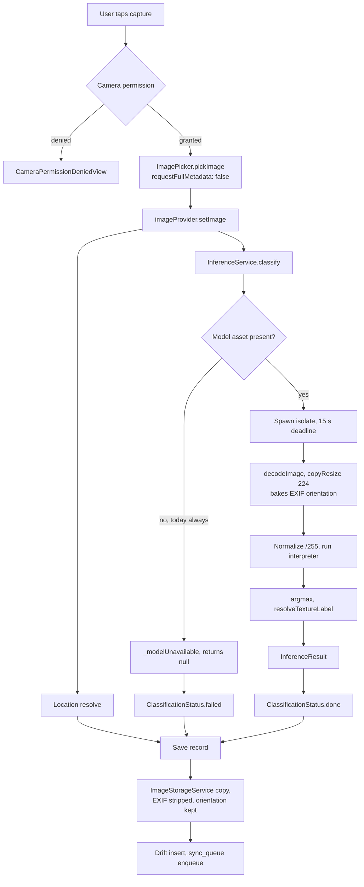
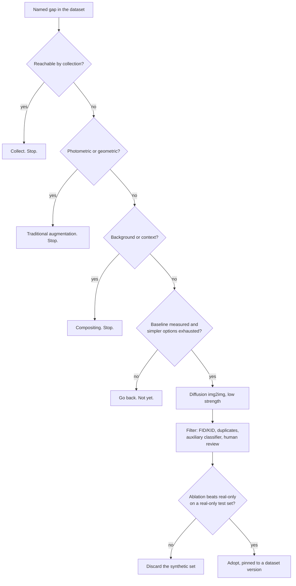
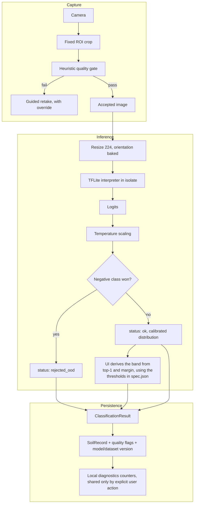

# Soil Texture Classification: Architecture Study

Status: research and planning. No implementation decision in this document is
binding until it is promoted to an ADR or a numbered SPEC. Three decisions have
already been promoted: ADR 0008 (inference runtime), ADR 0009 (target isolation),
ADR 0010 (synthetic data).

Scope of this study: computer vision, real and synthetic data, training,
image processing, mobile inference, calibration, and model monitoring. It does
not cover UI/UX rework or the research agent.

---

## 1. Diagnosis of the Current State

### 1.1 Classification is dead in production, not degraded

No TFLite artifact is tracked or built into the app. `assets/models/` contains
only `.gitkeep`, and `.gitignore` excludes both `assets/models/*.tflite` and
`assets/models/spec.json`. `InferenceService.initialize()` therefore reads an
absent asset, sets `_modelUnavailable` (`inference_service.dart:113-117`), and
`classify()` returns `null`. `CaptureScreen._classifySoilTexture` maps that
`null` to `ClassificationStatus.failed` (`capture_screen.dart:196-198`), and
`_saveRecord` persists the record with `textureClass: null` and
`confidenceScore: null` (`capture_screen.dart:269-270`).

Every observation below concerns a code path that does not currently execute.
This is the single most important framing fact in this study: there is no
regression to fix and no baseline to beat. There is an unbuilt feature whose
scaffolding is already in place.

### 1.2 The declared capture protocol is not enforced

`onboarding_screen.dart:24-49` states a precise protocol:

- a coin beside the sample as a scale reference;
- the soil centred in the viewfinder, occupying at least 70% of the frame;
- diffuse natural light, no shadows on the sample, no flash, because flash
  alters the soil's true colour;
- top-down, phone parallel to the sample surface, at roughly 20 cm.

Nothing in the capture path checks any of these. `CaptureScreen` opens
`ImagePicker` (`capture_screen.dart:95-100`) and accepts whatever comes back.
The protocol is advice shown once at first launch and never referenced again.

### 1.3 Verified train/serve skew on EXIF orientation

The app honours EXIF orientation; training ignores it.

- App: `InferenceService._runInference` calls `img.copyResize`
  (`inference_service.dart:207-212`). In `image` 4.8.0, `copyResize` bakes
  orientation whenever the tag is present and not 1
  (`image-4.8.0/lib/src/transform/copy_resize.dart:33-35`).
- Training: `dataset.py:257-259` uses `tf.io.decode_image` followed by
  `preprocess` → `tf.image.resize`. Neither reads EXIF.

Any training image carrying an orientation tag other than 1 is learned in one
geometry and served in another. With `augmentation.rotation_range: 15`, a 90°
discrepancy is outside the training distribution by construction. The severity
depends on how many raw images carry the tag, which the inventory (§4) must
measure. The training-side omission is unconditional regardless.

### 1.4 The `spec.json` contract exists on paper only

`export.py:118-166` generates `spec.json` with the input shape, dtype,
normalization method, output shape, and the ordered class list. Nothing reads
it. `InferenceService` hardcodes the labels (`inference_service.dart:60-66`),
the input size (`:56`), and the `/255.0` normalization (`:274-278`). This is
issue #79.

The label list has independent copies in `ml/config.yaml`, `InferenceService`,
`SoilTextureColors`, `ml/README.md`, and two ML test fixtures, with no test
asserting agreement (issue #116). `SoilTextureColors._colorMap`
(`soil_texture_colors.dart:7-13`) orders Siltosa before Media, contradicting
`InferenceService._textureLabels`, while its `all` getter documents itself as
"model output order". The getter has no consumers today, so this is a latent
trap rather than a live defect.

### 1.5 No rejection, no region of interest, no quality gate

`ConfidenceLevel` (`confidence_level.dart`) is presentation only: it selects a
badge colour and, in `classification_header.dart:19-21`, a warning banner for
low and moderate scores. Its thresholds (0.80 and 0.60) gate nothing. No
threshold blocks persistence, no "inconclusive" state exists in the domain
model, and `SoilRecord.textureClass` is a bare nullable `String`.

The consequence: a 21%-confidence prediction is stored and displayed exactly
like a 97% one, differing only in badge colour.

### 1.6 Training pipeline: sound foundation, known defects

The group-aware split is correct and worth preserving. `dataset.py:103-152`
groups images by sample id extracted from the filename, then splits at the
group level, so multiple photographs of one physical sample cannot straddle
train and test. This is the leakage control most projects omit.

Against that:

| Defect | Location | Issue |
|---|---|---|
| No global seed; augmentation, initialization, and dropout are unseeded | `train.py`, `preprocess.py:78-127`, `model.py:57-59` | #80 |
| Phase 2 can end worse than Phase 1 and `model.save()` still writes it | `train.py:137-157` | #26 |
| `export.py` loads `model.keras`, never `best_model.keras`; the checkpoint is dead code | `export.py:39-46` | #26 |
| Brightness/contrast augmentation discards the lower bound of the configured range | `preprocess.py:100-112` | #81 |
| `tf.io.decode_image` has no error handling; a corrupt file fails at iteration time | `dataset.py:257` | #25 |
| TFLite parity is verified against `np.random.rand`, and against a hardcoded 0.01 threshold | `export.py:92`, `:112` | #29 |
| Model path resolution duplicated across three modules | `train.py`, `evaluate.py:35-46`, `export.py:39-46` | #30 |
| `evaluate.py` reports no confidence or rejection metrics | `evaluate.py:75-91` | #30 |
| CI does not run `ml/tests/` | `.github/workflows/ci.yml` | #28 |

Random noise is not soil. `_verify_tflite` currently proves only that the
converted graph is numerically stable on uniform noise, which is close to
proving nothing about a classifier.

---

## 2. Current Classification Flow



Everything downstream of node I is what runs today. Nodes J through P are
unreachable.

---

## 3. Problems, Risks, and Gaps

Ordered by consequence, not by effort.

1. **The task may not be visually determined.** Soil colour responds mostly to
   organic matter and iron oxides, not to particle-size distribution. Textural
   class is a granulometric property. Whether it is recoverable from an RGB
   photograph at 20 cm is an empirical question this project has never
   answered. If it is only partly recoverable, the residue is aleatoric
   uncertainty, which by definition does not shrink with more data
   (llm-wiki `incerteza-aleatorica-epistemica.md`, citing Sick et al.,
   *Probabilistic Deep Learning*, part 3). Everything else in this study is
   contingent on a feasibility answer.
2. **No dataset.** `ml/data/raw/` does not exist, `data/splits/splits.json` was
   never generated despite the README claiming it is versioned, and
   `ml/models/v1` and `v2` are empty. The class counts in `ml/README.md:29-35`
   are unverifiable.
3. **Domain gap by design.** The dataset is collected under a controlled
   protocol; usage in the field is free. This is the textbook subpopulation
   mismatch: a curated sample models its own subpopulation well and fails on
   the population it is deployed against (llm-wiki `distribuicao-de-dados.md`,
   citing Ferlitsch, *Deep Learning Patterns and Practices*, §12.1.3 and §12.2,
   with MNIST as the canonical case).
4. **Soil moisture is an uncontrolled confound.** Wetting a soil sample changes
   its colour far more than its textural class changes its colour. If the
   dataset does not record moisture state, the model can learn moisture and
   report texture. This is not in any tracked issue and is not mentioned in the
   ML README.
5. **Severe class imbalance.** Declared counts give Argilosa:Siltosa at
   18.9 : 1. With group-aware splitting, 30 Siltosa images may represent as few
   as a handful of physical samples, and `dataset.py:129-136` enforces only a
   minimum of three groups per class.
6. **Overconfident failure.** Softmax without calibration reports high
   confidence on inputs outside the training distribution. This is the worst
   failure mode because it is indistinguishable from success at the UI layer
   (llm-wiki `incerteza-aleatorica-epistemica.md`, §7.1: models that classify
   elephants well cannot classify an elephant in a room, and predict a wrong
   class with high probability).
7. EXIF orientation skew (§1.3).
8. Unread `spec.json` contract and duplicated label lists (§1.4).
9. Non-reproducible training (#80): two runs of the same config produce
   different weights, so no A/B comparison between `models/vN` is meaningful.

---

## 4. Dataset Audit

An audit reports what was measured. Nothing can be measured here, so this
section reports what is *claimed*, what is *verifiable*, and what the inventory
must produce before any training decision is taken.

### 4.1 Claimed versus verifiable

| Claim | Source | Verifiable today |
|---|---|---|
| 1418 images across five classes | `ml/README.md:29-35` | No — `data/raw/` absent |
| Splits versioned in git for reproducibility | `ml/README.md:73` | No — `data/splits/` holds only `.gitkeep` |
| Previous v1 (SqueezeNet) and v2 (label-order bug) existed | `ml/README.md:154` | No — `models/v1` and `models/v2` are empty |
| Labels derive from official laboratory granulometry | User, this session | Pending: the manifest must carry the lab reference |
| Class boundaries follow the Embrapa standard textural grouping | User, this session | Pending: the exact thresholds must be recorded in the manifest |

### 4.2 Declared class distribution

| Class | Declared images | Share | Ratio to smallest |
|---|---|---|---|
| Argilosa | 566 | 39.9% | 18.9 |
| Arenosa | 340 | 24.0% | 11.3 |
| Media | 262 | 18.5% | 8.7 |
| Muito Argilosa | 220 | 15.5% | 7.3 |
| Siltosa | 30 | 2.1% | 1.0 |

`training.class_weights: "balanced"` computes `n / (k · n_i)`
(`dataset.py:306-329`). With `n = 1418` and `k = 5` that gives Siltosa a weight
of `1418 / (5 · 30) ≈ 9.45` and Argilosa `1418 / (5 · 566) ≈ 0.50`, so Siltosa
carries roughly **18.9×** the weight of Argilosa — the same figure the table's
last column already reports, because the weight ratio between two classes is
exactly the inverse ratio of their counts. Weighting redistributes gradient; it
does not create the variation that 30 images do not contain.

### 4.3 What the inventory must produce

The inventory is the first executable step of the whole programme. Per image:

- class label and the laboratory sample identifier it derives from;
- the granulometric percentages behind the label (metadata, never a training
  target) so boundary samples can be identified;
- pixel dimensions, file size, format;
- EXIF orientation tag value, to size the §1.3 skew;
- capture device and, where present, capture timestamp;
- collection site identifier;
- moisture state at capture, if recorded.

Per class and per grouping axis: sample-group counts, site counts, device
counts. The output is a machine-readable manifest plus a short written report.
An image that cannot be traced to a laboratory result does not enter the
dataset.

---

## 5. Class and Scenario Gap Map

Class gaps are visible from §4.2. Scenario gaps are the ones no counter exposes.

| Axis | Present in a controlled dataset | Present in free field use | Gap |
|---|---|---|---|
| Distance | ~20 cm, fixed | arbitrary | Severe |
| Angle | top-down | arbitrary | Severe |
| Background | uniform surface | vegetation, tools, hands, shadow | Severe |
| Illumination | diffuse natural | direct sun, shade, dusk, flash | Severe |
| Moisture | likely one state | wet, dry, freshly irrigated | Severe, and confounded with colour |
| Device | few | many, with different colour pipelines | Moderate |
| Occlusion | none | partial | Moderate |
| Negatives | none | user photographs anything | Total |

The two total gaps deserve naming. There is no "not soil" class anywhere in
`config.yaml`, so a photograph of a wall is guaranteed to be assigned one of the
five textural classes. And there is no out-of-distribution example set, so no
rejection threshold can be calibrated against anything.

---

## 6. Synthetic Data: Research Summary

### 6.1 What the evidence base says

The llm-wiki covers the generative families well and is cited below by page and
underlying source. It does **not** cover generative evaluation metrics (FID,
KID, precision/recall for generative models), calibration in vision, mobile
quantization, knowledge distillation as a topic, or active learning. Claims in
those areas are labelled by origin in §16 and §18.

| Family | Plain description | Mechanism | Evidence |
|---|---|---|---|
| Traditional augmentation | Flip, rotate, and re-light the real photograph | Affine transforms plus photometric jitter | llm-wiki `data-augmentation.md`, citing Stevens et al. §12.6 |
| Compositing | Cut the soil out and paste it onto different real backgrounds | Copy-paste with a mask; no generator is trained | Engineering practice; no wiki page |
| VAE | A network that compresses the photo and rebuilds it, yielding variations | Encoder emits a distribution, decoder reconstructs, KL regularizes the latent space | llm-wiki `autoencoders.md`, citing Chaudhury §14.5-14.7 |
| GAN / cGAN | Two networks compete until one produces convincing photographs | Minimax game; cGAN conditions both networks on a label | llm-wiki `gan.md`, `variantes-gan.md` |
| CycleGAN | Translates between two domains with no paired examples | Two generators, two discriminators, cycle-consistency loss | llm-wiki `variantes-gan.md`, citing Zhu et al. 2017 |
| Diffusion | A pretrained model redraws the photograph starting from noise | Iterative denoising; img2img starts from a noised real image | llm-wiki `modelos-difusao.md`, citing Ho et al. 2020 and Huang et al. §10.5-10.7 |

### 6.2 The domain-specific argument

Soil texture is high-frequency detail: grain size, aggregate structure,
particle specularity. Two documented properties of the generative families
collide with exactly that signal.

VAEs produce blurred output; the wiki states it plainly in its comparison table
(`autoencoders.md`, "Imagens mais borradas"). Blur is the destruction of the
discriminating signal, not a nuisance.

GANs struggle with diversity, and mode collapse is the characteristic pathology
of the family — the generator finds one output that fools the discriminator and
collapses onto it (`gan.md`, `variantes-gan.md`). Diversity is the entire reason
one would generate data here, so the failure mode negates the purpose.

Diffusion via img2img is the only technically plausible option on free-tier
compute, and it carries the sharpest risk. The acceptance criterion for any
augmentation is the one Stevens et al. give and the wiki reproduces: *does it
remain the same class, and is it different enough not to be memorized alongside
the original?* (`data-augmentation.md`). A diffusion pass strong enough to add
useful variety to a soil photograph is strong enough to redraw grain structure,
which changes the granulometric class the laboratory measured. The augmentation
would destroy the label while looking more realistic than the original.

### 6.3 Model collapse is a real risk but not the decisive one

Training on generated output over-represents the mode and thins the tails
(llm-wiki `colapso-de-modelo.md`, citing Raff §9.4.2). The same page carries the
nuance that matters here: the mechanism depends on *unfiltered chained
sampling*. Synthetic data with quality filtering, external verification, or
mixture with fresh real data does not necessarily follow that trajectory. The
page explicitly marks that no wiki source covers the filtered-synthetic
literature directly.

So model collapse argues for filtering and for a real-only test set. It does not
by itself rule out synthetic data. The decisive arguments here are §6.2 and the
plain fact that no dataset exists to train a generator on.

---

## 7. Comparison Matrix: Synthetic and Simpler Alternatives

Ranked by cost of ownership. "Gap addressed" names the specific deficiency from
§5 that the technique attacks.

| Technique | Gap addressed | Compute | Maintenance | Label-destroying risk | Verdict |
|---|---|---|---|---|---|
| Targeted collection | Any | None | Field time | None | **Do first** |
| Corrected traditional augmentation | Illumination, angle, scale | Negligible | Config only | Low | **Do first** (#81 fixes it) |
| Class weighting / resampling | Imbalance | Negligible | Config only | None | **Already configured** |
| Compositing onto real backgrounds | Background, occlusion | Low | Needs masks | Low | **Do if background is the measured gap** |
| Hard-negative mining | Negatives, OOD | Low | Curation loop | None | **Do after a baseline exists** |
| Focal loss | Imbalance | Negligible | Loss swap | None | Consider; compare to weighting |
| Active learning | Any, efficiently | Low | Labelling loop, and lab cost per label | None | Deferred: each label costs a lab analysis |
| VAE | Diversity | Moderate | Model to maintain | **High** (blur) | **Reject** |
| GAN / cGAN | Minority classes | High | Unstable training | **High** (mode collapse) | **Reject** |
| CycleGAN | Domain translation | High | Two generator pairs | **High** | **Reject** |
| Diffusion img2img (pretrained) | Rare conditions | Moderate on free tier | Prompt and strength tuning | **High** at useful strength | **Conditional** |

---

## 8. When Synthetic Data Would and Would Not Be Used

**Not used** when: no dataset exists to train or condition a generator; the gap
is reachable by collection; the gap is photometric and reachable by
augmentation; or the transformation strong enough to close the gap is strong
enough to change the class.

**Used** only when all of the following hold simultaneously:

1. a real baseline has been trained, evaluated, and recorded;
2. corrected traditional augmentation and compositing have both been tried and
   measured;
3. a *named* residual gap survives — for example, Siltosa recall below target
   with a documented shortage of physical samples and no near-term collection
   path;
4. free-tier compute is sufficient for a pretrained diffusion model with LoRA or
   low-strength img2img;
5. the ablation in §11 shows a downstream improvement on a real-only test set
   that exceeds run-to-run variance.

Condition 5 is the gate. Generative metrics never substitute for it.



---

## 9. Proposed Architecture for Synthetic Generation

Specified so it is ready if §8 ever triggers, and not built before then.

Pretrained latent diffusion, fine-tuned with LoRA on the real training split
only, never on validation or test. Generation by img2img seeded from real
training images at low denoising strength, conditioned on the class. Rationale
for LoRA over full fine-tuning: it trains a small low-rank adapter while the
base weights stay frozen, which fits free-tier VRAM (llm-wiki `lora.md`,
`modelos-difusao.md`).

Hard constraints:

- the generator sees images from the **training split only**; a generator that
  has seen validation or test images leaks them into training through its
  weights;
- every generated image inherits the source image's sample group id, so
  group-aware splitting keeps a synthetic child in the same split as its real
  parent;
- synthetic images are flagged in the manifest and can be excluded by a single
  switch;
- the test set stays exclusively real, always.

---

## 10. Validation and Filtering of Generated Data

Four stages, each able to reject.

1. **Automatic quality.** The same acceptance criteria the capture gate applies
   (SPEC 0030). A synthetic image that would be rejected at capture must not
   enter the dataset.
2. **Distributional distance.** FID and KID between the synthetic set and the
   real training set, per class. KID is preferred at small sample sizes because
   it is unbiased for small N, whereas FID is biased. *Origin: generative-model
   evaluation literature; the llm-wiki has no page on these metrics.*
3. **Diversity and leakage.** Embedding-space nearest-neighbour distance from
   each synthetic image to its nearest real image, to catch near-duplicates that
   would amount to memorization; and cluster analysis to catch collapse onto a
   few modes.
4. **Downstream utility.** The ablation in §11. This is the only stage whose
   verdict is binding.

Stages 2 and 3 are filters, not evidence of benefit. A synthetic set can have
excellent FID and still hurt the classifier.

---

## 11. Experiment and Ablation Plan

Every experiment records: hypothesis, configuration, dataset version, real/
synthetic ratio, generation technique, filtering criteria, seed, metrics,
result, compute cost, and conclusion. The test set is real, held out from
classifier training, classifier validation, generator training, synthetic
selection, and hyperparameter tuning.

| # | Experiment | Hypothesis | Blocking dependency |
|---|---|---|---|
| E0 | **Feasibility probe.** Train on the smallest viable real set; compare against a colour-histogram-only baseline and against a label-shuffled control | Textural class carries visual signal beyond colour statistics | Inventory |
| E1 | Real only, no augmentation | Establishes the floor | E0 |
| E2 | Real + corrected traditional augmentation | Augmentation helps; #81 fix changes the realized distribution | E1 |
| E3 | Real + compositing onto real backgrounds | Background variation closes the field gap | E2 |
| E4 | Architecture sweep: MobileNetV2 vs MobileNetV3 vs EfficientNet-Lite0 | The current backbone is not obviously optimal | E2 |
| E5 | Loss sweep: weighted CE vs focal loss | Focal loss handles imbalance better than weighting | E2 |
| E6 | Calibration: raw vs temperature-scaled | Temperature scaling reduces ECE without changing accuracy | E4 |
| E7 | Rejection thresholds per class, swept | Per-class thresholds beat one global threshold at equal coverage | E6 |
| E8 | Quantization ladder: float32, float16, dynamic range, int8 | Quantization preserves accuracy *and* calibration | E6 |
| E9 | Real + diffusion synthetic, ratios 10/25/50% | Conditional on §8 | E3 |
| E10 | Synthetic restricted to deficient classes only | Targeted beats uniform | E9 |
| E11 | Synthetic restricted to rare environmental conditions only | Targeted beats uniform | E9 |
| E12 | Combined with hard-negative mining | Negatives improve rejection more than they improve accuracy | E7 |

E0 is not optional and not a formality. If E0 cannot separate the real model
from the label-shuffled control by more than run-to-run variance, the product
premise is wrong and everything downstream is wasted effort. The
label-shuffled control is what distinguishes "the model learned soil" from
"the model learned the photographer's habits".

E0 therefore needs run-to-run variance to be measurable, which is why the global
seed (#80) is pulled forward into Phase 0 rather than left in the correction
batch: it is a one-call change, and without it "more than variance" has no
denominator. E0 runs each arm across several seeds and compares distributions,
not single numbers.

Note the deliberate omissions relative to the original brief: no GAN and no
VAE experiment is scheduled, for the reasons in §6.2 and §7. If a future
measurement contradicts that reasoning, the experiments are cheap to add.

---

## 12. Architectural Alternatives Considered

### 12.1 Backbone

| Option | Plain description | Trade-off |
|---|---|---|
| MobileNetV2 (current) | Light CNN built from depthwise-separable convolutions | 4.2M params at α=1.0; well supported by TFLite; the pipeline already targets it (llm-wiki `mobilenets.md`, citing Howard et al. 2017) |
| MobileNetV3 | Successor with squeeze-excite blocks and a searched architecture | Better accuracy per FLOP; more conversion edge cases |
| EfficientNet-Lite0 | Compound-scaled net with mobile-hostile ops removed | Strong accuracy/size; a Lite variant exists precisely for TFLite |
| Vision Transformer | Transformer over image patches | Data-hungry; wrong choice at this dataset scale (llm-wiki `vision-transformer.md`) |
| Train from scratch | No pretrained weights | Rejected: transfer learning's main gain is needing far less data (llm-wiki `transfer-learning.md`) |

A caution from the same source that applies unusually well here: transfer
learning inherits the pretraining invariances along with the features. ImageNet
pretraining uses horizontal flipping, so ImageNet features are near-invariant to
mirroring. For soil texture that is harmless, and probably useful. But ImageNet
features are also tuned to distinguish *objects*, and soil texture is a
statistics-of-a-surface problem with no object to find. Whether ImageNet
features transfer at all to this task is part of what E0 measures.

### 12.2 Task formulation

| Option | Verdict |
|---|---|
| Five-way classification (current) | **Chosen.** The product target is the textural class |
| Regress granulometric percentages, then bin | Rejected: the project targets the class, not granulometry; adds a target the product does not need |
| Ordinal loss over the five classes | Rejected: the classes are not totally ordered. Under the Embrapa standard grouping, Arenosa, Média, Argilosa and Muito Argilosa track increasing clay, but Siltosa is defined by low sand and sits off that axis. A linear ordinal penalty would encode a false geometry |
| Cost-sensitive evaluation and per-class rejection thresholds | **Chosen** as the way to express the asymmetry without corrupting the loss |

### 12.3 Inference runtime

Compared in ADR 0008: TFLite (chosen), ONNX Runtime Mobile, ExecuTorch,
Core ML.

### 12.4 Target isolation

Compared in ADR 0009: fixed ROI (chosen), classical segmentation, lightweight
segmentation model, detector-then-classifier. Background subtraction is
rejected on mechanism: it models a background from a temporal sequence or a
stable scene, and the app takes a single photograph of a new scene through
`ImagePicker`. There is nothing to subtract.

---

## 13. Recommended Architecture



Backbone: MobileNetV2 held as the incumbent until E4 measures an alternative.
Head unchanged. Loss: categorical cross-entropy with balanced class weights,
compared against focal loss in E5. Calibration by temperature scaling.
Rejection by per-class thresholds. Whether an **explicit negative class** joins
them is **provisional and open** — §24 question 5, which E12 informs. The two
candidate shapes are a sixth trained class over non-soil photographs, or the
quality gate plus a threshold doing the whole job with no extra class. They
differ in what has to be collected: the first needs a non-soil dataset that does
not exist and is not costed anywhere.

---

## 14. Data, Training, and Evaluation Pipeline

```mermaid
flowchart LR
    A[Field capture under<br/>the acceptance criteria] --> B[Lab granulometry]
    B --> C[Embrapa grouping to class]
    C --> D[Manifest: image + class +<br/>percentages + site + device + moisture]
    D --> E[Acceptance-criteria audit]
    E -->|reject| F[Quarantine, reported]
    E -->|accept| G[Split: grouped by sample, stratified by class<br/>site and device recorded, not held out]
    G --> H[splits.json, committed]
    H --> I[Train: two-phase transfer learning]
    I --> J[Evaluate on real test set]
    J --> K[Calibrate on validation]
    K --> L[Export + quantize]
    L --> M[Post-conversion parity on the real test set]
    M --> N[spec.json + model.tflite]
```



Changes to what exists today, all of them prerequisites rather than
improvements:

- global seed set before any dataset or model construction, and a seed threaded
  into every augmentation layer (#80), without which no experiment in §11 is
  interpretable;
- Phase 1 checkpointed; Phase 2 required to beat Phase 1's best validation
  accuracy before its weights are saved; export loading `best_model.keras`
  (#26);
- split validation before the model build (#26);
- decode failures logged and skipped with a pre-training summary (#25);
- both bounds of every augmentation range honoured (#81);
- `evaluate.py` reporting confidence percentiles, rejection rate at swept
  thresholds, ECE, and the cost-weighted confusion matrix (#30);
- `ml/tests/` running in CI (#28);
- EXIF orientation applied at decode time in training, matching the app.

---

## 15. Offline Inference Pipeline

Offline is the default and the only mode. The model ships inside the APK/IPA as
a bundled asset; there is no download, no fallback to a server, and no network
call anywhere in the classification path. `InferenceService` already reads the
model from `rootBundle` and passes the bytes into a spawned isolate because
`rootBundle` is unavailable there (`inference_service.dart:163-171`).

Hardware envelope. Android `minSdk` is inherited from
`flutter.minSdkVersion` (`android/app/build.gradle.kts:39`) and is not pinned
by the app; iOS deployment target is 13.0
(`ios/Runner.xcodeproj/project.pbxproj`). The realistic floor is a low-end
Android device with no NPU and constrained RAM, which sets the budget: CPU-only
inference, model well under 10 MB, peak memory dominated by the decoded bitmap
rather than by the model.

The existing isolate discipline is correct and should be preserved. `classify()`
spawns rather than using `Isolate.run` specifically so the timeout owns a handle
it can kill, and the `finally` block kills the isolate and closes the port on
every path (`inference_service.dart:157-185`). A timeout that merely stops
awaiting would leave the native interpreter and the input tensor alive.

Model update path: a new model version ships with a new app build. `spec.json`
carries the model version and the dataset version so telemetry can attribute a
change in field behaviour to a specific artifact. Rollback is an app release.
Over-the-air model delivery is deliberately out of scope; it would require
signature verification and a trust model that does not exist today.

---

## 16. ROI, Quality, and Segmentation Strategy

The core thesis, and the reason sub-projects A and B are one piece of work:
**there is one set of image acceptance criteria.** Applied at collection time it
defines what enters the dataset; applied in the app it defines what production
is allowed to produce. Two sets would let the two sides drift apart in
photographic quality on top of every other difference.

Read this as scoped to photographic quality and nothing wider. The criteria
govern framing, focus, exposure, and effective resolution — properties of the
photograph. They say nothing about the soil in it, and since collection is
bench-prepared while deployment is in situ, the subject differs regardless of
how well either is photographed. One criteria set removes the removable part of
the gap; ADR 0009's Consequences state what is left. The criteria are specified in SPEC 0030, with a Python reference
implementation for auditing and a Dart implementation for the gate, plus a
conformance test requiring both to return the same verdict on the same images.

| Criterion | Plain description | Computation | Cost |
|---|---|---|---|
| Blur | The photo is out of focus | Variance of the Laplacian over the ROI, in greyscale | O(n) |
| Underexposure / overexposure | Too dark or blown out | Mean luminance outside a band; fraction of pixels clipped at 0 or 255 | Histogram |
| Low contrast | Flat, washed out | Standard deviation of luminance over the ROI | Histogram |
| Colour cast | The whole photo is tinted | Per-channel deviation from grey-world | Per-channel mean |
| Flash / specular | Flash was used, or a hotspot burns detail | Fraction of very bright, low-saturation pixels | 2D histogram |
| Effective resolution | Too few pixels after cropping | ROI side length in pixels, minimum 224 | Metadata |
| Target fill | Soil does not fill the frame | Requires foreground separation — see below | Depends |

The first six are arithmetic over histograms and run in milliseconds. Target
fill is the one that needs a decision, and ADR 0009 takes it: a fixed central
ROI guided by a viewfinder overlay, with no fill measurement in phase one. The
reasoning is that a false block is worse than a marginal image entering the
dataset, and there is no data yet with which to calibrate a fill threshold.

Three refinements come from `docs/design/ux-2026/06-capture-experience.md` and
are adopted in SPEC 0030: three verdicts rather than two, so a marginal image
can be analysed and flagged instead of only passed or refused; the blur metric
computed on a fixed 512 px downscale, without which Laplacian variance is
resolution-dependent and no threshold is portable across devices; and an
analyzer failure yielding `unvalidated` rather than a block, because a crashed
checker must never refuse a valid sample. Only blur, exposure, clipping and
effective resolution may block in phase one; the remaining three — contrast,
colour cast and specular — are advisory until they are calibrated against real
images. (This paragraph named three blocking criteria until SPEC 0030 was
implemented and the count was found to be wrong; the four listed here are
authoritative.)

*Origin note: the specific estimators above are standard engineering practice
in image quality assessment, not results from the llm-wiki, which has no page
on image quality metrics.*

Every gate must have an escape. The user can capture anyway; the record stores
which criteria failed; telemetry counts block rate per criterion per device.
Without the escape the gate becomes a way to stop an agronomist from working.

---

## 17. Confidence and Rejection Strategy

**Calibration.** In plain terms: neural networks are overconfident, so "80%
confidence" does not mean "right 80% of the time". Temperature scaling fits a
single scalar T on the validation set by minimizing negative log-likelihood and
divides the logits by it. It cannot change which class wins, only how the
probability mass is spread, so accuracy is unchanged by construction and only
the confidence numbers move. Measured by expected calibration error and a
reliability diagram. *Origin: Guo et al., calibration literature; the llm-wiki
covers calibration only for LLMs (`calibracao-faithful-llm.md`).*

Until this exists, `ConfidenceLevel.highThreshold = 0.80` and
`moderateThreshold = 0.60` (`confidence_level.dart:13-16`) are decoration.
After it exists they become meaningful, and their values should be re-derived
from the reliability curve rather than kept because they are round numbers.

**Rejection.** Two axes, not one: the top-1 probability and the margin to the
second candidate. A high top-1 with a near-tie is still a near-tie, so a single
threshold cannot separate "one clear class" from "two adjacent candidates"
(`docs/design/ux-2026/08-results-and-uncertainty.md` §3). Both constants are
calibrated per class on the validation set, because the cost structure is
asymmetric — Média confused with Siltosa is a small error, Arenosa confused with
Muito Argilosa is a serious one — and both ship in `spec.json` so the app and
the pipeline read one source. This terminal calibrates and publishes the
numbers; the UI terminal owns how the resulting bands are presented.

**Out-of-distribution.** Maximum softmax probability is a weak OOD detector, and
the failure it misses is precisely the dangerous one — a confident wrong answer
on an input the model has never seen. Two cheap mitigations combine here: an
explicit negative class trained on non-soil photographs, and the quality gate,
which rejects much of the OOD space before inference by geometry and photometry
rather than by semantics. Bayesian neural networks and ensembles would estimate
epistemic uncertainty properly (llm-wiki `redes-neurais-bayesianas.md`,
`incerteza-aleatorica-epistemica.md`) and are rejected on cost for on-device
inference.

---

## 18. Monitoring Strategy

Nothing leaves the device automatically, of any category. **ADR 0013 is
authoritative for transmission and this section defers to it.** The table below
first read "Yes, aggregated" for telemetry and "Yes" for technical metadata,
which is the shape this section explored before the decision was taken; the
decision went the other way, and the table is corrected rather than left to
contradict the ADR that supersedes it.

| Category | Examples | Leaves the device |
|---|---|---|
| Anonymous telemetry | model version, dataset version, predicted class, confidence bucket, per-criterion gate verdict, inference latency, quantization variant | **No.** Computed and stored locally as counters; leaves only inside a diagnostics summary the user explicitly shares |
| Technical metadata | device model, OS version, available memory class | **No.** Same treatment: local, and only in an explicitly shared summary |
| Sensitive data | the photograph, GPS coordinates, address, laboratory identifiers | **Never**, under any setting, including the shared summary |

There is no automatic reporting path and no backend to receive one. The
distinction that matters is therefore not transmitted-versus-not but what a
diagnostics summary may contain when a user chooses to share it: aggregates
only, never a record or an image.

The precedent already exists in the codebase: ADR 0007 made location sharing a
per-share opt-in defaulting to omission. A later decision to introduce automatic
reporting would supersede ADR 0013 and needs its own ADR; it is not implied by
anything here.

Drift is inferred indirectly, since ground truth is unavailable in the field:
shifts in the confidence distribution, the rate of ambiguous and
insufficient-evidence verdicts, and per-criterion block rates, compared across
model versions and device classes. A rise in the ambiguous rate without a change
in block rates suggests the input distribution moved; a rise in block rates
suggests capture behaviour moved.

Rollback is a release. Version comparison requires that both versions report the
same telemetry schema, which is why the schema is pinned in `spec.json`.

*Origin: `padroes-deployment-llm.md` and `llmops.md` in the llm-wiki cover the
monitoring pattern for LLM systems; the mapping to on-device vision telemetry is
engineering judgment, not a cited result.*

---

## 19. Metrics and Acceptance Criteria

No accuracy target is set in this document. Setting one before E0 would be
inventing a number. What is fixed now is *which* metrics decide, and the
non-negotiable gates.

Reported metrics: macro-F1 (primary, because accuracy hides imbalance —
llm-wiki `metricas-classificacao.md`, citing Stevens et al. §12.3); per-class
precision and recall; cost-weighted confusion matrix; expected calibration
error; coverage and accuracy-at-coverage across rejection thresholds;
model size; median and p95 inference latency on a low-end reference device.

Non-negotiable gates:

1. the test set is real, and is never used for classifier training, classifier
   validation, generator training, synthetic selection, or hyperparameter
   tuning;
2. training is reproducible from a seed and a committed `splits.json`;
3. post-conversion parity is measured on the real test set, for accuracy **and**
   for calibration, never on random noise;
4. no model ships whose `spec.json` disagrees with the labels the app consumes;
5. any synthetic contribution is proven by ablation against a real-only
   baseline, not by generative metrics.

---

## 20. Technical Risks and Mitigations

| # | Risk | Mitigation |
|---|---|---|
| R1 | Textural class is not visually determinable; irreducible aleatoric uncertainty | E0 runs before any investment, with a label-shuffled control. A negative result stops the programme rather than being absorbed into it |
| R2 | ~~Moisture confounds colour and the model learns moisture~~ **Retired 2026-08-01.** Collection is on a bench after air-drying and sieving, so moisture is near-constant by construction rather than merely unrecorded. It cannot be recorded and no longer needs to be | Superseded by R11 |
| R3 | Siltosa is too scarce for a meaningful test split | Targeted collection before training. If unreachable, report Siltosa metrics as provisional and consider merging or deferring the class rather than reporting a number that four test images cannot support |
| R4 | Photographic-quality gap between controlled dataset and free field use | The capture gate narrows production to the collection protocol; local per-criterion block-rate counters measure whether it worked, read in settings rather than transmitted (ADR 0013). This covers photographic quality only — the subject-level gap is R11 |
| R5 | EXIF orientation skew | Apply orientation at decode in training; assert the two paths agree on a fixture |
| R6 | Overconfident wrong answers reach the user as fact | Calibration, two-axis per-class rejection constants published in `spec.json`, a negative class, and the ambiguous/insufficient bands surfaced in the UI |
| R7 | Quantization silently degrades calibration while preserving accuracy | Post-conversion parity measures ECE, not only accuracy |
| R8 | Label list divergence across six copies | #116 then #79: one declaration, sourced from `spec.json`, with a test |
| R9 | Non-reproducible training makes every comparison meaningless | #80 before any experiment in §11 |
| R10 | The quality gate blocks legitimate captures in the field | Override path always available; block rate per criterion is a monitored metric with a threshold that triggers recalibration |
| R11 | **Bench-to-field domain gap.** Sieving removes the coarse fraction that most distinguishes Arenosa and air-drying changes colour, so the training subject differs from the deployment subject. This replaced R2 as the dominant unmeasured risk | **A path to measuring this is OPEN — this row said "no mitigation available from this dataset", which assumed two fixed, incomparable worlds.** The project owner stated on 2026-08-06 that the product supports both, switchable per case, with more than one field form — one candidate being a sample from 10 cm depth spread on a sheet of paper. A declared capture mode would make the gap **measurable** — a recorded axis evaluation can report along, rather than an unmeasured average over incomparable rows. It would not make it mitigated: that still requires the dataset to cover every mode the app offers, or the app to refuse the modes it has no data for. A paper backing would additionally give a controlled background and a white reference, which matters because soil colour is signal. **Nothing is decided.** Registered as an input in `ml-implementation-map.md` §7. Until then, `setting` is recorded on every row, and **no field-accuracy claim is supportable** |

---

## 21. Implementation Roadmap

| Phase | Content | Gate to exit |
|---|---|---|
| 0 | Global seed (#80), inventory, feasibility probe (E0) | A written feasibility verdict |
| 1 | Acceptance criteria library (SPEC 0030), then capture gate wiring and guided collection | Conformance test green, then the gate live with its override path |
| 2 | Remaining pipeline corrections: #26, #25, #81, #29, #30, #28 | Two runs of one config produce identical metrics |
| 3 | Baseline and architecture sweep (E1–E5) | A recorded baseline in `models/vN` with committed metrics |
| 4 | Calibration and rejection (E6, E7) | ECE reported; the calibrated distribution and the per-class band constants reach the UI |
| 5 | Quantization and contract (E8, #79, #116) | `spec.json` consumed at runtime; parity measured on real data |
| 6 | Telemetry and monitoring | Anonymous telemetry live, images opt-in |
| C | Conditional synthetic-data branch (E9–E12) | Only if §8 triggers |

Phases 0 and 1 are prerequisites for everything. Phase 2 is a prerequisite for
Phase 3 because unreproducible experiments cannot be compared.

This table is the strategy. `docs/architecture/ml-implementation-map.md` is the
executable form of it: the same work broken into scoped items with acceptance
criteria, dependencies, and the lane split that separates what needs the dataset
from what does not.

---

## 22. Dependencies and Files Likely Affected

Flutter, contract and inference:

- `lib/core/services/inference_service.dart` — consume `spec.json`; return a
  four-state result; remove hardcoded labels, size and normalization
- `lib/models/` — new `ClassificationResult` and its status enum; shared label
  declaration (#116)
- `lib/models/confidence_level.dart` — thresholds re-derived post-calibration
- `lib/core/features/capture/` — ROI overlay, quality gate, guided retake,
  override path
- `lib/core/theme/soil_texture_colors.dart` — consume the shared label list
- `lib/core/features/details/widgets/classification_header.dart` — render the
  verdict bands and `rejectedOod`. Owned by the UI/UX terminal, which is already
  redesigning it in `docs/design/ux-2026/08-results-and-uncertainty.md`
- `lib/core/database/` — a schema migration to store status, quality flags,
  model version and dataset version alongside the record
- `assets/models/` and `.gitignore` — decide how the artifact and `spec.json`
  are tracked (#116, #79 depend on this)
- `pubspec.yaml` — `tflite_flutter ^0.12.1` and `image ^4.3.0` already present;
  no new dependency is planned

ML pipeline:

- `ml/src/train.py`, `model.py`, `dataset.py`, `preprocess.py`, `evaluate.py`,
  `export.py`, `config.py`, `config.yaml`
- `ml/data/` — inventory, manifest, `splits.json`
- new: acceptance-criteria reference implementation and the conformance fixture
- `.github/workflows/ci.yml` — run `ml/tests/` (#28)

Coordination note: the capture screen and the details header are shared surfaces
with the UI/UX terminal. The interface in §23 is the contract; it is defined
here before any shared file is edited.

---

## 23. Contract for Other Terminals

`docs/design/ux-2026/08-results-and-uncertainty.md` independently specifies the
presentation side of this contract, and its design is adopted here rather than
duplicated. Its central insight is one this study lacked: a single threshold
cannot distinguish "one clear class" from "two adjacent candidates", because
both can have a similar top-1 probability. The distinguishing quantity is the
**margin** between the first and second candidates, and two axes are required.

That fixes the division of labour. **This terminal produces evidence; the UI
terminal decides presentation.** Concretely, `inconclusive` is dropped from the
status enum: whether a result is conclusive, ambiguous, or insufficient is a
presentation policy computed from the distribution, not a fact the model
reports. What this terminal owes is the distribution, the calibration that makes
its numbers mean what they say, and the threshold constants — calibrated on the
validation set and shipped in `spec.json` so both sides read one source.

```dart
// NOT `ClassificationStatus`: capture_ui_state.dart:10 already declares that
// name for the capture screen's UI state machine, {idle, running, done, failed}.
enum ClassificationOutcome { ok, rejectedOod, failed }

class ClassScore {
  final String textureClass;
  final double probability;   // calibrated
}

class ClassificationResult {
  final ClassificationOutcome status;
  final List<ClassScore> distribution;  // all classes, descending; empty unless ok
  final String modelVersion;
  final String datasetVersion;
  final List<String> qualityFlags;      // acceptance criteria that failed
  final int inferenceMs;
}
```

- **Possible classes:** the five Embrapa textural groups, ordered as declared in
  `spec.json`. A sixth, negative class would never appear in `distribution` —
  when it wins, the status is `rejectedOod`. This is the signal
  `06-capture-experience.md` §3 correctly reports as absent today, and it is
  this terminal's job to supply it.
- **`rejectedOod` is reserved, not yet required.** Whether the "not soil" signal
  comes from a trained negative class or from the quality gate plus a threshold
  is open (§24 question 5, informed by E12). The enum member is declared now so
  that consumers written against this contract do not need a breaking change
  either way, and because a status a producer never emits costs a consumer
  nothing. **An implementation may ship without producing `rejectedOod`**; it
  may not ship without handling it. Read the member as a reserved slot, not as a
  commitment to train a sixth class.
- **Calibration changes what the numbers mean.** After temperature scaling a
  probability is calibrated, so the verdict-band constants in
  `08-results-and-uncertainty.md` §3 (0.70, 0.45, 0.15) must be calibrated
  *after* scaling, against the same validation set. Calibrating them against raw
  softmax and then enabling scaling would silently shift every band.
- **Error states:** `failed` covers model absent, decode failure, timeout, and
  interpreter error. These are distinguished in telemetry, not in the UI. It
  maps to the *não analisado* band, which `08-results-and-uncertainty.md` §3.1
  correctly identifies as a state today's `ConfidenceLevel.fromScore` conflates
  with a bad classification.
- **Estimated inference time:** to be measured in Phase 5 on a low-end reference
  device. The existing deadline is 15 s (`inference_service.dart:78`), which is
  a timeout, not an expectation.
- **User guidance requirements:** when `qualityFlags` is non-empty the UI must
  be able to name what failed, so a retake is actionable rather than a bare
  refusal.
- **Known limitations:** the model is trained on controlled captures; behaviour
  outside the protocol is not characterized until telemetry exists.
- **Versioning:** `modelVersion` and `datasetVersion` come from `spec.json` and
  must be surfaced in settings and attached to telemetry.

**On `TargetSignal`.** `06-capture-experience.md` §3.1 requests a shape for
target detection and correctly refuses to simulate it. ADR 0009 defers detection
and segmentation, so no producer of `targetFound`, `targetCount`, or a detected
`regionOfInterest` will exist in phase one, and the dormant states stay dormant.
The fixed centred-square ROI in SPEC 0030 is not a substitute for that signal:
it is a geometric convention applied unconditionally to every image on both the
training and the inference side, carrying no claim about what is inside it.

This replaces today's `InferenceResult?`, where `null` conflates at least six
distinct conditions.

---

## 24. Open Questions

1. Is textural class visually determinable from a 20 cm top-down RGB photograph?
   E0 answers this and everything depends on it.
2. Does the existing partial dataset record moisture state? If not, is it
   recoverable, or must collection restart on that axis?
3. What are the exact Embrapa grouping thresholds used by the laboratory that
   produced the labels? Needed to build the cost-weighted confusion matrix.
4. How many distinct sample groups, sites, and devices does the existing partial
   dataset contain? Image counts alone do not size a split.
5. Should the negative class live in the model or be handled entirely by the
   quality gate plus a threshold? E12 informs this.
6. ~~Is `assets/models/*.tflite` tracked in git, or built by CI from a released
   artifact? Blocks #79 and #116.~~ **Answered by ADR 0012**: tracked in git,
   along with `spec.json`; experiment outputs stay ignored.
7. What is the field cost of a laboratory analysis? It sets whether active
   learning is economical.
8. Does ImageNet pretraining transfer at all to a texture-statistics task with
   no object to localize? Measured in E0 and E4.
