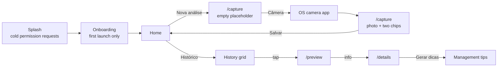
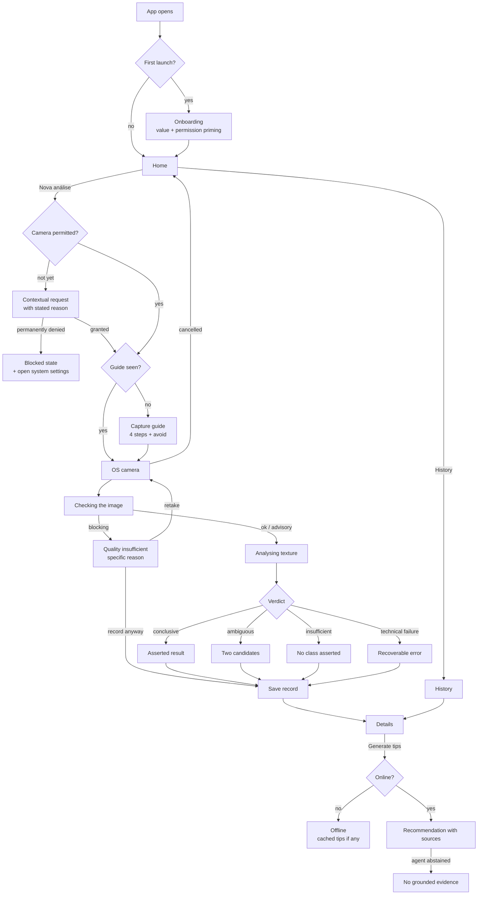

# User Journey

## 1. The journey today

Three things are visible in that shape. The capture route is entered twice for
one photograph, with a dead screen in between. Preview and details are two
destinations for one entity. And nothing between the shutter and the saved
record tells the user what the system is doing beyond two small chips.

## 2. The target journey

## 3. The nineteen states

Each state below carries: the user's goal, the information required, the
primary action, the secondary action, visual feedback, textual feedback,
behaviour on error, and the transition out.

### 3.1 Entering the application

- **Goal** — reach the last state of work, or start.
- **Information** — none. The user has no question at this moment.
- **Primary** — none; the app proceeds.
- **Secondary** — none.
- **Visual** — brand mark, settled, no progress theatre unless a real wait occurs.
- **Textual** — product name and tagline only. No narration of internal steps.
- **On error** — a storage or database failure routes to a retryable error
  screen rather than hanging on the logo.
- **Transitions to** — onboarding on first launch, home otherwise.

**Change from today.** The splash currently narrates its own permission calls.
Permission requests move out of this state entirely (see 3.3).

### 3.2 Initial orientation

- **Goal** — understand what the app does and why it wants access.
- **Information** — what a soil texture reading gives them; that photographs
  stay on the device; that location is optional.
- **Primary** — continue.
- **Secondary** — skip.
- **Visual** — one illustration per idea, progress across steps.
- **Textual** — value first, mechanics second.
- **On error** — writing the completion flag failing must not trap the user;
  proceed and retry the write silently on next launch.
- **Transitions to** — home.

**Change from today.** Onboarding stops being capture technique. Technique
moves to the capture guide, where it is needed. Onboarding becomes value plus
permission priming.

### 3.3 Camera permission

- **Goal** — grant access, or understand why the app cannot proceed.
- **Information** — the concrete reason: the app photographs a soil sample and
  classifies it on the device.
- **Primary** — allow.
- **Secondary** — not now.
- **Visual** — priming screen before the system dialog, never the system dialog
  cold.
- **Textual** — one sentence of reason, in the user's terms.
- **On error / denial** — a denial is a state, not a dead end: the screen
  explains what is unavailable and offers a retry. A permanent denial offers the
  system settings and re-checks on app resume, which the capture screen already
  implements correctly.
- **Transitions to** — capture guide or camera.

### 3.4 Preparing to capture

- **Goal** — know how to take a usable photograph.
- **Information** — clean the surface, roughly twenty centimetres, diffuse
  natural light, fill the guide; and what to avoid.
- **Primary** — open the camera.
- **Secondary** — back.
- **Visual** — four numbered steps, an illustration of the framed sample with a
  distance hint, and an "Evite" pair.
- **Textual** — imperative, short, one idea per step.
- **On error** — none; this state is static content.
- **Transitions to** — camera.

**Shown** on the first capture, and afterwards only on demand from a "Como
capturar" link on the analysis screen.

### 3.5 Framing

- **Goal** — position the phone over the sample.
- **Phase 1** — this state is owned by the operating system's camera
  application. The app contributes nothing and must not pretend otherwise.
- **Phase 2** — in-app viewfinder with a framing guide, region of interest, and
  live advisories. Specified in `06-capture-experience.md`.

### 3.6 Quality validation

- **Goal** — find out whether the photograph is usable before trusting a result
  derived from it.
- **Information** — the specific defect, not a generic rejection.
- **Primary** — retake.
- **Secondary** — record anyway.
- **Visual** — the photograph desaturates; a badge names the defect.
- **Textual** — "Imagem desfocada", "Imagem muito escura", "Resolução
  insuficiente". Never "imagem inválida" alone.
- **On error** — if the analysis itself throws, treat the image as *unvalidated*
  and continue to classification with an advisory. A failed check must never
  block a valid sample.
- **Transitions to** — camera, or classification, or save.

### 3.7 Capture

- **Goal** — take the photograph.
- **Feedback** — a light haptic on shutter return, and the photograph appearing
  immediately in the analysis screen rather than a blank screen with a button.

### 3.8 Local processing

- **Goal** — know that work is happening, roughly how much is left, and that it
  can be abandoned.
- **Information** — the current phase by name.
- **Primary** — cancel.
- **Secondary** — none.
- **Visual** — the photograph, dimmed, with a named phase and a determinate-feel
  progression through two phases.
- **Textual** — "Verificando a imagem", then "Analisando a textura". Location
  resolves on its own line and never gates anything.
- **On error** — a timeout is reported as a timeout, with retry.
- **Transitions to** — one of the four verdict states.

### 3.9 Confident result

- **Goal** — read the class and decide what to do next.
- **Information** — class, confidence band, the percentage as secondary detail,
  where the class sits on the texture scale.
- **Primary** — save the record.
- **Secondary** — retake.
- **Visual** — class name in display type, the scale colour for that class,
  `verified` icon, primary-tinted badge.
- **Textual** — the class, the band label, and a standing limit statement. High
  confidence still states its limits; today it states nothing.
- **Transitions to** — details.

### 3.10 Low-confidence result

Split into two distinct states, because today they are one and that is the
central defect.

**Ambiguous** — two classes are close.

- **Information** — both candidates with their scores, positioned on the scale.
- **Primary** — retake.
- **Secondary** — record anyway.
- **Visual** — warning-tinted, `compare_arrows`, both candidates highlighted on
  the texture scale, neither asserted as *the* class.
- **Textual** — states plainly that the sample is between two textures.

**Insufficient evidence** — no candidate clears the floor.

- **Information** — that no class can be asserted, and what would improve it.
- **Primary** — retake.
- **Secondary** — record without a class.
- **Visual** — neutral surface, `help_outline`, **no soil-scale colour and no
  class name**.
- **Textual** — "Evidência insuficiente para afirmar uma classe."

### 3.11 Invalid image

Reached when the quality gate blocks. Distinct from 3.10: nothing was
classified, so nothing about texture is said at all.

### 3.12 Target not found

**Hypothesis, not implemented.** No signal exists. Specified in
`06-capture-experience.md` as a contract awaiting the vision terminal. The app
must not infer it from colour statistics.

### 3.13 Multiple targets

**Hypothesis, not implemented.** Same standing as 3.12.

### 3.14 Offline operation

- **Goal** — know that capture, classification and saving all still work.
- **Information** — that only recommendations require a connection.
- **Visual** — a persistent, quiet indicator, not a modal.
- **Textual** — names what is unavailable, not merely "sem conexão".
- **Transitions** — everything except tips proceeds normally.

### 3.15 Generating or retrieving recommendations

- **Goal** — get guidance for this soil.
- **Primary** — generate.
- **Visual** — the section's own loading state, with cached content preserved
  underneath during a refresh. Already correct in the current implementation.
- **Textual** — "Gerando dicas de manejo…".

### 3.16 Connection failure

- Distinguishes timeout, network, rate limit, unauthenticated, malformed and
  upstream-unavailable, which the current implementation already does well.
- Cached tips survive a failed refresh; only a snackbar reports the failure.

### 3.17 No data

- **Empty history** — "Nenhum registro", with a capture action.
- **Empty search** — "Nenhum resultado", with the filters named.
- **No tips yet** — offers generation, or explains that a connection is needed.
- **Agent abstained** — states that no well-sourced guidance was found. This is
  a *success* of the honesty policy and must not be styled as an error.

### 3.18 Retry

Every recoverable failure offers exactly one retry affordance, in the same
position, with the same label. A retry that cannot succeed must never be
offered — the current "Classificação falhou · tocar para repetir" with no model
present is precisely this defect.

### 3.19 History and continuity

- **Goal** — find a previous reading.
- **Information** — class and confidence on the card, not only a timestamp.
- **Primary** — open the record.
- **Secondary** — filter, search, multi-select.
- **On error** — inline retry, preserving filters.

## 4. Alternative flows

| Flow | Trigger | Path |
| --- | --- | --- |
| Capture cancelled | User backs out of the OS camera | Returns to home, no state left behind |
| Permission denied mid-flow | Denial at the contextual request | Blocked state with settings deep link; re-checks on resume |
| Quality blocked, user overrides | "Record anyway" | Saves with the quality advisory attached to the record |
| Classification unavailable | No model artifact | Record saves as *not analysed*; no retry is offered |
| Save fails | Repository write throws | Photograph is retained, snackbar reports, user retries |
| Location times out | Twenty seconds elapse | Record saves without coordinates; no blocking |
| Offline at result | No connectivity | Save proceeds; the tips action becomes "Salvar e gerar depois" |
| Record deleted elsewhere | Tombstone written | Details shows the not-found state, which is not retryable |
