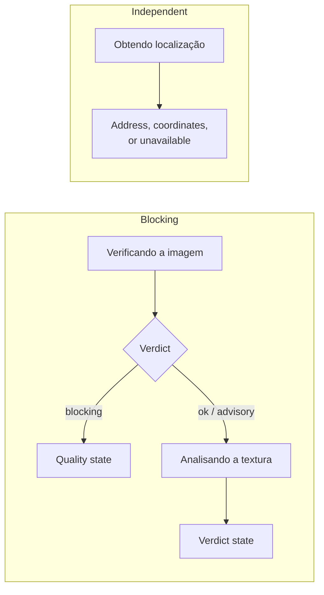

# Processing States

## 1. What the user sees today

Two chips over the photograph, each about twenty pixels tall, each containing a
fourteen-pixel spinner:

- "Localizando..." → the address, or "Sem localização"
- "Classificando..." → "Classe · 87%", or "Classificação falhou · tocar para
  repetir", or "Classificação indisponível"

That is the entire feedback surface for an operation that may take fifteen
seconds. Meanwhile the Save button is disabled by `isBusy`, which aggregates
location, classification and saving into one boolean — so the primary action
stays dead for up to twenty seconds waiting on reverse geocoding, a value the
record does not require.

## 2. Principles

1. **Name the phase, not the mechanism.** "Analisando a textura", not
   "Executando inferência" and not an unlabelled spinner.
2. **One blocking track.** Quality and classification are sequential and block
   the result. Location is a second, independent track that blocks nothing.
3. **Never classify what the gate rejected.** Quality runs first and can stop
   the pipeline, which is cheaper and more honest than classifying a frame the
   app already knows is unusable.
4. **Every wait is cancellable.** The user can abandon and retake at any point.
5. **A timeout is reported as a timeout**, not as a failure, because the two
   have different remedies.

## 3. The two tracks



| Phase | Track | Timeout | On timeout |
| --- | --- | --- | --- |
| Verificando a imagem | Blocking | Short — it is a local pixel pass | Treat as unvalidated, continue |
| Analisando a textura | Blocking | 15 s, owned by `InferenceService.classify` | Report as timeout, offer retry |
| Obtendo localização | Independent | 20 s | Settle to "sem localização", block nothing |

The fifteen-second inference timeout stays where it is. `classify()` holds the
isolate handle and is the only layer that can actually stop the work; a second
timeout at the screen would abandon the future while the isolate kept running.
That reasoning is already documented in the current code and remains correct.

## 4. Presentation

The photograph fills the screen, dimmed. Over it:

- The current phase name, in body type, changing by crossfade at `AppMotion.base`
  rather than by swapping spinners.
- A two-step progression indicator — checking, then analysing — so the user can
  see that there are two things and which one is happening.
- A quiet secondary line for location, which may resolve, fail or still be
  running without ever changing the primary reading.
- A cancel affordance.

No percentage-complete indicator. Neither phase can report genuine progress, and
a fake progress bar is a fabricated signal.

## 5. Unblocking Save

The current expression:

```dart
isBusy: _state.isLocating || _state.isClassifying || _state.isSaving
```

becomes: Save is enabled once the classification track has **settled** — done,
failed, or unavailable — regardless of the location track. `isSaving` remains a
re-entry guard.

Rationale: a record with a null latitude, null longitude and an unavailable
address is a valid record that the schema already supports and the repository
already writes. A record whose classification is still mid-flight is not, because
saving it would silently discard a result that is seconds away.

## 6. State announcements

Each phase transition, and the arrival of the verdict, is announced to
assistive technology via `SemanticsService.announce`. A screen-reader user
currently receives nothing at all during the entire operation — the chips are
unlabelled containers whose text changes without any announcement.

## 7. Interaction with the missing model

When no model artifact is present, `initialize()` sets `_modelUnavailable` and
`classify()` returns null on every call without spawning anything. The phase
must therefore distinguish three outcomes, not two:

| Outcome | State | Retry offered |
| --- | --- | --- |
| Result returned | Verdict state | — |
| Model unavailable | **Não analisado** — classification is not part of this build | **No** |
| Run failed or timed out | Recoverable error | **Yes** |

This is the fix for P0-2. Today all three collapse into "Classificação falhou ·
tocar para repetir", which offers a retry that cannot succeed in the first case.

## 8. Acceptance criteria

- `phases_are_named` — the processing surface shows a named phase, and the name
  changes when the phase does.
- `quality_gates_classification` — a blocking quality verdict prevents the
  classification phase from starting.
- `save_not_gated_by_location` — with classification settled and location still
  pending, Save is enabled; the record persists with null coordinates.
- `timeout_distinguished_from_failure` — an inference timeout and an inference
  error produce different messages.
- `unavailable_offers_no_retry` — with no model artifact present, the state
  reads as not analysed and offers no retry affordance.
- `phase_changes_announced` — each phase transition and the verdict arrival are
  announced to assistive technology.
- `processing_is_cancellable` — cancelling returns to a state from which the
  user can retake, with no orphaned isolate.
