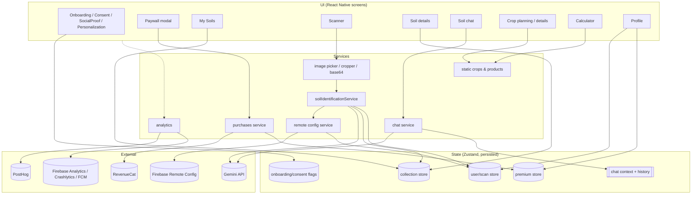

# 03 — System architecture

## Verdict

**A thin-client, service-module architecture on React Native**: screens call
plain JS service modules (`soilIdentificationService`, a chat service, a
purchases service, a remote-config service) and read and write **Zustand**
stores persisted to AsyncStorage. There is **no Clean Architecture domain layer
and no repository abstraction**. Services talk to SDKs directly, and screens
contain orchestration such as consent, permission and navigation decisions.
Closest named style: **"MVVM-lite with global stores"**, where Zustand stores
play the view-model role. **INFERRED** from the identifier vocabulary (E-S); the
JS bytecode was not decompiled.

Evidence for the shape:

| Observation | Source | Reading |
|---|---|---|
| `subscribeWithSelector`, `skipHydration`, `persist`, `createJSONStorage` | E-S | Zustand with the `persist` (JSON storage adapter) and `subscribeWithSelector` middlewares |
| `soilIdentificationService`, `identifyWithGemini`, `identifySoilFromImages` | E-S | An identification service module that owns the AI call |
| `addSoilToCollection` / `addSoilToRegistry`, `removeSoilFromCollection` / `removeSoilFromRegistry`, `getAllSoils called before initialization`, `Cleared soil registry` | E-S | Two collaborating stores: a persisted **collection** store and an in-memory **registry** with query helpers |
| `getSoilsByTexture`, `getSoilsByHealthScore`, `getSoilsWithHighConfidence`, `getRecentSoils`, `getFavoriteSoils`, `getCollectionStats` | E-S | Query/selector helpers next to the registry, not a database |
| `checkPremiumStatus`, `syncAttributesAndOfferingsIfNeeded`, `Transforming customer info`, `Premium status analysis` | E-S | A purchases service that wraps RevenueCat and maps `CustomerInfo` to app state |
| `updateScanLimitsFromRemoteConfig`, `Firebase Remote Config timed out or failed, using fallback` | E-S | A config service with timeout and defaults |
| `useChatContext`, `watchChatScreen` | E-S | A React context for chat |

## Layers as built

```text
┌──────────────────────────────────────────────────────────────────────────┐
│ UI — React components (screens, cards, modals), React Navigation          │
│      Reanimated, gesture handler, SVG, Lucide icons, Lottie               │
├──────────────────────────────────────────────────────────────────────────┤
│ State — Zustand stores (persisted): collection, user/scans, onboarding,  │
│         premium; React context: chat; component state: forms, progress  │
├──────────────────────────────────────────────────────────────────────────┤
│ Services — identification (Gemini), chat (Gemini), purchases            │
│            (RevenueCat), remote config, analytics (Firebase + PostHog), │
│            image (picker/cropper/base64), i18n, crops & products data    │
├──────────────────────────────────────────────────────────────────────────┤
│ Static data — crop catalogue (41 entries), soil-type tables, product    │
│               catalogue with retailer URLs (bundled in JS)               │
├──────────────────────────────────────────────────────────────────────────┤
│ Platform bridges — VisionCamera, image-crop-picker (uCrop), AsyncStorage│
│   geolocation, device-info, store-review, notifee, RN Firebase, RC,      │
│   PostHog RN — all TurboModules/Fabric on the New Architecture           │
├──────────────────────────────────────────────────────────────────────────┤
│ External — Gemini API · Firebase (RC, Analytics, Crashlytics, FCM, A/B) │
│            RevenueCat (+ Play Billing, Amazon IAP) · PostHog             │
└──────────────────────────────────────────────────────────────────────────┘
```

Data flows **down** for commands (screen → service → SDK) and **up** through
store subscriptions. Services write their results into stores, and screens
re-render from selectors. **INFERRED**.



## Bootstrap

```text
Process start
→ ContentProviders, by initOrder: NotifeeInit(-100) … MlKitInit(99), RNFirebaseAppInit(99), RNFirebaseCrashlyticsInit(98), FirebaseInit(100), androidx.startup (WorkManager, ProcessLifecycle, EmojiCompat, ProfileInstaller)  [CONFIRMED E-M]
→ MainApplication: SoLoader off (meta-data soloader.enabled=false), Hermes + New Architecture host  [CONFIRMED E-M/E-N]
→ pairip LicenseContentProvider (Play licence check)                            [CONFIRMED E-M]
→ MainActivity (singleTask) → JS bundle (Hermes bytecode)
→ i18n init ("i18n initialized successfully")                                  [HIGHLY LIKELY E-S]
→ Zustand rehydration from AsyncStorage (collection, user/scanCount, flags)    [HIGHLY LIKELY E-S]
→ Remote Config fetch with timeout → fallback defaults; sets scan limits and model names  [HIGHLY LIKELY E-S]
→ RevenueCat init ("Initializing RevenueCat…") → identify user → initial purchase sync  [HIGHLY LIKELY E-S]
→ PostHog init (flags, surveys)                                                [HIGHLY LIKELY E-S]
→ Route: Onboarding if not completed, else MainTabs                            [CONFIRMED E-O]
```

There is no splash gate that waits for the network: the offline cold start
reached My Soils in under 4 seconds. **CONFIRMED** (E-O).

## Structural map (Android side)

```text
com.indiemobileapps.soilidentifier
├── MainApplication / MainActivity (RN host, singleTask, adjustResize)
├── Activities: UCropActivity, SignInHubActivity*, ProxyBilling(V2), ProxyAmazonBilling,
│               NotificationReceiverActivity (notifee), GoogleApiActivity, PlayCoreDialogWrapper,
│               pairip LicenseActivity
├── Services:   FCM (RNFB + Firebase), WorkManager system services, notifee Foreground/Receiver,
│               AppMeasurement, SessionLifecycle, Room MultiInstanceInvalidation, datatransport
├── Receivers:  FCM, WorkManager constraint proxies, notifee reboot/alarm/block-state,
│               Amazon IAP ResponseReceiver, ProfileInstaller
└── Providers:  Firebase/RNFB/Crashlytics/MLKit init, notifee init, androidx.startup,
                two FileProviders (image pickers), pairip LicenseContentProvider
* present through play-services-auth; no sign-in UI observed
```

## Coupling points

- **Screens ↔ RevenueCat package shapes**: the paywall reads `availablePackages`, `introPrice`, `pricePerWeekString` and similar fields directly. **HIGHLY LIKELY** (E-S).
- **Identification ↔ prompt/JSON contract**: the details screen renders whatever keys the parser filled, with silent defaults, so a model drift degrades without anyone noticing. **CONFIRMED** behaviour (E-O).
- **Remote Config ↔ AI behaviour**: model choice and limits are remote values, so a config change alters results with no release and no client-side record of which model answered. **HIGHLY LIKELY** (E-S).
- **Template coupling**: generic identifier fields (materials, age, condition, valuation) are still in the soil model and the UI. **CONFIRMED** (E-O).
