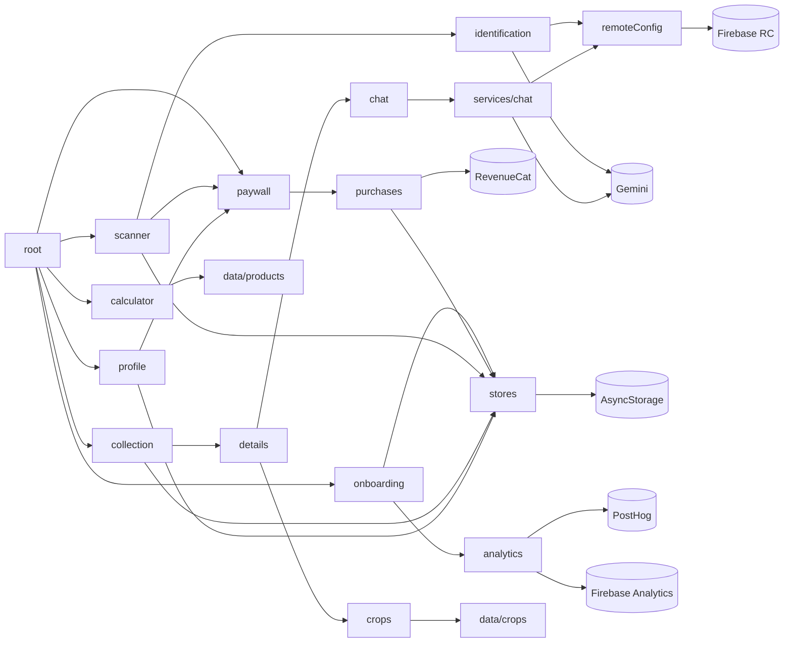

# 04 — Module dependencies

The bundle is a single Hermes file with numeric module IDs, so module boundaries
are reconstructed from identifier clusters. Every module below is **INFERRED**
unless stated otherwise. The third-party package list is **HIGHLY LIKELY**, from
the dex packages (E-D), native libraries (E-N) and library-specific strings (E-S).

## Third-party packages (JS side)

| Area | Package (evidence) |
|---|---|
| Navigation | `@react-navigation/native`, native-stack, bottom-tabs (`RootNavigator`, `MainTabs`, reactnavigation.org links) · `react-native-screens` |
| Animation / gesture | `react-native-reanimated` + `react-native-worklets`, `react-native-gesture-handler`, `lottie-react-native` (`com/airbnb/android`) |
| Graphics | `react-native-svg`, `lucide-react-native` (`Lucide*` icon names), `@react-native-community/blur`, `@react-native-masked-view` |
| Layout | `react-native-safe-area-context`, `react-native-keyboard-controller` |
| State | `zustand` (+ `persist`, `subscribeWithSelector`) |
| Storage | `@react-native-async-storage/async-storage` |
| i18n | `i18next` + `react-i18next` + language detector (`languageDetector`, `cacheUserLanguage`) |
| Dates | `dayjs` (`dayjs_plugin_calendar`) |
| AI | `@google/generative-ai` (`formatGenerateContentInput`, `generateContentStream`, `CountTokensRequest…`) |
| Camera / images | `react-native-vision-camera`, `react-native-image-crop-picker` (ivpusic + uCrop), `react-native-image-picker` |
| Purchases | `react-native-purchases` (RevenueCat, incl. Amazon), `react-native-iap` (`com/dooboolab/rniap`) |
| Firebase | `@react-native-firebase/app`, `analytics`, `crashlytics`, `messaging`, `remote-config` |
| Product analytics | `posthog-react-native` (flags, surveys, session-replay settings) |
| Device | `react-native-device-info`, `@react-native-community/geolocation`, store review (`com/oblador/storereview`) |
| Notifications | `@notifee/react-native` |
| Media | `react-native-video` (ExoPlayer), `react-native-sound` |

Two purchase SDKs are linked side by side (RevenueCat and react-native-iap).
Every purchase log string names RevenueCat, so `react-native-iap` is
**INFERRED** to be a template leftover.

## App modules

| Module | Responsibility | Main objects | Inputs → outputs | Depends on | Called by |
|---|---|---|---|---|---|
| `app/root` | Providers, navigation container, bootstrap | `RootNavigator`, `MainTabs` | persisted flags → initial route | all stores, i18n, config, purchases | — |
| `features/onboarding` | Slides, consent, social proof, personalisation | `OnboardingScreen`, `AIConsentModal`, `SocialProofScreen`, `PersonalizationScreen` | taps → `setOnboardingComplete`, `aiConsent` | onboarding store, analytics, store-review | root |
| `features/paywall` | Offer display and purchase | `PaywallScreen` | RC offerings → purchase / restore | purchases service, premium store | onboarding, scanner, profile |
| `features/collection` | Home grid, stats, search | `CollectionScreen`, soil card | collection store → UI | collection store, registry helpers | tabs |
| `features/scanner` | Camera, quota check, capture, crop, identify | `ScannerScreen`, `handleTakePhoto`, `handleImageIdentification` | photo → soil entity | VisionCamera, image service, identification service, user/scan store | tabs, collection "+" |
| `features/details` | Render a soil record | `SoilDetailsScreen` | soil id → UI | collection store | scanner, collection, chat |
| `features/chat` | Per-soil conversation | `SoilChatScreen`, `useChatContext` | user text → AI text | chat service, chat history persistence | details, collection |
| `features/crops` | Catalogue, filters, compatibility | `CropPlanningScreen`, `CropDetailsScreen`, `getCropsForSoilType`, `getSoilCompatibilityScore` | soil type → ranked crops | crops data | details |
| `features/calculator` | Volume, bags, cost, products | `SoilCalculatorScreen`, `calculateRectangularVolume`, `calculateCircularVolume`, `estimateBagsNeeded`, `convertVolume` | dimensions → volume + products | products data | tabs |
| `features/profile` | Plan card, stats, legal, wipe | `ProfileScreen` | stores → UI; wipe | user/scan store, premium store, collection store | tabs |
| `services/identification` | Gemini vision call and parsing | `soilIdentificationService`, `identifyWithGemini` | images (base64) → parsed soil JSON | remote config, `@google/generative-ai` | scanner |
| `services/chat` | Gemini chat with a model fallback | chat service | history + soil context → reply | remote config, `@google/generative-ai` | chat |
| `services/purchases` | RevenueCat wrapper | `checkPremiumStatus`, `loadOfferings`, `purchasePackage`, restore | → `isPremium`, `expirationDate` | RevenueCat | paywall, root, profile |
| `services/remoteConfig` | Fetch with timeout, defaults | `updateScanLimitsFromRemoteConfig`, model lookups | → models, limits | RN Firebase RC | root, identification, chat |
| `services/analytics` | Event fan-out | Firebase Analytics, PostHog | events → SDKs | — | screens |
| `stores/*` | App state | persisted: collection, user (`scanCount`, `scansRemaining`), onboarding, premium; in memory: the registry, derived from the collection | — | AsyncStorage (persisted stores only) | everyone |
| `data/crops`, `data/products` | Static catalogues | 41 crops; topsoil / raised-bed / potting / cactus products with retailer URLs | — | — | crops, calculator |

## Dependency graph

No cycle is implied except `scanner ⇄ paywall`, which is navigation, not import.
