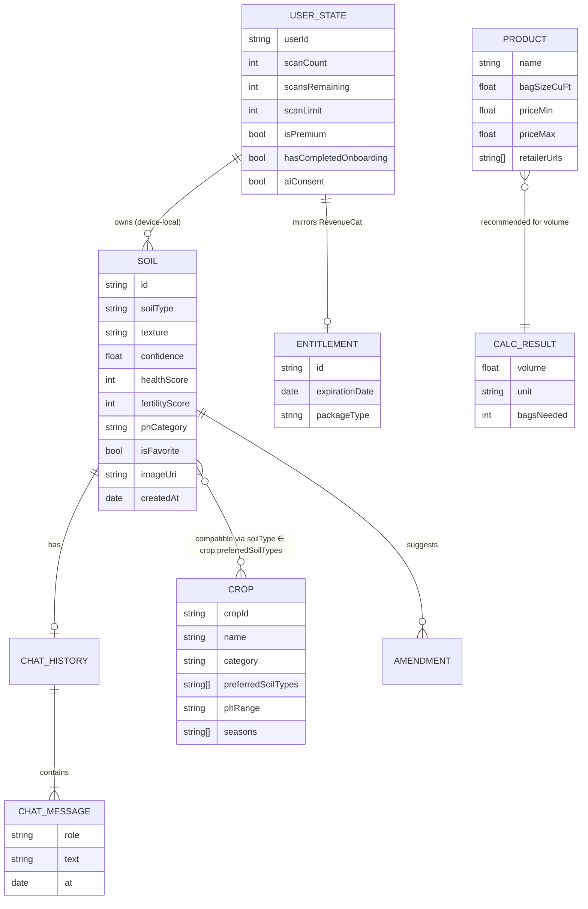

# 05 — Domain model

There is no separate DTO / data model / domain entity / UI model chain. The
Gemini JSON is parsed, defaulted and stored **as is** as the soil record, and the
UI reads that record directly. **INFERRED** from the field names reappearing
unchanged between the parser strings, the persisted collection helpers and the
rendered labels (E-S, E-O).

```text
Gemini JSON text ──parse + defaults──▶ Soil record (stored in the collection) ──▶ UI
       (no DTO type)                     (one shape for storage and display)
```

## Entities

### Soil (the identification record)

| Attribute | Observed value / meaning | Source | Label |
|---|---|---|---|
| `id` | local id (`soilId`, `getSoilById`) | E-S | HIGHLY LIKELY |
| `soilType` | "Unknown" for a non-soil photo; the chips say "Unknown" | E-O, E-S | CONFIRMED |
| `soilSubType` | — | E-S | INFERRED |
| `texture` | "Medium Texture" (a default) | E-O | CONFIRMED |
| `confidence` | 0 % ("0% match", "0% confidence") | E-O | CONFIRMED |
| `healthScore` / `overallHealthScore` | 50/100 (a default) | E-O | CONFIRMED |
| `fertilityScore` | 50/100 | E-O | CONFIRMED |
| water retention | 50/100 | E-O | CONFIRMED |
| `phEstimate`, `phCategory`, `phRange` | "7 (Neutral)" | E-O | CONFIRMED |
| `organicMatter` / `organicMatterEstimate` | "Medium" | E-O | CONFIRMED |
| `compaction` / `compactionScore` | 50/100 | E-O | CONFIRMED |
| `drainage`, `moisture` | — | E-S | INFERRED |
| `nutrientClues`, `phosphorusIndicator` | — | E-S | INFERRED |
| `amendments[]` (`amendmentPurpose`, `recommendedAmount`) | soil amendment suggestions | E-S | INFERRED |
| `suitableCrops[]` | card tags "Vegetables", "Herbs" | E-O | CONFIRMED |
| `companionPlants`, `plantingGuide`, `cropSeasonAlerts` | — | E-S | INFERRED |
| `condition` | "Fair" | E-O | CONFIRMED |
| `materials[]` | "Digital pixel data" (the model described the synthetic scene) | E-O | CONFIRMED |
| `physicalDescription` / description | the model's free text | E-O | CONFIRMED |
| `ageEstimate` | "N/A" | E-O | CONFIRMED |
| `estimatedValue`, `marketValue`, `valueFactors` | template fields; not rendered for soil | E-S | HIGHLY LIKELY |
| `conditionNotes`, `overallNotes`, `recommendations[]` | — | E-S | INFERRED |
| `imageUri` / `imageUris[]` | cropped photo path(s) | E-S | HIGHLY LIKELY |
| `isFavorite` | ♥ | E-O, E-S | CONFIRMED |
| `scanTime` / created date | "Today" | E-O | CONFIRMED |
| location (`latitude`, `longitude`, `shareLocation`) | not captured in the observed flow | E-S | UNKNOWN |

**Lifecycle**: created by identification → listed in the collection → favourited
or unfavourited → refined in chat (whether chat writes back to the record is
**UNKNOWN**; `applySoilUpdates`, `updateSoilInCollection` and `updatedSoil` exist
in E-S) → deleted individually or wiped with "Delete All Data".

### ChatMessage / ChatHistory

`conversationHistory`, `chatHistory`, `saveChatHistory`, `validateChatHistory`.
Each message is user or AI text with a timestamp. History is kept per soil and
survives app restarts. **CONFIRMED** (E-O: history present after a force-stop).
The first AI bubble is a **local template**, not a model reply ("Great find!
I've identified this as **{type}**…"). **CONFIRMED** (E-O: shown instantly and
identical to the stored values).

### UserState (scan quota)

`scanCount` (scans used), `scansRemaining`, `scanLimit` (from Remote Config,
`getFreeScanLimit`), `isPremium`, `expirationDate`, `hasCompletedOnboarding`,
`aiConsent`, a user id (`@soil_identifier_user`). **HIGHLY LIKELY** (E-S); the
free limit of 1 is **CONFIRMED** (E-O).

### Crop (static)

`cropId`, `cropName`, scientific name, category (Vegetable, Fruit, Grain, Root,
Herb…), family, growth time, yield, sunlight, water requirement, nitrogen need,
`preferredSoilTypes[]`, pH range, seasons. 41 entries. **CONFIRMED** (E-O).

### Product (static, calculator)

Name, description, bag size (cu ft), price range per bag, "best for" tags,
retailer URLs (Amazon / Home Depot / Lowe's search links). **CONFIRMED** (E-O)
for the rendered fields; retailer URLs **HIGHLY LIKELY** (E-S).

### Entitlement (remote, RevenueCat)

`premium` entitlement with `expirationDate`, the active packages (weekly, yearly,
lifetime) and intro-offer eligibility. **HIGHLY LIKELY** (E-S).

## Conceptual ER diagram



## Compatibility score (crops)

The score appears to be a set-membership heuristic: is the soil type among the
crop's preferred soil types, plus a pH-range check. With `soilType = "Unknown"`
every crop scored **50 %** and the details page warned "Not ideal for Unknown.
Consider soil amendments." **CONFIRMED** output (E-O); the formula is
**INFERRED** (`getSoilCompatibilityScore`, `getSoilCompatibilityColor` in E-S).
