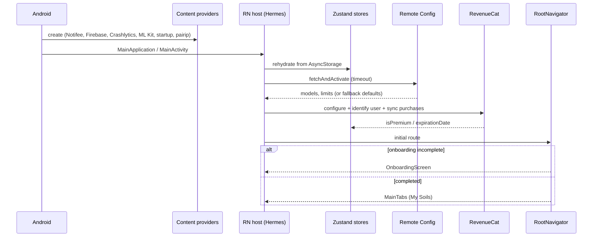
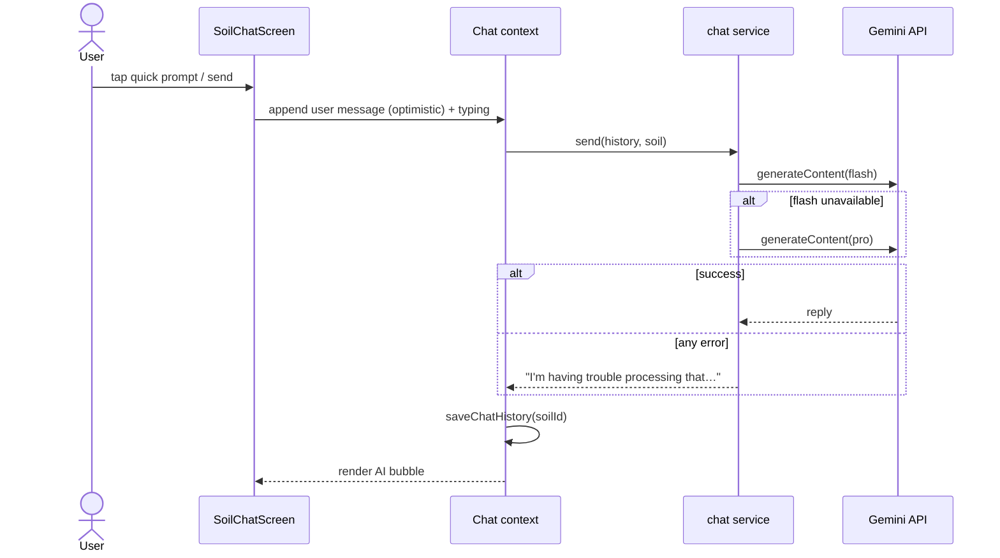
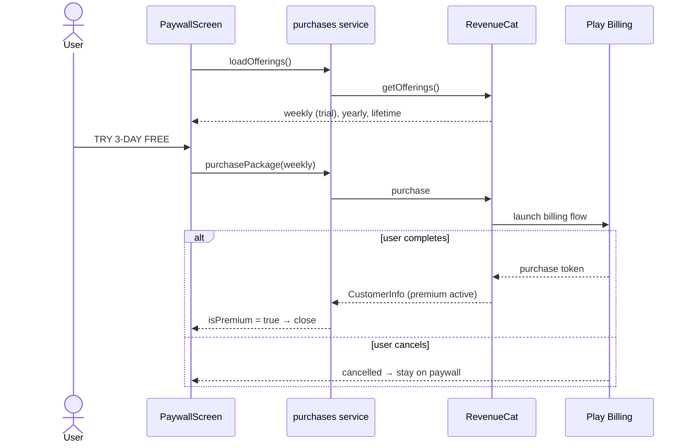
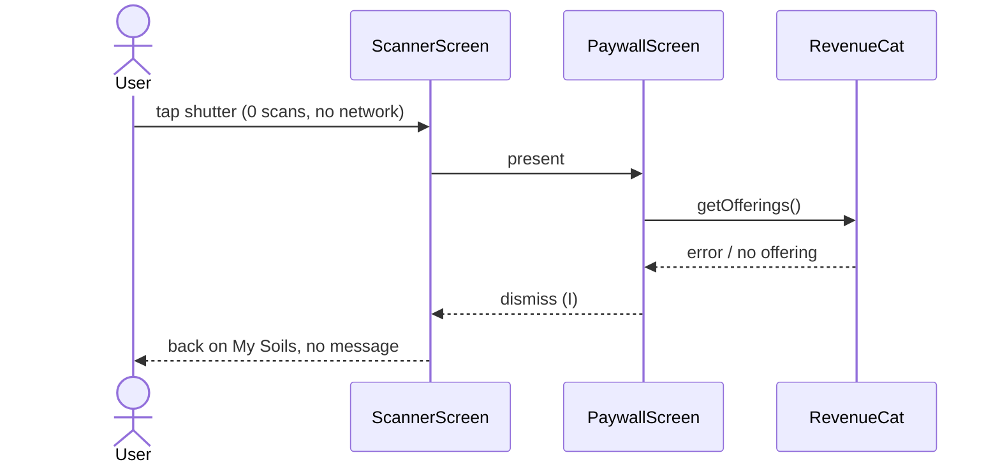

# 14 — Sequence diagrams

Participants follow the reconstructed modules of [04](04-module-dependencies.md).
Arrows marked `(I)` are inferred and the others are observed or highly likely.

## 1. Cold start



## 2. Identification (happy path and the non-soil path)

```mermaid
sequenceDiagram
    actor U as User
    participant S as ScannerScreen
    participant CAM as VisionCamera
    participant CR as uCrop
    participant ID as identification service
    participant RC as Remote Config
    participant G as Gemini API
    participant ST as Stores
    U->>S: tap shutter
    S->>ST: canScanMore?
    alt no scans left and online
        S-->>U: present Paywall
    else no scans left and offline
        S-->>U: back to My Soils, no message (diagram 5)
    else scans left
        S->>CAM: takePhoto()
        CAM-->>S: file
        S->>CR: openCropper(file)
        U->>CR: confirm ✓
        CR-->>S: cropped file
        S-->>U: overlay "Identifying Soil…" (progress)
        S->>ID: identifySoilFromImages([base64])
        ID->>RC: primary_model
        ID->>G: generateContent(prompt + inlineData)
        alt 503 / 429
            G-->>ID: error
            ID->>G: generateContent(backup_model)
        end
        G-->>ID: text (JSON)
        ID->>ID: parse → soils[0] → apply defaults
        Note over ID: non-soil photo still yields a record<br/>(Unknown, 0 %, health 50, pH 7)
        ID-->>S: soil
        S->>ST: addSoil(soil); incrementScanCount()
        S-->>U: navigate SoilDetails
    end
```

## 3. Chat turn



## 4. Purchase from the paywall



## 5. Shutter at zero scans while offline (observed)


